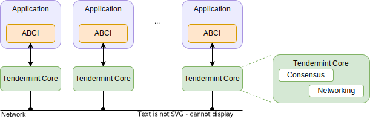
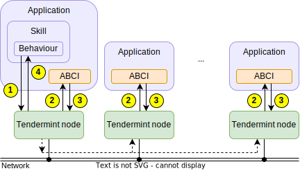

# The Application BlockChain Interface (ABCI)

The [Application BlockChain Interface (ABCI)](https://docs.tendermint.com/master/spec/abci/) defines the boundary between the replication/consensus engine (the blockchain) and an FSM-based application that is replicated in a collection of agents. It lets the application logic communicate with the consensus engine in a transparent way so that all agents' state are synchronized. The application to be replicated can be written in any programming language, and it communicates with the consensus engine of each agent through a variety of methods, e.g., Unix or TCP sockets.

The ABCI standard was introduced with the
[Tendermint project](https://docs.tendermint.com/master/introduction/what-is-tendermint.html). Nevertheless,
an ABCI-based application can work with any consensus engine
that is ABCI-compatible, e.g., [Fantom](https://fantom.foundation/about/).
In the remaining of this section, we will consider [Tendermint](https://tendermint.com/) as the replication/consensus engine.

!!! note

    ABCI applications are only reactive and specify how
    a transaction updates the application state.
    On the other hand, {{agent_service}}s rely on the low-level ABCI application layer to replicate the state consistently among different instances,
    but they also exhibit _proactive behaviour_. For example, periodically
    execute some routines, monitor the value of the crypto assets of the final customer, etc.

    In other words, {{agent_service}}s rely on the underlying ABCI, but an {{agent_service}} **is not** an ABCI application.

## Brief Overview of Tendermint

[Tendermint](https://docs.tendermint.com/) is a software for securely and consistently replicating
an application on many machines. It ensures that the replication is Byzantine fault-tolerant (BFT),
i.e., it has the ability to tolerate machines failing in arbitrary ways, including becoming malicious.

Tendermint consists of two chief technical components:
a blockchain consensus engine, and a generic application interface:

- [Tendermint Core](https://tendermint.com/core/) is the underlying consensus engine, which ensures that the same transactions are recorded on every machine in the same order.
- The  [Application BlockChain Interface (ABCI)](https://docs.tendermint.com/master/spec/abci/) is the interface that
  enables the transactions to be processed in any programming language.
  Unlike other blockchain and consensus solutions, which come pre-packaged with
  built-in state machines, developers can use [Tendermint](https://tendermint.com/) for
  state machine replication of arbitrary applications written in any programming
  language and development environment.

In the picture below, you can see a simplified diagram showing how [Tendermint](https://tendermint.com/)
modularizes a distributed state-machine replication system by clearly separating the business logic layer (the application)
from the consensus and networking layer (Tendermint Core) through the ABCI layer:

<figure markdown>
  {align=center}
  <figcaption>Diagram of a Tendermint replicated application</figcaption>
</figure>

The interaction between the consensus node and the ABCI application
follows the client-server paradigm:
the ABCI application (the server) listens for requests coming
from the consensus node (the client), which sends requests
to the ABCI application for different purposes, e.g.,
check whether a transaction is valid and therefore if it can be added
to the transaction pool, to notify the app that
a block has been validated, or to get information from the
application layer.

A detailed description of the consensus algorithm implemented
by Tendermint is out of the scope of this document.
We refer the reader to the
[Tendermint documentation](https://docs.tendermint.com/master/introduction/what-is-tendermint.html)
for the complete details.

## The ABCI Protocol

When building an ABCI-based application, it must be taken into account both the callbacks received by the consensus node (i.e., information that the application must process and respond), and the proactive execution of transactions that the application wishes to execute.

### Reactive Callbacks from the Consensus Node

The ABCI protocol specifies a number of [method calls](https://docs.tendermint.com/master/spec/abci/abci.html) that follow request-response interactions between the consensus node and the ABCI application. That is, the application will receive a number of callbacks related to events occurring at the consensus layer that are grouped according to their specific functionality as follows:

- Methods related to the consensus protocol: `InitChain`, `BeginBlock`, `DeliverTx`, `EndBlock` and `Commit`.
- Methods related to the mempool, used to validate new transactions before they are shared or included in a block: `CheckTx`.
- Methods for initialization and for queries from the user: `Info` and `Query`.
- Methods for serving and restoring state sync snapshots `ListSnapshots`, `LoadSnapshotChunk`, `OfferSnapshot` and `ApplySnapshotChunk`.

Additionally, there is a `Flush` method that is called on every connection, and an `Echo` method that is just for debugging.

Some requests like `Info` and `InitChain` are proactively made by the consensus node upon genesis. Most of the requests instead depend on the transactions stored in the mempool.

### Proactive Calls to the Blockchain

The transactions are submitted by the ABCI app's behaviours which interact with a Tendermint node
through the [Tendermint RPC protocol](https://docs.tendermint.com/master/rpc/).
See also the [Protobuf definitions](https://github.com/tendermint/abci/blob/master/types/types.proto) of those messages.

Below we will review the most important interactions
between a simple behaviour, a Tendermint node, and an ABCI application instance,
with a focus on how the ABCI protocol comes into play.

A quick overview of the ABCI protocol is depicted in the diagram below:

<figure markdown>

<figcaption>Overview of the ABCI protocol</figcaption>
</figure>

The behaviour can send a transaction by using the following three
Tendermint RPC methods:

- [`broadcast_tx_sync`](https://docs.tendermint.com/master/rpc/#/Tx/broadcast_tx_sync),
  which is blocking until the transaction is considered valid and added to the mempool;
- [`broadcast_tx_async`](https://docs.tendermint.com/master/rpc/#/Tx/broadcast_tx_async),
  which does not wait until the transaction is considered valid and added to the mempool;
- [`broadcast_tx_commit`](https://docs.tendermint.com/master/rpc/#/Tx/broadcast_tx_commit),
  which waits until the transaction is committed into a block and processed by the ABCI app.

Note that the above methods take as input a transaction, i.e., a sequence of bytes.
The consensus node does not know the meaning of the content of the transaction,
as its meaning resides in the ABCI application logic. This is a key feature
that makes the application layer and the consensus layer highly decoupled.

## Transaction Examples

In this section we depict sequence diagrams for the three transactions presented above, showing how both the proactive and reactive calls work.
The figure below shows the sequence of actions on the different components on a Tendermint application, e.g., for the request [`broadcast_tx_sync`](https://docs.tendermint.com/master/rpc/#/Tx/broadcast_tx_sync):

<figure markdown>

<figcaption>Sequence of actions to submit a transaction on Tendermint.</figcaption>
</figure>

1. An application behaviour initiates the process by submitting a request, e.g., [`broadcast_tx_sync`](https://docs.tendermint.com/master/rpc/#/Tx/broadcast_tx_sync).
2. The Tendermint nodes handle the transaction and handle any required networking or consensus actions to be done at this stage. This is transparent from the point of view of the application. Each Tendermint node notifies its associated application through the ABCI interface by calling, e.g., `CheckTx` callback method.
3. The applications respond accordingly through the ABCI interface. Again, at this point the Tendermint nodes will handle the networking and consensus layer transparently.
4. Finally, the calling behaviour receives response of the executed transaction (if applies).

A more detailed sequence diagram corresponding to this transaction can be shown below:

<figure markdown>

    sequenceDiagram

        participant Behaviour
        participant Tendermint node
        participant ABCI app

        Behaviour->>Tendermint node: broadcast_tx_sync(tx=0x1234...)
        activate Behaviour
        note over Behaviour: wait until the transaction is added to the mempool

        Tendermint node->>ABCI app: [Request] CheckTx(tx)
        alt tx is not valid
          ABCI app->>Tendermint node: [Response] CheckTx(tx) = ERROR
          Tendermint node->>Behaviour: ERROR
        else tx is valid
          ABCI app->>Tendermint node: [Response] CheckTx(tx) = OK
          Tendermint node->>Tendermint node: add tx to mempool
          Tendermint node->>Behaviour: OK
        end

        deactivate Behaviour

<figcaption>Sequence diagram of the ``broadcast_tx_sync`` method</figcaption>
</figure>

Similarly, for the [`broadcast_tx_async`](https://docs.tendermint.com/master/rpc/#/Tx/broadcast_tx_async) and the [`broadcast_tx_commit`](https://docs.tendermint.com/master/rpc/#/Tx/broadcast_tx_commit) transactions we show the corresponding sequence diagrams:

<figure markdown>

    sequenceDiagram

        participant Behaviour
        participant Tendermint node
        participant ABCI app

        Behaviour->>Tendermint node: broadcast_tx_sync(tx=0x1234...)
        activate Behaviour
        note over Behaviour: behaviour does not wait...
        deactivate Behaviour

<figcaption>Flow diagram for the ``broadcast_tx_async`` request</figcaption>
</figure>

<figure markdown>

    sequenceDiagram

        participant Behaviour
        participant Tendermint node
        participant ABCI app

        Behaviour->>Tendermint node: broadcast_tx_commit(tx=0x1234...)
        activate Behaviour
        note over Behaviour: wait until the transaction is committed to the chain

        Tendermint node->>ABCI app: [Request] CheckTx(tx)
        alt tx is not valid
          ABCI app->>Tendermint node: [Response] CheckTx(tx) = ERROR
          Tendermint node->>Behaviour: ERROR
          note over Behaviour: STOP
        end
        note over Behaviour, ABCI app: tx passed the mempool check
        ABCI app->>Tendermint node: [Response] CheckTx(tx) = OK
        Tendermint node->>Tendermint node: add tx to mempool
        note over Tendermint node: eventually, the tx gets added to a committed block
        note over Tendermint node: on receipt of such block:
        Tendermint node->>ABCI app: [Request] BeginBlock(...)
        ABCI app->>Tendermint node: [Response] BeginBlock(...)
        loop for tx_i in block
          Tendermint node->>ABCI app: [Request] DeliverTx(tx_i)
          ABCI app->>Tendermint node: [Response] DeliverTx(tx_i)
        end
        Tendermint node->>ABCI app: [Request] EndBlock(...)
        ABCI app->>Tendermint node: [Response] EndBlock(...)

        alt if [Response] DeliverTx(tx) == OK
          Tendermint node->>Behaviour: ERROR
        else
          Tendermint node->>Behaviour: OK
        end
        deactivate Behaviour

<figcaption>Flow diagram for the ``broadcast_tx_commit`` request</figcaption>
</figure>

Also, the ABCI application state can be queried by means of the
[`abci_query`](https://docs.tendermint.com/master/rpc/#/ABCI/abci_query)
request.
The sender has to provide the `path` parameter (a string) and the `data`
parameter (a string). The actual content will depend on the queries the ABCI application
supports.

The consensus node forwards the query through the `Query` request.

<figure markdown>

    sequenceDiagram

        participant Behaviour
        participant Tendermint node
        participant ABCI app

        Behaviour->>Tendermint node: query(path="/a/b/c", data=0x123...)
        activate Behaviour
        Tendermint node->>ABCI app: [Request] Query(...)
        ABCI app->>Tendermint node: [Response] Query(...)
        Tendermint node->>Behaviour: response(...)
        deactivate Behaviour

<figcaption>Flow diagram for the ``abci_query`` request</figcaption>
</figure>
