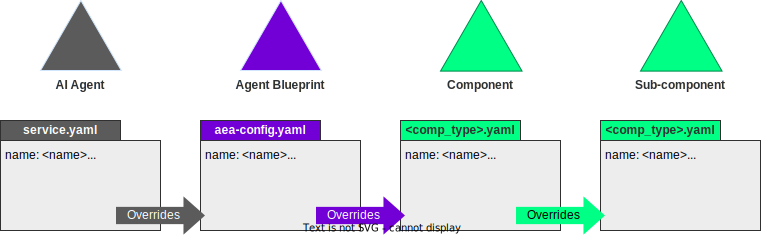

The AI agent configuration file `service.yaml` is a YAML file where the main attributes of the AI agent are set up, including the particular agent blueprint that defines the AI agent. An important feature of AI agent configuration files is that they can override attributes defined in agent blueprint or component configurations.


## The structure of the AI agent configuration file

The AI agent configuration file `service.yaml` is typically composed of AI-agent-specific attributes followed by additional YAML documents. Each additional document overrides the parameter of a specific agent blueprint or component configuration used by the AI agent, and they must begin with `---`.

???+ example

    Here is an example of the AI agent configuration file of the [Hello World AI agent](https://stack.olas.network/demos/hello-world/):

    ```yaml title="service.yaml"
    name: hello_world
    author: valory
    version: 0.1.0
    description: A simple demonstration of a simple ABCI application
    aea_version: '>=2.0.0, <3.0.0'
    license: Apache-2.0
    fingerprint:
      README.md: bafybeiapubcoersqnsnh3acia5hd7otzt7kjxekr6gkbrlumv6tkajl6jm
    fingerprint_ignore_patterns: []
    agent: valory/hello_world:0.1.0:bafybeig6p6shyx6wmih2xlzu3h6rd7gul3fxqhpdoi77qidqmpzxf33spm
    number_of_agents: 4
    deployment: {}
    dependencies: {}
    ---
    extra:
      benchmark_persistence_params:
        args: &id001
          log_dir: /benchmarks
    public_id: valory/hello_world_abci:0.1.0
    type: skill
    0:
      models:
        params:
          args:
            hello_world_message: ${MY_HELLO_WORLD_MESSAGE:str:HELLO_WORLD_AGENT_0}
        benchmark_tool:
          args: *id001
    1:
      models:
        params:
          args:
            hello_world_message: ${MY_HELLO_WORLD_MESSAGE:str:HELLO_WORLD_AGENT_1}
        benchmark_tool:
          args: *id001
    2:
      models:
        params:
          args:
            hello_world_message: ${MY_HELLO_WORLD_MESSAGE:str:HELLO_WORLD_AGENT_2}
        benchmark_tool:
          args: *id001
    3:
      models:
        params:
          args:
            hello_world_message: ${MY_HELLO_WORLD_MESSAGE:str:HELLO_WORLD_AGENT_3}
        benchmark_tool:
          args: *id001
    ---
    public_id: valory/ledger:0.19.0
    type: connection
    config:
      ledger_apis:
        ethereum:
          address: http://host.docker.internal:8545
          chain_id: 31337
          poa_chain: false
          default_gas_price_strategy: eip1559

    ```

     As you can see, the AI agent configuration file is overriding some attributes for the skill `valory/hello_world_abci` and the connection `valory/ledger`.
     Also, note how the attributes `hello_world_message` read their value from the  environment variable `MY_HELLO_WORLD_STRING` of type string, and take a default value if they are not defined.

There are a number of mandatory attributes that define the AI agent, which are summarized in the table below:

| Attribute                     | Description                                                                                                                                                                                           |
|-------------------------------|-------------------------------------------------------------------------------------------------------------------------------------------------------------------------------------------------------|
| `name`                        | AI agent name. It shall not contain spaces.                                                                                                                                                           |
| `author`                      | Author name.                                                                                                                                                                                          |
| `version`                     | AI Agent version, in the format `<major>.<minor>.<patch>`.                                                                                                                                            |
| `description`                 | Description of the AI agent.                                                                                                                                                                          |
| `aea_version`                 | {{open_aea}} version supported by the AI agent.                                                                                                                                                       |
| `license`                     | License identifier.                                                                                                                                                                                   |
| `fingerprint`                 | List with entries `<file>: <hash>` for all the files that compose the AI agent.                                                                                                                       |
| `fingerprint_ignore_patterns` | Filename patterns to be ignored.                                                                                                                                                                      |
| `agent`                       | Agent blueprint, in the form `<agent_public_id>:<version>:<hash>`.                                                                                                                                    |
| `number_of_agents`            | Number of agent instances that the AI agent is composed of.                                                                                                                                 |
| `deployment`                  | External deployment configuration for [publishing container ports](#publish-container-ports).                                                                                                         |
| `dependencies`                | Python dependencies to include in the runtime image [publishing container ports](#publish-container-ports).                                                                                           |

## AI-agent-level overrides

The {{open_aea}} framework already has the notion of [component overrides](https://stack.olas.network/open-aea/overrides/): if a component uses another component, the former can override configuration values of the sub-component.

Similarly, the {{open_autonomy}} framework has the notion of AI-agent-level overrides. You can define them in the AI agent configuration file `service.yaml`, which will be used to generate the deployment environment for the agent instances.

AI-agent-level overrides follow the mandatory AI-agent-specific attributes, separated by `---`.
You can, for example, override the default `HELLO_WORLD!` string that each agent instances prints on their console in the [Hello World AI agent](https://stack.olas.network/demos/hello-world/), which is originally defined in the `hello_world_abci` skill.

```yaml title="service.yaml"
name: hello_world
author: valory
version: 0.1.0
description: A simple demonstration of a simple ABCI application
aea_version: '>=2.0.0, <3.0.0'
license: Apache-2.0
fingerprint:
  README.md: bafybeiapubcoersqnsnh3acia5hd7otzt7kjxekr6gkbrlumv6tkajl6jm
fingerprint_ignore_patterns: []
agent: valory/hello_world:0.1.0:bafybeig6p6shyx6wmih2xlzu3h6rd7gul3fxqhpdoi77qidqmpzxf33spm
number_of_agents: 4
---
public_id: valory/hello_world_abci:0.1.0
type: skill
models:
  params:
    args:
      hello_world_message: Hello world!
```

Note that AI-agent-level overrides take precedence over agent-blueprint-level overrides, and agent-blueprint-level overrides take precedence over component-level overrides.

<figure markdown>

<figcaption>Overrides precedence</figcaption>
</figure>


You can define values for overridden attributes in two ways:

1. Directly assign a hardcoded value, for example:
   ```yaml
   hello_world_message: HELLO_WORLD!
   ```

2. Use an environment variable with a default value using the syntax
   ```yaml
   <overridden_attribute>: ${<env_var_name>:<type>:<default_value>}  
   ```
   for example:
   ```yaml
   hello_world_message: ${MY_HELLO_WORLD_MESSAGE:str:HELLO_WORLD!}   
   ```
   In this case, the environment variable `MY_HELLO_WORLD_MESSAGE` will be read by the agent instance in runtime. If not found, the default value `HELLO_WORLD!` will be used.


### Multiple overrides

You can override different values for different agent instances in the AI agent configuration file with the multiple override feature, using the pattern below:

```yaml title="service.yaml"
# (...)
---
public_id: valory/hello_world_abci:0.1.0
type: skill
<agent_number>:
  <overridden_attributes>
```

!!! warning "Important"
    If you choose to use the multiple override feature, you have to define overrides for **every** single agent instance that composes the AI agent.

???+ example

    If you wish that each agent instance outputs a different message in the [Hello World AI agent](https://stack.olas.network/demos/hello-world/) with four agent instances, you can define the following multiple override in the `service.yaml` file:

    ```yaml title="service.yaml"
    # (...)
    ---
    public_id: valory/hello_world_abci:0.1.0
    type: skill
    0:
      models:
        params:
          args:
            hello_world_message: Hello, from agent instance 0
    1:
      models:
        params:
          args:
            hello_world_message: Hello, from agent instance 1
    2:
      models:
        params:
          args:
            hello_world_message: Hello, from agent instance 2
    3:
      models:
        params:
          args:
            hello_world_message: Hello, from agent instance 3
    ```

If you have repetitive overridden parameters, you can define them using [YAML anchors](https://yaml.org/spec/1.2.2/) under the section `extra`, and reference them when defining overrides for different agent instances.

???+ example

    In this example, we define a YAML anchor with label `&id001` to avoid repeating the same configuration of the `args` parameter in all the agent instances.

    ```yaml title="service.yaml"
    # (...)
    ---
    extra:
      benchmark_tool:
        args: &id001
          log_dir: /benchmarks
    public_id: valory/hello_world_abci:0.1.0
    type: skill
    0:
      models:
        params:
          args:
            hello_world_message: Hello, from agent instance 0
        benchmark_tool:
          args: *id001
    1:
      models:
        params:
          args:
            hello_world_message: Hello, from agent instance 1
        benchmark_tool:
          args: *id001
    2:
      models:
        params:
          args:
            hello_world_message: Hello, from agent instance 2
        benchmark_tool:
          args: *id001
    3:
      models:
        params:
          args:
            hello_world_message: Hello, from agent instance 3
        benchmark_tool:
          args: *id001
    ```

## Export to environment variables

When building the deployments, the overrides from the AI agent components are exported as system environment variables inside the Docker containers and picked up at runtime by the agent instances. The exported environment variables are labelled with their upper case JSON path:

```
<COMPONENT_TYPE>_<UPPERCASE_ATTRIBUTE_PATH>=<value>
```

Note that when deploying an AI agent, environment variables are defined separately within each agent instance container. Therefore, even if you use the multiple override feature to define a different value per agent instance, their respective environment variable within the container will have the same name.

???+ example

    If you have an override like
    ```yaml title="service.yaml"
    # (...)
    ---
    public_id: valory/hello_world_abci:0.1.0
    type: skill
    models:
      params:
        args:
          hello_world_message: Hello world!
    ```
    it will export the environment variable `SKILL_MODELS_PARAM_ARGS_HELLO_WORLD_MESSAGE`.

    On the other hand, if you use the multiple override feature and you have something like
    ```yaml title="service.yaml"
    # (...)
    ---
    public_id: valory/hello_world_abci:0.1.0
    type: skill
    0:
      models:
        params:
          args:
            hello_world_message: Hello, from agent instance 0
    1:
      models:
        params:
          args:
            hello_world_message: Hello, from agent instance 1
    2:
      models:
        params:
          args:
            hello_world_message: Hello, from agent instance 2
    3:
      models:
        params:
          args:
            hello_world_message: Hello, from agent instance 3
    ```
    it will also export the environment `SKILL_MODELS_PARAM_ARGS_HELLO_WORLD_MESSAGE` within each agent instance container. However each such variable will have a different value inside each container, that is, `Hello, from agent instance 0`, `Hello, from agent instance 1`, etc.

Exported environment variables require such specific format because they are used by the constituent agent instances and skills. Read about [component overrides](https://stack.olas.network/open-aea/overrides/) in the {{open_aea}} framework for more information.

### Export complicated data structures

If you have nested lists the environment export rules will differ as per the inner data structures. If the list is a strict list, meaning the inner values are either primitive data types like `int`, `str`, `float` or `boolean`, the list will be exported as a JSON string.

???+ example

    If you have an override like
    ```yaml title="service.yaml"
    # (...)
    ---
    public_id: vendor/hello_world_abci:0.1.0
    type: skill
    models:
      params:
        args:
          simple_list:
            - 1
            - 2
            - 3
          nested_list:
          - - foo
            - bar
          - - "hello"
            - "world"
    ```
    it will export the environment variables

    - `SKILL_HELLO_WORLD_ABCI_MODELS_PARAMS_ARGS_SIMPLE_LIST='[1, 2, 3]'`,
    - `SKILL_HELLO_WORLD_ABCI_MODELS_PARAMS_ARGS_NESTED_LIST='[["foo", "bar"], ["hello", "world"]]'`.


If an overridden list contains mapping values, it will be exported as
```
<COMPONENT_TYPE>_<UPPERCASE_ATTRIBUTE_PATH>_<MAPPING_INDEX>_KEY=<value>
```

???+ example

    If you have an override like
    ```yaml title="service.yaml"
    # (...)
    ---
    public_id: valory/hello_world_abci:0.1.0
    type: skill
    models:
      params:
        args:
          list_with_mappings:
            - key: value_0
            - key: value_1
    ```
    it will export the environment variables

    - `SKILL_HELLO_WORLD_ABCI_MODELS_PARAMS_ARGS_LIST_WITH_MAPPINGS_0_KEY='value_0'`,
    - `SKILL_HELLO_WORLD_ABCI_MODELS_PARAMS_ARGS_LIST_WITH_MAPPINGS_1_KEY='value_1'`.

So when defining the agent blueprint/component level overrides you will have to explicitly define all the elements of the list like this:

```yaml title="service.yaml"
# (...)
---
public_id: valory/hello_world_abci:0.1.0
type: skill
models:
  params:
    args:
      list_with_mappings:
        - key: ${<env_var_name>:<type>:<default_value>}
        - key: ${<env_var_name>:<type>:<default_value>}
```

## Publish container ports

We use a syntax similar to Docker for [port publishing](https://docs.docker.com/config/containers/container-networking/#published-ports). To expose agent instance container ports to host machine ports use the following configuration:

```yaml title="service.yaml"
# (...)
deployment:
  agent:
    ports:
      <agent_id>:
        <host_machine_port>: <agent_container_port>
  tendermint:
    ports:
      <node_id>:
        <host_machine_port>: <node_container_port>
```

Port publishing also works with [multiple overrides](#multiple-overrides). For example if you want to map port `8080` of agent instance 0 to port `8081` of the host machine, use:

```yaml title="service.yaml"
# (...)
deployment:
  agent:
    ports:
      0:
        8081: 8080
  tendermint:
    ports:
      0:
        26656: 26656
```

You can also configure these mappings using environment variables:

```yaml title="service.yaml"
# (...)
deployment:
  agent:
    ports:
      0:
        8081: ${AGENT_0_HTTP_PORT:int:8080}
  tendermint:
    ports:
      0:
        26656: ${TM_NODE_0_P2P_PORT:int:26656}
```

## Mount volumes for agent instance data

Custom volumes can be mounted using the `deployment` configuration.

```yaml title="service.yaml"
# (...)
deployment:
  agent:
    volumes:
      <host_dir>: <container_dir>
```

Or specify volumes specific to agent instance

```yaml title="service.yaml"
# (...)
deployment:
  agent:
    volumes:
      <agent_index>:
        <host_dir>: <container_dir>
```

For example, if you want to mount `./data` directory as `/data` volume

```yaml title="service.yaml"
# (...)
deployment:
  agent:
    volumes:
      ./data: /data
```

and

```yaml title="service.yaml"
# (...)
deployment:
  agent:
    volumes:
      0:
        ./data_0: /data
      1:
        ./data_1: /data
```

**Note**: When specifying the host directory path, use absolute path instead of relative path to avoid mounting related errors.

## Override agent blueprint/component dependencies

AI agent level dependencies can be defined using following format

```yaml title="service.yaml"
# (...)
dependencies:
  pypi-package:
    version: ==1.0.0
  git-package:
    git: https://github.com/valory-xyz/open-autonomy
    ref: 79342a93079648ef03ab5aaf14978068fc96587a
```

The dependencies defined at the AI agent level will take priority over the dependencies defined at the agent blueprint or component level. This means, if you define some dependency `pypi-package==1.0.0` at the agent blueprint/component level and re-define it as `py-package==1.1.0` at the AI agent level, `py-package==1.1.0` will get installed when building the agent blueprint image following the `AI agent > agent blueprint > skill > connection > contract > protocol` priority order.
