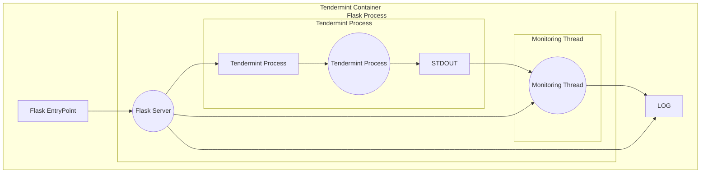
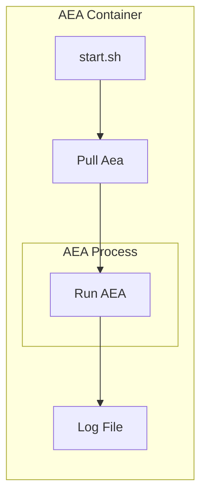
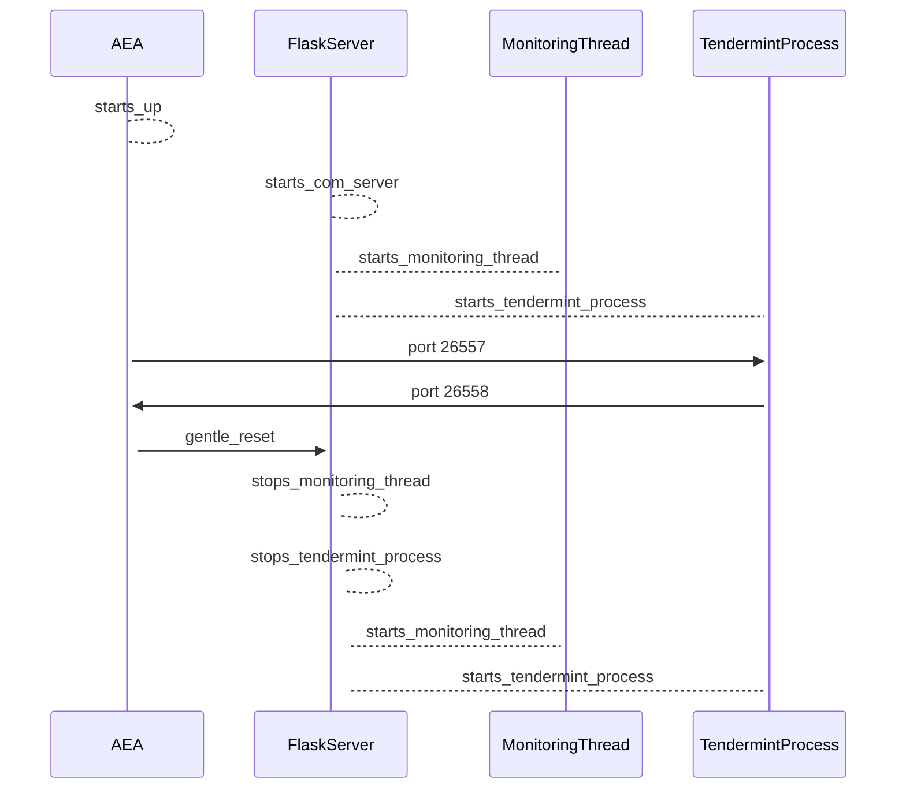
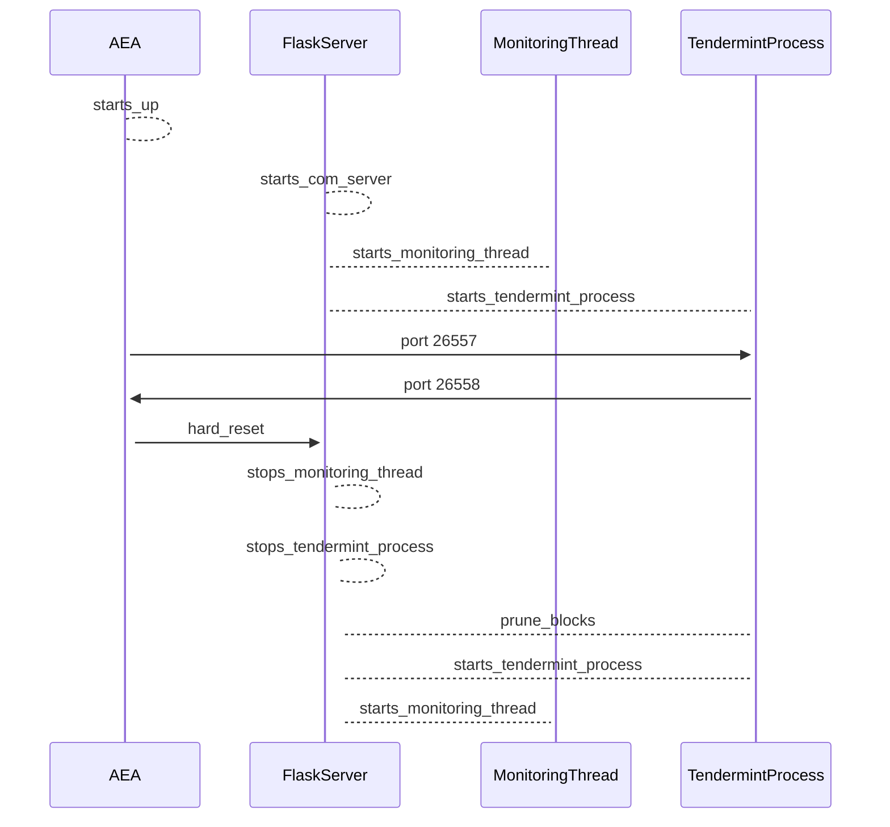
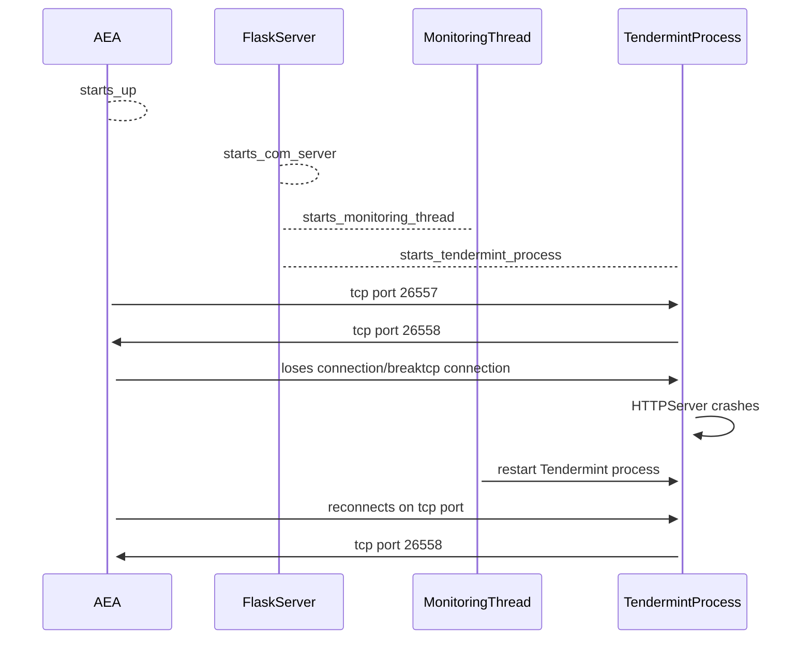
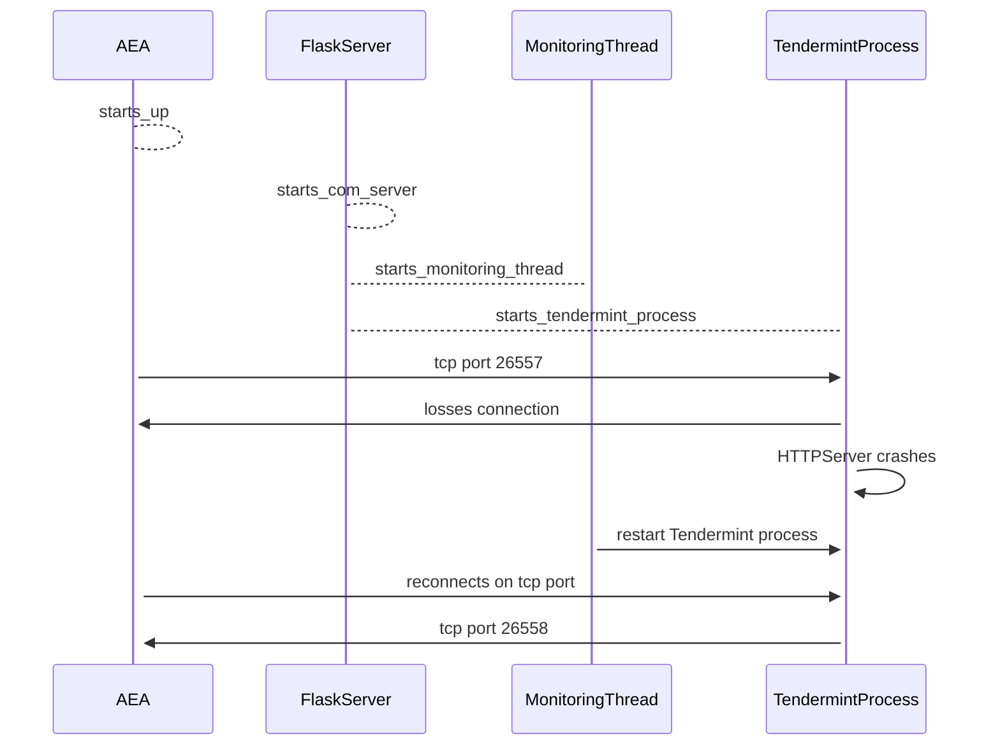

# Application Control Flow

Within a deployment, each individual tendermint node consists of a:
- Tendermint Node
- ABCI application

Each of these is implemented as a docker image which is deployed in a 1-2-1 relationship.

The tendermint image is implemented as a flask server built on top of the ```valory/tendermint``` image.

## Tendermint Image control flow. 






# Gentle Restart flow

This can viewed in the logs as;
```bash

tail -f /logs/node_0.txt

Monitoring thread terminated
Tendermint process stopped
Tendermint process started
Monitoring thread started

```


# Hard Restart flow


```bash
E[2022-05-11|13:45:41.355] abci.socketClient failed to connect to tcp://localhost:26658.  Retrying after 3s... module=abci-client connection=query err="dial tcp 127.0.0.1:26658: connect: connection refused"
Monitoring thread terminated
Tendermint process stopped
Tendermint process started
Monitoring thread started
I[2022-05-11|13:45:41.450] Starting multiAppConn service                module=proxy impl=multiAppConn
```

Simultaneously, the flask server will display;

```
I[2022-05-11|13:45:41.389] Removed existing address book                module=main file=/tendermint/node1/config/addrbook.json
I[2022-05-11|13:45:41.389] Removed all blockchain history               module=main dir=/tendermint/node1/data
I[2022-05-11|13:45:41.395] Reset private validator file to genesis state module=main keyFile=/tendermint/node1/config/priv_validator_key.json stateFile=/tendermint/node1/data/priv_validator_state.json
```


# AEA Network interruption Flow



# Tendermint Network interruption Flow


