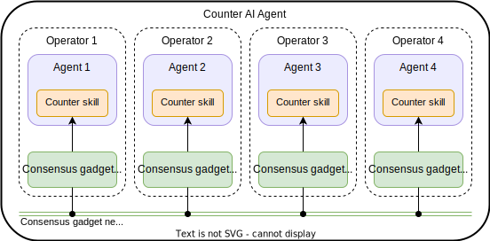

# Counter Agent Service Demo

This demo shows how to run an agent service implementing a counter.
It is a simple example that illustrates how state-machine replication is achieved across different agents through the consensus gadget, which is Tendermint, in this case. Note that, unlike the remaining demos, due to its simplicity, the business logic of this service is not encoded as an {{fsm_app}}. Rather, it is implemented as a simple skill (`counter`) containing an `ABCIHandler`. The skill does not contain proactive behaviours, which means that no client calls are made to the consensus gadget.

## Architecture of the Demo

This demo is composed of:

- A set of four [Tendermint](https://tendermint.com/) nodes (`node0`, `node1`, `node2`, `node3`).
- A set of four AEAs (`abci0`, `abci1`, `abci2`, `abci3`), in one-to-one connection with their corresponding Tendermint
node.

<figure markdown>

<figcaption>Architecture of the Counter demo</figcaption>
</figure>


## Running the Demo
The steps below will guide you to download the counter agent service configuration from the Service Registry, build and run a deployment that will run locally.

1. Ensure that your machine satisfies the [framework requirements](guides/quick_start.md#requirements) and that
you have followed the [setup instructions](guides/quick_start.md#setup). As a result you should have a Pipenv workspace folder.

2. Use the CLI to download the `valory/counter` service.
    ```bash
    autonomy fetch valory/counter:0.1.0:bafybeide5newoe636fdtzib46kt3lhc5ls22fvnsymwxnbri6k3gevqjbe --remote --service
    cd counter
    ```

3. Inside the workspace folder, create a JSON file `keys.json` containing the addresses and keys of the four agents that are
   part of this demo. Below you have a sample `keys.json` file that you can use for testing.

    !!! warning "Important"
        Use these keys for testing purposes only. **Never use these keys in a production environment or for personal use.**

        ```json
        [
          {
              "address": "0x15d34AAf54267DB7D7c367839AAf71A00a2C6A65",
              "private_key": "0x47e179ec197488593b187f80a00eb0da91f1b9d0b13f8733639f19c30a34926a"
          },
          {
              "address": "0x9965507D1a55bcC2695C58ba16FB37d819B0A4dc",
              "private_key": "0x8b3a350cf5c34c9194ca85829a2df0ec3153be0318b5e2d3348e872092edffba"
          },
          {
              "address": "0x976EA74026E726554dB657fA54763abd0C3a0aa9",
              "private_key": "0x92db14e403b83dfe3df233f83dfa3a0d7096f21ca9b0d6d6b8d88b2b4ec1564e"
          },
          {
              "address": "0x14dC79964da2C08b23698B3D3cc7Ca32193d9955",
              "private_key": "0x4bbbf85ce3377467afe5d46f804f221813b2bb87f24d81f60f1fcdbf7cbf4356"
          }
        ]
        ```

4. Build the required image
    ```bash
    autonomy build-image
    ```
    The command above generates the required images to run the agent service.

5. Build a deployment setup for the demo service:
    ```bash
    autonomy deploy build keys.json -ltm
    ```

    This will build the deployment setup required to run the service locally.
    !!!note
        It is also possible to generate a deployment using a local service configuration. See the Commands section for the complete details.

6. The build configuration will be located in `./abci_build`. Run the deployment using
    ```bash
    cd abci_build
    autonomy deploy run
    ```

    This will deploy a local counter service with four agents connected to four Tendermint nodes.

7. The logs of a single agent or [Tendermint](https://tendermint.com/) node can be inspected in another terminal with, e.g.,
    ```bash
    docker logs <container_id> --follow
    ```
    where `<container_id>` refers to the Docker container ID for either an agent
    (`abci0`, `abci1`, `abci2` and `abci3`) or a Tendermint node (`node0`, `node1`, `node2` and `node3`).


## Interacting with the Demo

Recall that each agent has the skill `counter`, and the consensus gadget (Tendermint) manages the consensus protocol for incoming transactions. The `counter` skill implements the `ABCICounterHandler` which receives (and responds to) callbacks from the Tendermint network when certain events happen, in particular, when a client sends a transaction to the local blockchain managed by Tendermint.

Once the agent service is up, you can interact with it.
The four Tendermint nodes, `node0`, `node1`, `node2`, and `node3`, are listening at ports `26657`, `26667`, `26677`, and `26687`, respectively.
To query the state of the service from Tendermint `node0`, execute the following HTTP request:

```
curl http://localhost:26657/abci_query
```

What will happen behind the scenes is that the Tendermint node `node0`
will send a `request_query` ABCI request to the agent `abci0` which will be handled by the `ABCICounterHandler`. The handler will reply
with a `response_query` ABCI response, containing the current state of the service.

The response to this HTTP request above is:
```
{
  "jsonrpc": "2.0",
  "id": -1,
  "result": {
    "response": {
      "code": 0,
      "log": "value: 0",
      "info": "",
      "index": "0",
      "key": null,
      "value": "AAAAAA==",
      "proofOps": {
        "ops": []
      },
      "height": "0",
      "codespace": ""
    }
  }
}
```

As you can see from the `log` field, the counter is initialized at `0`.
`value` contains the `base64` encoding of the bytes of the data,
representing the app state.

You can verify that running the same query against the other
nodes will give you the same response, e.g.

```bash
curl http://localhost:26667/abci_query
```

### Send a Transaction

To send a transaction and update the ABCI application state:

```bash
curl http://localhost:26657/broadcast_tx_commit\?tx\=0x01
```

where `0x01` is the new value for the distributed counter.

Once the request is received, the Tendermint node will
first check that the transaction is indeed valid against
the current state of the application by sending
a `check_tx` request to the ABCI application.
If so, the transaction will be added to the mempool
of pending transactions.

In our case, since the state before the transaction was `0x00`,
and since `0x01` is a unitary increment of the counter,
the transaction is valid.

After the Tendermint network managed to reach a consensus,
the command above receives this HTTP response:

```
{
  "jsonrpc": "2.0",
  "id": -1,
  "result": {
    "check_tx": {
      "code": 0,
      "data": null,
      "log": "valid transaction.",
      "info": "OK: the next count is a unitary increment.",
      "gas_wanted": "0",
      "gas_used": "0",
      "events": [],
      "codespace": ""
    },
    "deliver_tx": {
      "code": 0,
      "data": null,
      "log": "",
      "info": "",
      "gas_wanted": "0",
      "gas_used": "0",
      "events": [],
      "codespace": ""
    },
    "hash": "4BF5122F344554C53BDE2EBB8CD2B7E3D1600AD631C385A5D7CCE23C7785459A",
    "height": "3"
  }
}
```

The `check_tx` part is the response of the ABCI app when the
transaction was received and checked,
and `deliver_tx` is the response of the ABCI app after the transaction was applied
to the state.
The `info` field of the `check_tx` response:
```
OK: the next count is a unitary increment.
```
describes
the reason why the transaction is considered valid by the ABCI application.

Note that we would have obtained the same result
by interacting with another available Tendermint node;
you can try by replacing the port `26657`
with one of `26667`, `26677` and `26687`.

If, say, we had sent the transaction `0x02` instead of the
only legal one `0x01`, we would have got the following response:

```
{
  "jsonrpc": "2.0",
  "id": -1,
  "result": {
    "check_tx": {
      "code": 1,
      "data": null,
      "log": "invalid transaction.",
      "info": "ERROR: the next count must be a unitary increment.",
      "gas_wanted": "0",
      "gas_used": "0",
      "events": [],
      "codespace": ""
    },
    "deliver_tx": {
      "code": 0,
      "data": null,
      "log": "",
      "info": "",
      "gas_wanted": "0",
      "gas_used": "0",
      "events": [],
      "codespace": ""
    },
    "hash": "DBC1B4C900FFE48D575B5DA5C638040125F65DB0FE3E24494B76EA986457D986",
    "height": "0"
  }
```
The `info` field of the `check_tx` response:
```
ERROR: the next count must be a unitary increment.
```
describes  the reason why the transaction has been rejected.

Now, the query request
```bash
curl http://localhost:26667/abci_query
```

returns the updated counter value:
```
{
  "jsonrpc": "2.0",
  "id": -1,
  "result": {
    "response": {
      "code": 0,
      "log": "value: 1",
      "info": "",
      "index": "0",
      "key": null,
      "value": "AAAAAQ==",
      "proofOps": {
        "ops": []
      },
      "height": "0",
      "codespace": ""
    }
  }
}
```

### Interact through an AEA

In this section we will see an example of
how to use an AEA to interact with the Tendermint network built above.

First, open a terminal to the root of this repository,
and fetch the `counter_client` agent:

```bash
autonomy fetch valory/counter_client:0.1.0:bafybeig6i2nhbifc4yenj4sx6q4xh75lgum2t4fs2r4ts2yezzynkur2pq --remote
```

This will copy the agent project in the `counter_client` directory.

Then, enter into the project, and generate a private key:
```bash
cd counter_client
autonomy generate-key ethereum
autonomy install
```

You can see the Tendermint node the skill is configured to interact with
using the following command:
```bash
autonomy config get vendor.valory.skills.counter_client.models.params.args.tendermint_url
```

It will print `localhost:26657`, i.e. `node0`.

Finally, run the agent:
```bash
autonomy run
```

The agent periodically checks the current value of the counter;
this behaviour is implemented in the `MonitorBehaviour` of the
`counter_client` skill.
Moreover, it periodically sends a transaction to increment the
value of the counter; this behaviour is implemented in the
`IncrementerBehaviour` of the `counter_client` skill.

The output of the run should be something like:

```text
    _     _____     _
   / \   | ____|   / \
  / _ \  |  _|    / _ \
 / ___ \ | |___  / ___ \
/_/   \_\|_____|/_/   \_\

v1.0.2

Starting AEA 'counter_client' in 'async' mode...
info: [counter_client] Start processing messages...
info: [counter_client] [2021-08-05T20:00:05.783576] Sending transaction with new count: 1
info: [counter_client] [2021-08-05T20:00:05.793780] The counter value is: 0
info: [counter_client] [2021-08-05T20:00:06.817543] The counter value is: 1
info: [counter_client] [2021-08-05T20:00:06.817852] Update current state: 1
info: [counter_client] [2021-08-05T20:00:07.816933] The counter value is: 1
info: [counter_client] [2021-08-05T20:00:08.784843] Sending transaction with new count: 2
info: [counter_client] [2021-08-05T20:00:08.838607] The counter value is: 1
info: [counter_client] [2021-08-05T20:00:09.822670] The counter value is: 2
info: [counter_client] [2021-08-05T20:00:09.823049] Update current state: 2
info: [counter_client] [2021-08-05T20:00:10.823978] The counter value is: 2
info: [counter_client] [2021-08-05T20:00:11.785852] Sending transaction with new count: 3
info: [counter_client] [2021-08-05T20:00:11.830393] The counter value is: 2
info: [counter_client] [2021-08-05T20:00:12.829347] The counter value is: 3
info: [counter_client] [2021-08-05T20:00:12.829746] Update current state: 3
info: [counter_client] [2021-08-05T20:00:13.826483] The counter value is: 3
info: [counter_client] [2021-08-05T20:00:14.787033] Sending transaction with new count: 4
info: [counter_client] [2021-08-05T20:00:14.838130] The counter value is: 3
info: [counter_client] [2021-08-05T20:00:15.826483] The counter value is: 4
info: [counter_client] [2021-08-05T20:00:15.826825] Update current state: 4
info: [counter_client] [2021-08-05T20:00:16.831485] The counter value is: 4
(...)
```
