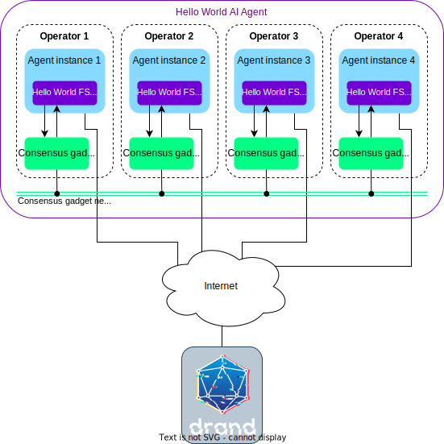

This demo service is aimed at giving a general, introductory overview on what are the main elements that make an agent service and how they work together. The goal is to provide a global understanding on the development process and the relationship between the main components of the stack to new users of the {{open_autonomy}} framework.

Although the functionality of this agent service is very simple, it demonstrates a number of features that are common in many agent services. It can also be considered as a baseline service to which more complex functionalities can be added towards building your own service.


## Architecture of the demo
The demo is composed of:

- A set of four [Tendermint](https://tendermint.com/) nodes (`node0`, `node1`, `node2`, `node3`).
- A set of four AEAs (`abci0`, `abci1`, `abci2`, `abci3`), in one-to-one connection with their corresponding Tendermint
node.

The agents connect to the remote [DRAND](https://drand.love) service during the execution
of the demo.

<figure markdown>
  {align=center}
  <figcaption>Hello World service demo architecture with four agents</figcaption>
</figure>

## Running the demo
Before running the demo, ensure that your machine satisfies the [framework requirements](../guides/set_up.md#requirements) and that
you have followed the [setup instructions](../guides/set_up.md#setup). As a result you should have a Pipenv workspace folder.

Running the Hello World service demo is demonstrated in the [quick start](../guides/quick_start.md) guide. Therefore, you just need to follow the instructions therein to run the demo.


## Details of the demo
The functionality of the service is extremely simple. Namely, each agent will output (at different times) the following message to its local console:
```
Agent [name] (address [address]) in period [period_num] says: HELLO_WORLD!
```

The execution timeline is divided into periods, and within each period, *only one designated agent will print the `HELLO_WORLD!` message*. The other agents will just print a neutral face `:|`. In the context of agent services, you cam think of a *period* as an interval where the service executes an iteration of its intended functionality (e.g., checking some price on a market, execute an investment strategy, or in this demo, printing a message).

Recall that agents are coordinated through the *consensus gadget* (i.e., the consensus gadget nodes + the consensus gadget network). For clarity, we will be using the simplified architecture diagram depicted below.

<figure markdown>
{align="center"}
<figcaption>A simplified view of the Hello world service architecture</figcaption>
</figure>


!!! warning "Important"

    Every agent service is connected to the *consensus gadget* through its *consensus gadget node*:

    * The consensus gadget is the component that makes possible for the agents to synchronise state data. This allows them to, e.g. reach agreement on certain actions or reconcile information.

    * Anything happening at the consensus network level is completely abstracted away so that developers can see it as a given functionality. An application run by the agent service can be thought and developed as a single "virtual" application, and the framework will take care of replicating it.

    * Currently, the consensus gadget is implemented using [Tendermint](https://tendermint.com/).


This is what the service would look like in all its glory:

<figure markdown>

<figcaption>Hello World service in action</figcaption>
</figure>

Even though printing `HELLO_WORLD!` on a local console is far from being an exciting functionality, this example shows a number of  non-trivial elements that are key components in many agent services:

* The service defines a sequence of individual, well-defined actions, whose execution in the appropriate order achieves the intended functionality.
* Agents have to interact with each other to execute each of those actions, and reach a consensus on a number of decisions at certain moments (e.g., which is the agent that prints the message in each period).
* Agents are also allowed to execute actions on their own. In this simple example it just consists of printing a local message.
* Agents have to use a shared, global store for persistent data (e.g., which was the last agent that printed the message).
* Finally, the service can progress even if some agent is faulty or malicious (up to a certain threshold of malicious agents).

In this toy example we assume that the agent that is charge of printing the message locally will do so (i.e., it will behave honestly). Moreover, there is no way for the other agents to verify it. When a service implements some critical operation, like sending a transaction to a blockchain, it is not enough with trusting that the agent will behave honestly, and further security and cryptographic mechanisms will be required.

The main questions that we try to answer in the sections below are:

* What are the main components of the {{open_autonomy}} framework to implement an agent service?
* How do agents interact with such components?

### The FSM of an agent service

As discussed in the [overview of the development process](../guides/overview_of_the_development_process.md), the first step when designing an agent service is to define the [FSM](../key_concepts/fsm.md) that represents its business logic. In order to do so, we need to divide the intended functionality into individual steps, and define what events cause a transition from one to another. For example, for the Hello World service, we identify these steps as follows:

1. Each agent registers to the service.
2. [If Step 1 OK] Agents connect to the remote [DRAND](https://drand.love) service and retrieve the latest randomness available.
3. [If Step 2 OK] Agents select which is the next agent to print the message. We call this agent the _keeper_ for this period.
4. [If Step 3 OK] The keeper prints the message `HELLO_WORLD!` on its local console.
5. Pause for a while and go to Step 2. Another service period begins.

Probably you have identified some of these steps beforehand. Let us make some comments about them. Step 1 is a requirement in each agent service: it is simply a preliminary stage where each agent commits to participate actively in the service. In Step 2 all agents connect to a remote service to retrieve some random value. Note that agents cannot use a local source of randomness: it is very important that all the agents execute deterministic actions at each step, otherwise it will be impossible to synchronize their shared state. Therefore, given such a common randomness value, agent choose the same keeper in Step 3. Next, Step 4, is where the main functionality is executed. Finally, Step 5 is also a standard step in agent services that execute periodic actions in a loop (like the Hello World service). It makes agents "sleep" before the new period starts.

Graphically, the FSM of the Hello Word service looks as follows

<figure markdown>

<figcaption>Diagram of individual operations of the Hello World service</figcaption>
</figure>

You can also take a look at the Hello World service FSM specification file, which can be parsed by the {{open_autonomy}} framework.

??? example "Example of the Hello World service `fsm_specification.yaml` file"

    ```yaml
    alphabet_in:
    - DONE
    - NO_MAJORITY
    - RESET_TIMEOUT
    - ROUND_TIMEOUT
    default_start_state: RegistrationRound
    final_states: []
    label: packages.valory.skills.hello_world_abci.rounds.HelloWorldAbciApp
    start_states:
    - RegistrationRound
    states:
    - CollectRandomnessRound
    - PrintMessageRound
    - RegistrationRound
    - ResetAndPauseRound
    - SelectKeeperRound
    transition_func:
        (CollectRandomnessRound, DONE): SelectKeeperRound
        (CollectRandomnessRound, NO_MAJORITY): CollectRandomnessRound
        (CollectRandomnessRound, ROUND_TIMEOUT): CollectRandomnessRound
        (PrintMessageRound, DONE): ResetAndPauseRound
        (PrintMessageRound, ROUND_TIMEOUT): RegistrationRound
        (RegistrationRound, DONE): CollectRandomnessRound
        (ResetAndPauseRound, DONE): CollectRandomnessRound
        (ResetAndPauseRound, NO_MAJORITY): RegistrationRound
        (ResetAndPauseRound, RESET_TIMEOUT): RegistrationRound
        (SelectKeeperRound, DONE): PrintMessageRound
        (SelectKeeperRound, NO_MAJORITY): RegistrationRound
        (SelectKeeperRound, ROUND_TIMEOUT): RegistrationRound
    ```


Ignoring network latency and delays caused by the underlying consensus gadget, it can be considered that at any given time, **all the agents have the same view of the service FSM**, and **all the agents execute the same transitions**. This is one of the key concepts of the {{open_autonomy}} framework.

Each agent runs internally a component that implements such FSM: it processes events and transits to the corresponding states according to the state-transition function. The component that encapsulates this functionality is a skill called **{{fsm_app}}**. For the Hello World service, such {{fsm_app}} is called `hello_world_abci`. A zoom on an agent would look like this:

<figure markdown>

<figcaption>Zoom on a Hello World service agent.</figcaption>
</figure>

An agent can have one or multiple skills, in addition to several other components. Skills can implement a variety of functionalities, not only {{fsm_app}}s, but this is out of the scope of this tutorial.

!!! warning "Important"

    All agents in an agent service are implemented by the same codebase. We call such codebase a _canonical agent_, and we call each of the actual instances an _agent instance_, or simply _agent_ for short.
    Each agent instance in a service is then parameterized with their own set of keys, addresses and other required attributes.

### Transitioning through the FSM

To understand how an agent in the service transitions through the FSM let us focus on a concrete example. Namely, let us focus on what happens on a particular agent when the service is located in the SelectKeeper state, and how it transitions to the next state (PrintMessage). At high level, this is what happens:

1.  **Prepare the payload.** Each state of the FSM has an associated component called _Behaviour_, which is in charge of executing the action corresponding to that state. In this case, the `SelectKeeperBehaviour` determines what agent will be voted for as the new keeper. Since the choice must be deterministic, each agent will vote for "Agent $R\pmod 4+1$," where $R$ is the randomness value collected in the previous state (CollectRandomness). Thus, the `SelectKeeperBehaviour` prepares an appropriate _payload_ that contains that information.

    


2.  **Send the payload.** The `SelectKeeperBehaviour` is in charge of casting the vote to the consensus gadget.

    


3.  **Reach consensus.** The consensus gadget reads all the agents' outputs, and ensures that the collection of responses observed is consistent. The gadget takes the responsibility of executing the consensus algorithm, which is abstracted away to the developer.

    

    !!! note
        "Reaching consensus" does not mean that the consensus gadget ensures that all the agents send the same payload. Rather, it means that all the agents have a _consistent view_ on what payload was sent by each of them. In this particular case, however all agents cast the same vote.


4.  **Callback to the {{fsm_app}}.** Once the consensus phase is finished (and stored in a temporary blockchain maintained by the agents), each agent is notified with the corresponding information via the [ABCI interface](../key_concepts/abci.md).

    


    Each FSM state is also associated to a special component called _Round_, which receives and processes this information. If strictly more than $2/3$ of the agents voted for a certain keeper, then the `SelectKeeperRound` records this result persistently for future reference. After finalizing all this processing, the `SelectKeeperRound` outputs the event that indicates how the FSM should transit. If nothing unexpected occurred, it should be the `DONE` event.


6.  **Transition to the next state.** The event cast in the previous step is received by the component that actually manages the FSM transition function (_AbciApp_). This component processes the event accordingly and moves the FSM to the next state.

    


!!! warning "Important"

    As illustrated by the example above, there are a number of components from the {{fsm_app}} that need to be defined in order to build an agent service. As a summary:

    * **`AbciApp`**: The component that defines the FSM itself and the transitions between states.
    * **`Behaviours`**: The components that execute the proactive action expected at each state: e.g. cast a vote for a keeper, print a message on screen, execute a transaction on a blockchain, etc.
    * **`Rounds`**: The components that process the input from the consensus gadget and outputs the appropriate events to make the next transition.
    * **`Payloads`**: Associated to each behaviour. They define the contents of the transactions sent by the corresponding behaviour.
    * **`RoundBehaviour`**: This can be seen as the main class of the skill, which aggregates the `AbciApp` and ensures to establish a one-to-one relationship between the rounds and behaviours associated to each state of the FSM.

    There must be exactly one `Round` and one `Behaviour` per FSM state.


At this point, the walk-through of a single transition from one state of the FSM, has essentially introduced the main components of an agent and the main interactions that occur in an agent service. It is important that the developer keeps these concepts in mind, since executions of further state transitions can be easily mapped with what has been presented here so far.

### Executing the main functionality

At this point, the service has only transitioned to a new state on its FSM. But, what would happen in an actual execution of the service functionality?

Mimicking the steps that occurred in the previous state, it is not difficult to see that this is what would actually happen:

1.   Upon entering the PrintMessage state, the associated behaviour, `PrintMessageBehaviour`, will be in charge of executing the functionality. For the chosen keeper, it will be printing the celebrated `HELLO_WORLD` message. The rest of the agents simply print a neutral face.
2.   The `PrintMessageBehaviour` will send a payload to the consensus gadget, indicating what was the message it printed. In this case, the payload is not very useful (the service does not do anything with it), but it is a requirement to send some payload to know that the agent has finished executing the Behaviour.
3.   The consensus gadget executes its protocol on the inputs received from the agents, ensuring a consistent view.
4.   The result of the consensus is forwarded to the `PrintMessageRound` via the [ABCI interface](../key_concepts/abci.md), and after checking that all agents have responded it will produce the `DONE` event.
5.   The `AbciApp` takes over and processes the event `DONE`, and moves the current state of the FSM to the next FSM state, ResetAndPause.

Hence, we have finished a period of execution of the FSM, concluding with the expected result:

<figure markdown>

<figcaption>Result of the execution the second period of the Hello World service</figcaption>
</figure>


!!! note

    Observe that whereas in the SelectKeeper state we expect that all agents output the same payload to the consensus gadget (the same keeper vote), in the PrintMessage state it is admissible that the agents send different values, because they print different things on their console.

    Other states might have different waiting conditions, for instance

    * wait until all agents respond with a (possibly) different value, or
    * wait until more than a threshold of agents respond with the same value.

    When the waiting condition is not met during a certain time interval, a special timeout event is generated by the `Round`, and the developer is in charge of defining how the FSM will transit in that case. You can see some of these unexpected events in the FSM diagram above.

### Bird's eye view
As a summary, find below an image which shows the main components of the agent and the skill related to the Hello World service presented in this overview. Of course, this is by no means the complete picture of what is inside an agent, but it should give a good intuition of what are the main elements that play a role in any agent service and how they interact.

<figure markdown>

<figcaption>Main components of an agent that play a role in an agent service. Red arrows indicate a high-level flow of messages when the agent is in the SelectKeeper state.</figcaption>
</figure>

### Coding the Hello World service: a primer
So far, we have given a conceptual description of the Hello World service. As we have seen, there are a number of components that a developer needs to focus in order to fully define the service.
Before continuing, we assume that you have some familiarity with the [guide to create a service from scratch](../guides/create_service_from_scratch.md).

The objective of what follows is to explore the internal details of the agent and the {{fsm_app}} so that you know how to define the functionalities implementing the business logic. We also suggest that you [fetch the latest Hello World agent](../guides/publish_fetch_packages.md#fetch-an-agent-from-a-registry) and [Hello World service](../guides/publish_fetch_packages.md#fetch-a-service-from-a-registry), and explore the contents under their main folder, and under `<agent_folder>/vendor/valory/skills/hello_world_abci`, which is the skill that implements the Hello World {{fsm_app}}.

#### Coding the agent
Agents are defined through the {{open_aea}} library as YAML files, which specify what components the agent made of, together with some configuration parameters. Agents components can be, for example, connections, contracts, protocols or skills. We refer to the {{open_aea_doc}} for the complete details, although the reader might already have some intuition about their meaning.

This is an excerpt of the `aea-config.yaml` file:

```yaml
# ...
connections:
- valory/abci:0.1.0:<ipfs_hash>
- valory/http_client:0.23.0:<ipfs_hash>
- valory/ipfs:0.1.0:<ipfs_hash>
- valory/ledger:0.19.0:<ipfs_hash>
- valory/p2p_libp2p_client:0.1.0:<ipfs_hash>
contracts: []
protocols:
- open_aea/signing:1.0.0:<ipfs_hash>
- valory/abci:0.1.0:<ipfs_hash>
- valory/http:1.0.0:<ipfs_hash>
- valory/ipfs:0.1.0:<ipfs_hash>
skills:
- valory/abstract_abci:0.1.0:<ipfs_hash>
- valory/abstract_round_abci:0.1.0:<ipfs_hash>
- valory/hello_world_abci:0.1.0:<ipfs_hash>
# ...
```

It is mandatory that all agents that will be part of an agent service have the `abci` connection, the `abci` protocol, as well as the `abstract_abci` and `abstract_round_abci` skills. These are the essential components that allow to interact with the consensus gadget, and contain helper and base classes that simplify the process of building the code for the skill.

Additionally, the agent can use other connections, protocols or skills, depending of its particular needs. In the example, the `http_client` connection and the `http` protocol allows the agent to interact with HTTP servers (although we are not using it in this service). Similarly, you can add the `ledger` connection and the `ledger_api` protocol in case the agent needs to interact with a blockchain.

Note that the agent also includes the `hello_world_abci` skill, which is the one that we need to code for this example. Except that, there is no more to code to write for the agent. The {{open_aea}} library will be in charge of reading this configuration file and execute its skills accordingly.

Note that although it is possible to develop your own protocols and connections, the {{open_aea}} framework provides a number of typical ones which can be reused. Therefore, it is usual that the developer focuses most of its programming efforts in coding the particular skill(s) for their new agent.

#### Coding the skill
Recall that the skill needs to define a number of classes:

1. The `Rounds`, `Behaviours` and `Payloads` associated with each FSM state.
2. The `AbciApp` class defining the FSM transition function.
3. The `AbstractRoundBehaviour` class, which puts together the above classes.


The easiest way to start building these classes is by [using the {{fsm_app}} scaffold tool](../guides/create_fsm_app.md).

Let's look how each of these objects are implemented. If you have fetched the Hello World agent from the remote registry, the files referenced below are located in `<agent_folder>/vendor/valory/skills/hello_world_abci/`:

  **`rounds.py`**: This file contains the implementation of the rounds associated to each state and the shared `SynchronizedData` class. It also contains the declaration of the FSM events, and the `HelloWorldAbciApp`, which defines the transition function of the FSM.

  This is how the `PrintMessageRound` inherits from its parent classes:

  <figure markdown>
  <div class="mermaid">
  classDiagram
      AbstractRound <|-- CollectionRound
      CollectionRound <|-- _CollectUntilAllRound
      _CollectUntilAllRound <|-- CollectDifferentUntilAllRound
      CollectDifferentUntilAllRound <|-- PrintMessageRound
      HelloWorldABCIAbstractRound <|-- PrintMessageRound
      AbstractRound <|-- HelloWorldABCIAbstractRound
      class AbstractRound{
        +round_id
        +payload_class
        -_synchronized_data
        +synchronized_data()
        +end_block()*
        +check_payload()*
        +process_payload()*
      }
      class HelloWorldABCIAbstractRound{
        +synchronized_data()
        -_return_no_majority_event()
      }
      class CollectionRound{
        -collection
        +payloads()
        +payloads_count()
        +process_payload()
        +check_payload()
      }
      class _CollectUntilAllRound{
        +check_payload()
        +process_payload()
        +collection_threshold_reached()
      }
      class CollectDifferentUntilAllRound{
        +check_payload()
      }
      class PrintMessageRound{
        +payload_class = PrintMessagePayload
        +end_block()
      }
  </div>
  <figcaption>Hierarchy of the PrintMessageRound class (some methods and fields are omitted)</figcaption>
  </figure>

  Note that the `HelloWorldABCIAbstractRound` is merely a convenience class defined in the same file. The class `CollectDifferentUntilAllRound` is a helper class for rounds that expect that each agent sends a different message. In this case, the message to be sent is the agent printed by each agent, which will be obviously different for each agent (one of them will be the celebrated 'Hello World' message, and the others will be 'empty' messages). Other helper classes exist within the stack to account for rounds that expect agents to agree on a common value.

  Since most of the logic is already implemented in the base classes, the programmer only needs to define a few parameters and methods within the `Round`. Most notably, the method `end_block`, which is the callback triggered when the ABCI notifies the end of a block in the consensus gadget:

  ```python
class PrintMessageRound(CollectDifferentUntilAllRound, HelloWorldABCIAbstractRound):
    """A round in which the keeper prints the message"""

    payload_class = PrintMessagePayload

    def end_block(self) -> Optional[Tuple[BaseSynchronizedData, Event]]:
        """Process the end of the block."""
        if self.collection_threshold_reached:
            synchronized_data = self.synchronized_data.update(
                participants=tuple(sorted(self.collection)),
                printed_messages=sorted(
                    [
                        cast(PrintMessagePayload, payload).message
                        for payload in self.collection.values()
                    ]
                ),
                synchronized_data_class=SynchronizedData,
            )
            return synchronized_data, Event.DONE
        return None
  ```

  The method updates a number of variables collected at that point, and returns the appropriate event (`DONE`) so that the `AbciApp` can process and transit to the next round.

!!! warning "Important"
    Most of the code that needs to be implemented for a `Round` is about setting the appropriate attributes for the parent classes, and possibly implementing the `end_block` method.

  Observe that the `RegistrationRound` is very similar to the `PrintMessageRound`, as it simply has to collect the different addresses that each agent sends. On the other hand, the classes `CollectRandomnessRound` and  `SelectKeeperRound` just require to define some parent classes attributes, as they execute fairly standard operations already available in the framework.

  After having defined the `Rounds`, the `HelloWorldAbciApp` does not have much mystery. It simply defines the transitions from one state to another in the FSM, arranged as Python dictionaries. For example,

  ```python
  SelectKeeperRound: {
      Event.DONE: PrintMessageRound,
      Event.NO_MAJORITY: RegistrationRound,
      Event.ROUND_TIMEOUT: RegistrationRound,
  },
  ```

  denotes the three possible transitions from the `SelectKeeperRound` to the corresponding `Rounds`, according to the FSM depicted above.


**`behaviours.py`**: This file defines the `Behaviours`, which encode the proactive actions occurring at each state of the FSM. Recall that each behaviour is one-to-one associated to a `Round`. It also contains the `HelloWorldRoundBehaviour` class, which can be thought as the "main" class for the skill behaviour.


The class diagram for the `PrintMessageBehaviour` is as follows:

  <figure markdown>
  <div class="mermaid">
  classDiagram
      HelloWorldABCIBaseBehaviour <|-- PrintMessageBehaviour
      BaseBehaviour <|-- HelloWorldABCIBaseBehaviour
      IPFSBehaviour <|-- BaseBehaviour
      AsyncBehaviour <|-- BaseBehaviour
      CleanUpBehaviour <|-- BaseBehaviour
      SimpleBehaviour <|-- IPFSBehaviour
      Behaviour <|-- SimpleBehaviour

      class AsyncBehaviour{
          +async_act()*
          +async_act_wrapper()*
      }
      class HelloWorldABCIBaseBehaviour {
          +syncrhonized_data()
          +params()
      }
      class PrintMessageBehaviour{
          +behaviour_id = "print_message"
          +matching_round = PrintMessageRound
          +async_act()
      }
  </div>
  <figcaption>Hierarchy of the PrintMessageBehaviour class (some methods and fields are omitted)</figcaption>
  </figure>

Again, the `HelloWorldABCIBaseBehaviour` is a convenience class, and the upper class in the hierarchy are abstract classes from the stack that facilitate re-usability of code when implementing the `Behaviour`. An excerpt of the `PrintMessageBehaviour` code is:

```python
class PrintMessageBehaviour(HelloWorldABCIBaseBehaviour, ABC):
    """Prints the celebrated 'HELLO WORLD!' message."""

    matching_round = PrintMessageRound

    def async_act(self) -> Generator:
        """
        Do the action.

        Steps:
        - Determine if this agent is the current keeper agent.
        - Print the appropriate to the local console.
        - Send the transaction with the printed message and wait for it to be mined.
        - Wait until ABCI application transitions to the next round.
        - Go to the next behaviour (set done event).
        """

        if (
            self.context.agent_address
            == self.synchronized_data.most_voted_keeper_address
        ):
            message = self.params.hello_world_string
        else:
            message = ":|"

        printed_message = f"Agent {self.context.agent_name} (address {self.context.agent_address}) in period {self.synchronized_data.period_count} says: {message}"

        print(printed_message)
        self.context.logger.info(f"printed_message={printed_message}")

        payload = PrintMessagePayload(self.context.agent_address, printed_message)

        yield from self.send_a2a_transaction(payload)
        yield from self.wait_until_round_end()

        self.set_done()
```

Let us remark a number of noteworthy points from this code:

1.  The `matching_round` variable must be set to the corresponding `Round`.
2.  Within `async_act()`, The action must be executed (in this case, the keeper agent prints `HELLO_WORLD!`). Note how the agent reads the `context` and `synchronized_data` information to determine if it is the keeper agent.
3.  After the action has been executed, the agent must prepare the `Payload` associated with this state. The payload can be anything that other agents might find useful for the action in this or future states. In this case, we simply send the message printed to the console.
4.  The agent must send the `Payload`, which the consensus gadget will be in charge of synchronizing with all the agents.
5.  The agent must wait until the consensus gadgets finishes its work, and mark the state as 'done'.

Steps 3, 4, 5 above are common for all the `Behaviours` in the agent service skills.

Once all the `Behaviours` are defined, it is time to define the `HelloWorldRoundBehaviour` class. This class follows a quite standard structure in all agent services, and the reader can easily infer what is it from the source code:

```python
class HelloWorldRoundBehaviour(AbstractRoundBehaviour):
    """This behaviour manages the consensus stages for the Hello World abci app."""

    initial_behaviour_cls = RegistrationBehaviour
    abci_app_cls = HelloWorldAbciApp
    behaviours: Set[Type[BaseBehaviour]] = {
        RegistrationBehaviour,  # type: ignore
        CollectRandomnessBehaviour,  # type: ignore
        SelectKeeperBehaviour,  # type: ignore
        PrintMessageBehaviour,  # type: ignore
        ResetAndPauseBehaviour,  # type: ignore
    }
```

**`payloads.py`**: This file defines the payloads associated to the consensus engine for each of the states. Payload classes are mostly used to encapsulate data values, and carry almost no business logic. Consider for instance the payload associated to the `PrintMessageBehaviour`:

```python
@dataclass(frozen=True)
class PrintMessagePayload(BaseTxPayload):
    """Represent a transaction payload of type 'randomness'."""

    message: str
```


**Other required components.**  There are a number of extra files which define other components required by the agent that we have not addressed so far.
To conclude this section, let us briefly describe the purposes of each one, and we invite you to take a look at the source code:

* `skill.yaml`: This is the skill specification file. Similarly to the agent configuration file, it defines the components (e.g. protocols, connections) required by the skill, as well as a number of configuration parameters.
* `handlers.py`: Defines the `Handlers` (implementing reactive actions) used by the skill. It is mandatory that the skill associated to an agent service implements a handler inherited from the `ABCIRoundHandler`. Other handlers are required according to the actions that the skill is performing (e.g., interacting with an HTTP server). As you can see by exploring the file, little coding is expected unless you need to implement a custom protocol.
* `dialogues.py`: It defines the dialogues associated to the protocols described in the `skill.yaml` configuration file. Again, not much coding is expected in most cases.
* `models.py`:
* `fsm_specification.yaml`: It contains a specification of the FSM in a simplified syntax. It is used for checking the consistency of the implementation, and it can be used to verify the implementation or to [scaffold the {{fsm_app}}](../guides/create_fsm_app.md) providing an initial structure.


## Further reading
This walk-through to the Hello World service, together with the [guide to create a service from scratch](../guides/create_service_from_scratch.md)  should give an overview of the development process, and of the main elements that play a role in an agent service. Obviously, there are more elements in the {{open_autonomy}} framework that facilitate building complex applications by enabling to interact with blockchains and other networks. We refer the reader to the more advanced sections of the documentation (e.g., key concepts) where we explore in detail the components of the stack.
