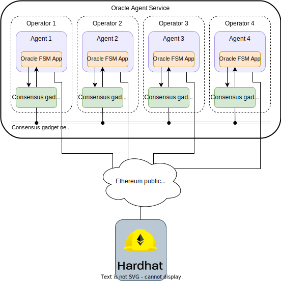

# Price Oracle Agent Service Demo

The goal of this demo is to demonstrate an agent service that provides an estimation
of the Bitcoin price (USD) based on observations coming from different data sources,
e.g., CoinMarketCap, CoinGecko, Binance and Coinbase.
Each agent collects an observation from one of the data sources above and
shares it with the rest of the agents through the consensus gadget (Tendermint).
Once all the observations are settled, each agent
computes locally a deterministic function that aggregates the observations made by all the
agents, and obtains an estimate of the Bitcoin price. In this demo, we consider the
average of the observed values.
The local estimates made by all the agents are shared, and
a consensus is reached when one estimate
reaches $\lceil(2n + 1) / 3\rceil$ of the total voting power committed
on the consensus gadget.
Once the consensus on an estimate has been reached, a multi-signature transaction
with $\lceil(2n + 1) / 3\rceil$ of the participants' signatures is settled on the
Ethereum chain, which is emulated by a local Hardhat node in the demo.


## Architecture of the demo
This demo is composed of:

- A [HardHat](https://hardhat.org/) node (emulating an Ethereum blockchain).
- A set of four [Tendermint](https://tendermint.com/) nodes (`node0`, `node1`, `node2`, `node3`).
- A set of four AEAs (`abci0`, `abci1`, `abci2`, `abci3`), in one-to-one connection with their corresponding Tendermint
node.

<figure markdown>

<figcaption>Architecture of the Price Oracle demo</figcaption>
</figure>


## Running the demo

Before running the demo, ensure that your machine satisfies the [framework requirements](../guides/set_up.md#requirements) and that
you have followed the [setup instructions](../guides/set_up.md#setup). As a result you should have a Pipenv workspace folder.

To run the Price Oracle service follow the instructions in the [OracleKit section](https://docs.autonolas.network/product/oraclekit/#demo), which contains the necessary steps to download the service from the Service Registry, build and run a deployment locally with a local [HardHat](https://hardhat.org/) node.


## Interacting with the demo

The logs of a single agent or [Tendermint](https://tendermint.com/) node can be inspected in another terminal with, e.g.,

```bash
docker logs <container_id> --follow
```

where `<container_id>` refers to the Docker container ID for either an agent
(`abci0`, `abci1`, `abci2` and `abci3`) or a [Tendermint](https://tendermint.com/) node (`node0`, `node1`, `node2` and `node3`).

By examining the logs of an agent container, you will see a message similar to the one depicted below, after the framework successfully builds and starts it:

```
   / \   | ____|   / \   
  / _ \  |  _|    / _ \  
 / ___ \ | |___  / ___ \
/_/   \_\|_____|/_/   \_\

v1.16.0

All available packages.
================================================================================
| Package                                          | IPFSHash                  |
================================================================================
                                                   |                           |
(...)                                              |                           |
                                                   |                           |
================================================================================

All instantiated components
======================================================
| ComponentId                                        |
======================================================
| (protocol, valory/ledger_api:1.0.0)                |
| (protocol, open_aea/signing:1.0.0)                 |
| (protocol, valory/acn:1.1.0)                       |
| (protocol, valory/http:1.0.0)                      |
| (protocol, valory/tendermint:0.1.0)                |
| (protocol, valory/abci:0.1.0)                      |
| (protocol, valory/contract_api:1.0.0)              |
| (connection, valory/abci:0.1.0)                    |
| (connection, valory/http_client:0.1.0)             |
| (connection, valory/ledger:0.1.0)                  |
| (contract, valory/gnosis_safe_proxy_factory:0.1.0) |
| (contract, valory/gnosis_safe:0.1.0)               |
| (contract, valory/offchain_aggregator:0.1.0)       |
| (contract, valory/service_registry:0.1.0)          |
| (skill, valory/oracle_abci:0.1.0)                  |
======================================================

All available addresses.
=========================================================
| Name     | Address                                    |
=========================================================
| ethereum | 0x15d34AAf54267DB7D7c367839AAf71A00a2C6A65 |
=========================================================
```

Following that, you will find the log messages indicating the different stages that the agent is currently executing:

```
Starting AEA 'agent' in 'async' mode...
[INFO] [agent] Entered in the 'registration_startup' round for period 0
[INFO] [agent] Start processing messages...
[INFO] [agent] Entered in the 'registration_startup' behaviour
[INFO] [agent] Checking sync...
[INFO] [agent] Checking status @ http://node0:26657/status
[ERROR] [agent] Tendermint not accepting transactions yet, trying again!
[INFO] [agent] Checking status @ http://node0:26657/status
[ERROR] [agent] Tendermint not accepting transactions yet, trying again!
[INFO] [agent] Checking status @ http://node0:26657/status
[INFO] [agent] local height == remote == 0; Sync complete...
[INFO] [agent] Sharing Tendermint config on start-up?: False
[INFO] [agent] arrived block with timestamp: 2022-08-02 20:19:20.382918
[INFO] [agent] current AbciApp time: None
[INFO] [agent] no pending timeout, move time forward
[INFO] Created a new local deadline for the next `begin_block` request from the Tendermint node: 2022-08-02 20:21:22.036121
[INFO] [agent] arrived block with timestamp: 2022-08-02 20:20:21.841451
[INFO] [agent] current AbciApp time: 2022-08-02 20:19:20.382918
[INFO] [agent] no pending timeout, move time forward
[INFO] Created a new local deadline for the next `begin_block` request from the Tendermint node: 2022-08-02 20:21:23.463276
[INFO] [agent] 'registration_startup' round is done with event: Event.DONE
[INFO] [agent] scheduling timeout of 7.0 seconds for event Event.ROUND_TIMEOUT with deadline 2022-08-02 20:20:28.841451
[INFO] [agent] Entered in the 'randomness_safe' round for period 0
[INFO] [agent] Entered in the 'randomness_safe' behaviour
[INFO] [agent] Retrieving DRAND values from api.
[INFO] [agent] Verifying DRAND values.
[INFO] [agent] DRAND check successful.
```

From the logs, you can see how the agent traverses the different states of the
{{fsm_app}}: registration, randomness collection, keeper selection, price collection, price estimation, etc.
For example, note how this particular agent collects the Bitcoin price from CoinGecko:

```
[INFO] [agent] Entered in the 'collect_observation' round for period 19
[INFO] [agent] Entered in the 'collect_observation' behaviour
[INFO] [agent] Got observation of BTC price in USD from coingecko: 23112.0
[INFO] [agent] arrived block with timestamp: 2022-08-02 22:51:16.858947
[INFO] [agent] current AbciApp time: 2022-08-02 22:51:15.566192
[INFO] Created a new local deadline for the next `begin_block` request from the Tendermint node: 2022-08-02 22:52:18.304367
[INFO] [agent] 'collect_observation' round is done with event: Event.DONE
[INFO] [agent] scheduling timeout of 7.0 seconds for event Event.ROUND_TIMEOUT with deadline 2022-08-02 22:51:23.858947
```

Afterwards, the agent estimate the price based on all the different observations collected and forwarded by all the agents:

```
[INFO] [agent] Entered in the 'estimate_consensus' round for period 19
[INFO] [agent] Entered in the 'estimate' behaviour
[INFO] [agent] Got estimate of BTC price in USD: 23117.695, Using aggregator method: median
[INFO] [agent] arrived block with timestamp: 2022-08-02 22:51:18.194988
[INFO] [agent] current AbciApp time: 2022-08-02 22:51:16.858947
[INFO] Created a new local deadline for the next `begin_block` request from the Tendermint node: 2022-08-02 22:52:19.744814
[INFO] [agent] 'estimate_consensus' round is done with event: Event.DONE
[INFO] [agent] scheduling timeout of 7.0 seconds for event Event.ROUND_TIMEOUT with deadline 2022-08-02 22:51:25.194988
```

In order to fully understand what are the constituent states that the {{fsm_app}} is traversing,
we refer you to the [technical details](price_oracle_technical_details.md) of the demo, and also to
the [composition of FSMs](price_oracle_fsms.md) that make up the agents' {{fsm_app}}.
