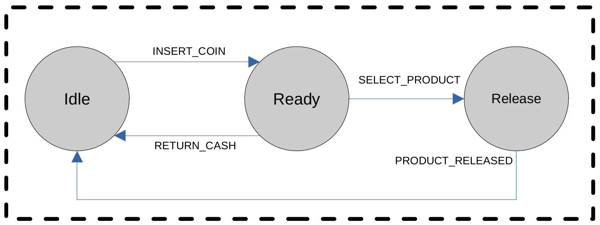

# FSM: Finite State Machines

A [finite state machine](https://en.wikipedia.org/wiki/Finite-state_machine) (FSM) is a mathematical model of computation that can be
used to represent the sequential logic of state transitions. At any given time
the FSM can be in exactly one particular state from which it can transition to
other states based on the inputs/events it is given. An FSM can be represented by a
graph, with a finite number of nodes describing the possible states of the
system, and a finite number of arcs representing the transitions from one state
to another. In this section we discuss the role FSMs play in the construction
of ABCI applications and the operation of AEAs.

We use FSMs to describe systems that have multiple states and can transition from one state to another due to some event or signal. In every state, we will need to perform one or more actions to trigger an event. This event will make the machine transition to a new state.

As an example, we can use a FSM model to describe a vending machine with three different states:

- Idle: the machine just waits for some event to happen.
- Ready: a product has been paid and the machine is ready to release it.
- Release: the machine releases the selected product.

And four different events:

- Insert coin
- Select product
- Return cash
- Product released

We can represent these in a FSM diagram:

## How FSMs come into play

Accepting this is sufficient as a notion on the FSM we may start to think of
what it is that is changing when we transition from one state to another in the case of Valory apps. Such states consists of:

- A **round**: some concrete implementation of `AbstractRound`. It usually involves
  interactions between participants, although this is not enforced
  at this level of abstraction. A round can validate, store and aggregate data
  coming from different agents by means of transactions. The actual meaning of
  the data depends on the implementation of the specific round.

- A **behaviour**: some concrete implementation of `BaseState` that contains the application logic for this state. It is scheduled for
  execution by the agents. Every behaviour is associated with a specific round.

- A **period state**: some concrete implementation of `BasePeriodState`. It provides
  access to the state data that is shared by the agents throughout the period
  and gets updated at the end of round.

We define _period_ as a sequence of rounds. A _round_ might just be a stage in
the consensus (e.g. waiting that a sufficient number of participants commit their
observations to the temporary tendermint blockchain), or a voting round (e.g.
waiting till at least one estimate has reached `ceil((2n + 1) / 3)` of the votes).

A concrete example of the state flow in a Valory app is our price oracle app, that aggregates asset prices from different data sources and submits the aggregation result to a blockchain:
>
    Period with n agents
        1. Collect observations from external APIs or prior rounds.
        2. Share observations until threshold of 2/3rd is reached.
        3. Compute on observations, reach consensus on the result.
        4. Construct a transaction that contains the aggregation result.
        5. Sign the transactions, again need 2/3rd majority.
        6. A single agent, randomly nominated as the keeper, sends the
           transaction to the chain. If it does not do this before a
           timeout event occurs, another agent is selected to be the
           keeper.
        7. Start over
>