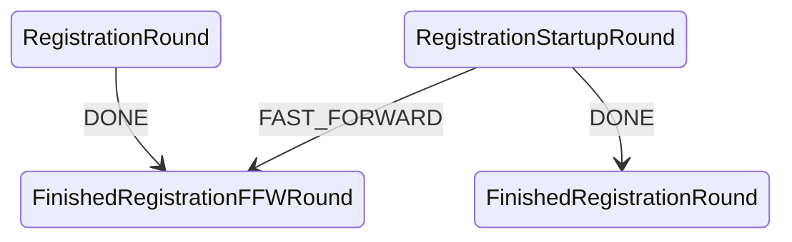
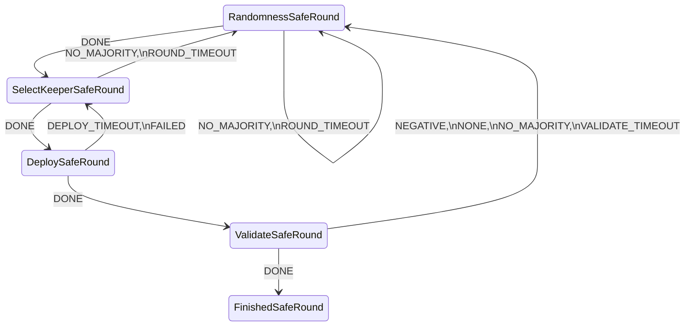
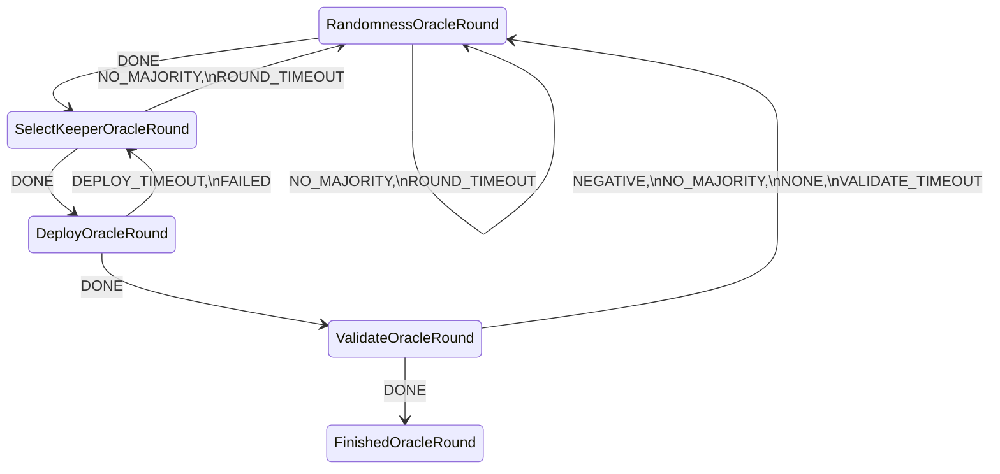
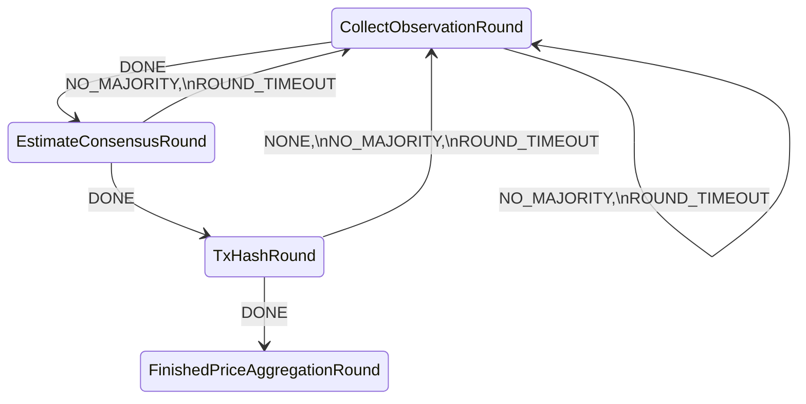
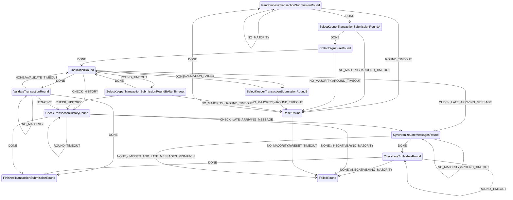
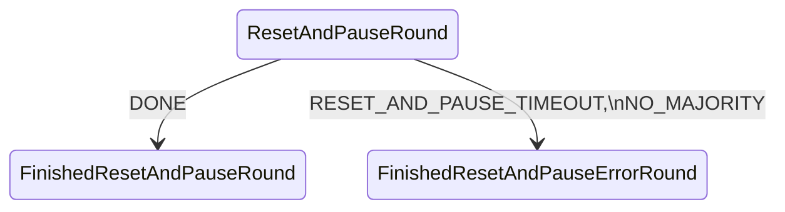
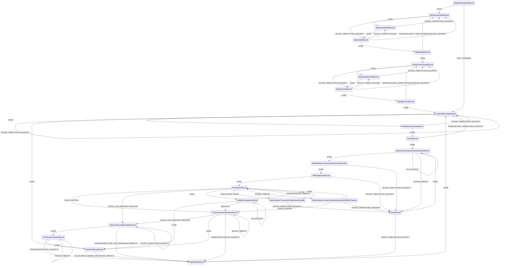

### High-Level Description of the Constituent FSMs.
For reference, we provide a high-level descritpion of the FSMs that constitute
the Price Estimation demo using a simplified syntax.
The syntax should be easy to understand for a reader familiar with conventional
automata textbook notation.

The aim of this syntax is to be used as a starting point in the design and
reasoning of an ABCI application without delving into the internals of the Valory stack
itself. Hence, the usage of objects is minimized, and only strings are
used as identifiers. It can be used as a description language to translate a
specification into code, e.g., for agent development, or for conducting some
formal analysis using a model checker like SPIN.

Each FSM object is defined by a collection of seven input parameters:
* label (optional),
* states,
* default start state,
* allowed start states (e.g., when re-routing a transition from another FSM),
* final states,
* input alphabet (i.e., received events),
* transition function, expressed as a function that maps tuples of the form (S, E) to the resulting state S'. That is, upon receiving event E being at state S, the FSM will transit to state S'.

The summary of the constituent FSMs is as follows:

| FSM                     | States  | Start states  | Final states  | Events  | Non-trivial transitions (*)   |
|-----------------------  |-------: |-------------: |-------------: |-------: |------------------------:  |
| AgentRegistration       |      4  |            2  |            2  |      3  |                       3   |
| SafeDeployment          |      5  |            1  |            1  |      8  |                      14   |
| OracleDeployment        |      5  |            1  |            1  |      8  |                      14   |
| PriceAggregation        |      9  |            1  |            1  |      4  |                       9   |
| TransactionSubmission   |     10  |            1  |            2  |      9  |                      26   |
| ResetPauseABCIApp       |      3  |            1  |            2  |      3  |                       3   |
| **OracleAbciApp**       | **21**  |        **2**  |        **0**  | **12**  |                  **66**   |

(*) Transitions to a different state, i.e., not self-transitions.

#### `AgentRegistrationAbciApp` FSM
```yaml
alphabet_in:
- DONE
- FAST_FORWARD
default_start_state: RegistrationStartupRound
final_states:
- FinishedRegistrationFFWRound
- FinishedRegistrationRound
label: packages.valory.skills.registration_abci.rounds.AgentRegistrationAbciApp
start_states:
- RegistrationRound
- RegistrationStartupRound
states:
- FinishedRegistrationFFWRound
- FinishedRegistrationRound
- RegistrationRound
- RegistrationStartupRound
transition_func:
    (RegistrationRound, DONE): FinishedRegistrationFFWRound
    (RegistrationStartupRound, DONE): FinishedRegistrationRound
    (RegistrationStartupRound, FAST_FORWARD): FinishedRegistrationFFWRound
```



#### `SafeDeploymentAbciApp` FSM
```yaml
alphabet_in:
- DEPLOY_TIMEOUT
- DONE
- FAILED
- NEGATIVE
- NONE
- NO_MAJORITY
- ROUND_TIMEOUT
- VALIDATE_TIMEOUT
default_start_state: RandomnessSafeRound
final_states:
- FinishedSafeRound
label: packages.valory.skills.safe_deployment_abci.rounds.SafeDeploymentAbciApp
start_states:
- RandomnessSafeRound
states:
- DeploySafeRound
- FinishedSafeRound
- RandomnessSafeRound
- SelectKeeperSafeRound
- ValidateSafeRound
transition_func:
    (DeploySafeRound, DEPLOY_TIMEOUT): SelectKeeperSafeRound
    (DeploySafeRound, DONE): ValidateSafeRound
    (DeploySafeRound, FAILED): SelectKeeperSafeRound
    (RandomnessSafeRound, DONE): SelectKeeperSafeRound
    (RandomnessSafeRound, NO_MAJORITY): RandomnessSafeRound
    (RandomnessSafeRound, ROUND_TIMEOUT): RandomnessSafeRound
    (SelectKeeperSafeRound, DONE): DeploySafeRound
    (SelectKeeperSafeRound, NO_MAJORITY): RandomnessSafeRound
    (SelectKeeperSafeRound, ROUND_TIMEOUT): RandomnessSafeRound
    (ValidateSafeRound, DONE): FinishedSafeRound
    (ValidateSafeRound, NEGATIVE): RandomnessSafeRound
    (ValidateSafeRound, NONE): RandomnessSafeRound
    (ValidateSafeRound, NO_MAJORITY): RandomnessSafeRound
    (ValidateSafeRound, VALIDATE_TIMEOUT): RandomnessSafeRound
```




#### `OracleDeploymentAbciApp` FSM
```yaml
alphabet_in:
- DEPLOY_TIMEOUT
- DONE
- FAILED
- NEGATIVE
- NONE
- NO_MAJORITY
- ROUND_TIMEOUT
- VALIDATE_TIMEOUT
default_start_state: RandomnessOracleRound
final_states:
- FinishedOracleRound
label: packages.valory.skills.oracle_deployment_abci.rounds.OracleDeploymentAbciApp
start_states:
- RandomnessOracleRound
states:
- DeployOracleRound
- FinishedOracleRound
- RandomnessOracleRound
- SelectKeeperOracleRound
- ValidateOracleRound
transition_func:
    (DeployOracleRound, DEPLOY_TIMEOUT): SelectKeeperOracleRound
    (DeployOracleRound, DONE): ValidateOracleRound
    (DeployOracleRound, FAILED): SelectKeeperOracleRound
    (RandomnessOracleRound, DONE): SelectKeeperOracleRound
    (RandomnessOracleRound, NO_MAJORITY): RandomnessOracleRound
    (RandomnessOracleRound, ROUND_TIMEOUT): RandomnessOracleRound
    (SelectKeeperOracleRound, DONE): DeployOracleRound
    (SelectKeeperOracleRound, NO_MAJORITY): RandomnessOracleRound
    (SelectKeeperOracleRound, ROUND_TIMEOUT): RandomnessOracleRound
    (ValidateOracleRound, DONE): FinishedOracleRound
    (ValidateOracleRound, NEGATIVE): RandomnessOracleRound
    (ValidateOracleRound, NONE): RandomnessOracleRound
    (ValidateOracleRound, NO_MAJORITY): RandomnessOracleRound
    (ValidateOracleRound, VALIDATE_TIMEOUT): RandomnessOracleRound
```



#### `PriceAggregationAbciApp` FSM
```yaml
alphabet_in:
- DONE
- NONE
- NO_MAJORITY
- ROUND_TIMEOUT
default_start_state: CollectObservationRound
final_states:
- FinishedPriceAggregationRound
label: packages.valory.skills.price_estimation_abci.rounds.PriceAggregationAbciApp
start_states:
- CollectObservationRound
states:
- CollectObservationRound
- EstimateConsensusRound
- FinishedPriceAggregationRound
- TxHashRound
transition_func:
    (CollectObservationRound, DONE): EstimateConsensusRound
    (CollectObservationRound, NO_MAJORITY): CollectObservationRound
    (CollectObservationRound, ROUND_TIMEOUT): CollectObservationRound
    (EstimateConsensusRound, DONE): TxHashRound
    (EstimateConsensusRound, NO_MAJORITY): CollectObservationRound
    (EstimateConsensusRound, ROUND_TIMEOUT): CollectObservationRound
    (TxHashRound, DONE): FinishedPriceAggregationRound
    (TxHashRound, NONE): CollectObservationRound
    (TxHashRound, NO_MAJORITY): CollectObservationRound
    (TxHashRound, ROUND_TIMEOUT): CollectObservationRound
```



#### `TransactionSubmissionAbciApp` FSM
```yaml
alphabet_in:
- CHECK_HISTORY
- CHECK_LATE_ARRIVING_MESSAGE
- DONE
- FINALIZATION_FAILED
- MISSED_AND_LATE_MESSAGES_MISMATCH
- NEGATIVE
- NONE
- NO_MAJORITY
- RESET_TIMEOUT
- ROUND_TIMEOUT
- VALIDATE_TIMEOUT
default_start_state: RandomnessTransactionSubmissionRound
final_states:
- FailedRound
- FinishedTransactionSubmissionRound
label: packages.valory.skills.transaction_settlement_abci.behaviours.TransactionSubmissionAbciApp
start_states:
- RandomnessTransactionSubmissionRound
states:
- CheckLateTxHashesRound
- CheckTransactionHistoryRound
- CollectSignatureRound
- FailedRound
- FinalizationRound
- FinishedTransactionSubmissionRound
- RandomnessTransactionSubmissionRound
- ResetRound
- SelectKeeperTransactionSubmissionRoundA
- SelectKeeperTransactionSubmissionRoundB
- SelectKeeperTransactionSubmissionRoundBAfterTimeout
- SynchronizeLateMessagesRound
- ValidateTransactionRound
transition_func:
    (CheckLateTxHashesRound, DONE): FinishedTransactionSubmissionRound
    (CheckLateTxHashesRound, NEGATIVE): FailedRound
    (CheckLateTxHashesRound, NONE): FailedRound
    (CheckLateTxHashesRound, NO_MAJORITY): FailedRound
    (CheckLateTxHashesRound, ROUND_TIMEOUT): CheckLateTxHashesRound
    (CheckTransactionHistoryRound, CHECK_LATE_ARRIVING_MESSAGE): SynchronizeLateMessagesRound
    (CheckTransactionHistoryRound, DONE): FinishedTransactionSubmissionRound
    (CheckTransactionHistoryRound, NEGATIVE): FailedRound
    (CheckTransactionHistoryRound, NONE): FailedRound
    (CheckTransactionHistoryRound, NO_MAJORITY): FailedRound
    (CheckTransactionHistoryRound, ROUND_TIMEOUT): CheckTransactionHistoryRound
    (CollectSignatureRound, DONE): FinalizationRound
    (CollectSignatureRound, NO_MAJORITY): ResetRound
    (CollectSignatureRound, ROUND_TIMEOUT): ResetRound
    (FinalizationRound, CHECK_HISTORY): CheckTransactionHistoryRound
    (FinalizationRound, CHECK_LATE_ARRIVING_MESSAGE): SynchronizeLateMessagesRound
    (FinalizationRound, DONE): ValidateTransactionRound
    (FinalizationRound, FINALIZATION_FAILED): SelectKeeperTransactionSubmissionRoundB
    (FinalizationRound, ROUND_TIMEOUT): SelectKeeperTransactionSubmissionRoundBAfterTimeout
    (RandomnessTransactionSubmissionRound, DONE): SelectKeeperTransactionSubmissionRoundA
    (RandomnessTransactionSubmissionRound, NO_MAJORITY): RandomnessTransactionSubmissionRound
    (RandomnessTransactionSubmissionRound, ROUND_TIMEOUT): ResetRound
    (ResetRound, DONE): RandomnessTransactionSubmissionRound
    (ResetRound, NO_MAJORITY): FailedRound
    (ResetRound, RESET_TIMEOUT): FailedRound
    (SelectKeeperTransactionSubmissionRoundA, DONE): CollectSignatureRound
    (SelectKeeperTransactionSubmissionRoundA, NO_MAJORITY): ResetRound
    (SelectKeeperTransactionSubmissionRoundA, ROUND_TIMEOUT): ResetRound
    (SelectKeeperTransactionSubmissionRoundB, DONE): FinalizationRound
    (SelectKeeperTransactionSubmissionRoundB, NO_MAJORITY): ResetRound
    (SelectKeeperTransactionSubmissionRoundB, ROUND_TIMEOUT): ResetRound
    (SelectKeeperTransactionSubmissionRoundBAfterTimeout, CHECK_HISTORY): CheckTransactionHistoryRound
    (SelectKeeperTransactionSubmissionRoundBAfterTimeout, DONE): FinalizationRound
    (SelectKeeperTransactionSubmissionRoundBAfterTimeout, NO_MAJORITY): ResetRound
    (SelectKeeperTransactionSubmissionRoundBAfterTimeout, ROUND_TIMEOUT): ResetRound
    (SynchronizeLateMessagesRound, DONE): CheckLateTxHashesRound
    (SynchronizeLateMessagesRound, MISSED_AND_LATE_MESSAGES_MISMATCH): FailedRound
    (SynchronizeLateMessagesRound, NONE): FailedRound
    (SynchronizeLateMessagesRound, NO_MAJORITY): SynchronizeLateMessagesRound
    (SynchronizeLateMessagesRound, ROUND_TIMEOUT): SynchronizeLateMessagesRound
    (ValidateTransactionRound, DONE): FinishedTransactionSubmissionRound
    (ValidateTransactionRound, NEGATIVE): CheckTransactionHistoryRound
    (ValidateTransactionRound, NONE): FinalizationRound
    (ValidateTransactionRound, NO_MAJORITY): ValidateTransactionRound
    (ValidateTransactionRound, VALIDATE_TIMEOUT): FinalizationRound
```



### `ResetPauseABCIApp` FSM

```yaml
alphabet_in:
- DONE
- NO_MAJORITY
- RESET_AND_PAUSE_TIMEOUT
default_start_state: ResetAndPauseRound
final_states:
- FinishedResetAndPauseErrorRound
- FinishedResetAndPauseRound
label: packages.valory.skills.reset_pause_abci.rounds.ResetPauseABCIApp
start_states:
- ResetAndPauseRound
states:
- FinishedResetAndPauseErrorRound
- FinishedResetAndPauseRound
- ResetAndPauseRound
transition_func:
    (ResetAndPauseRound, DONE): FinishedResetAndPauseRound
    (ResetAndPauseRound, NO_MAJORITY): FinishedResetAndPauseErrorRound
    (ResetAndPauseRound, RESET_AND_PAUSE_TIMEOUT): FinishedResetAndPauseErrorRound
```




#### `OracleAbciApp` FSM
As described above, the `PriceEstimationAbciApp` FSM is the composition of the
FSMs defined above using an FSM transition mapping that establishes the relationship
between the final states of a certain FSM with the start states of another FSM, that is,

```python
OracleAbciApp = compose_dfa(
    (
        AgentRegistrationAbciApp,
        SafeDeploymentAbciApp,
        OracleDeploymentAbciApp,
        PriceAggregationAbciApp,
        TransactionSubmissionAbciApp,
        ResetPauseABCIApp,        
    ),
    OracleAbciAppAppTransitionMapping
)
```
The transition mapping for this FSM is defined as

```python
OracleAbciAppAppTransitionMapping = {
    'FinishedRegistrationRound': 'RandomnessSafeRound',
    'FinishedSafeRound': 'RandomnessOracleRound',
    'FinishedOracleRound': 'CollectObservationRound',
    'FinishedRegistrationFFWRound': 'CollectObservationRound',
    'FinishedPriceAggregationRound': 'RandomnessTransactionSubmissionRound',
    'FinishedTransactionSubmissionRound': 'CollectObservationRound',
    'FailedRound': 'RegistrationRound',    
    }
```


The complete specification of the composed FSM is therefore:

```yaml
    alphabet_in:
    - CHECK_HISTORY
    - CHECK_LATE_ARRIVING_MESSAGE
    - DEPLOY_TIMEOUT
    - DONE
    - FAILED
    - FAST_FORWARD
    - FINALIZATION_FAILED
    - MISSED_AND_LATE_MESSAGES_MISMATCH
    - NEGATIVE
    - NONE
    - NO_MAJORITY
    - RESET_AND_PAUSE_TIMEOUT
    - RESET_TIMEOUT
    - ROUND_TIMEOUT
    - VALIDATE_TIMEOUT
    default_start_state: RegistrationStartupRound
    final_states: []
    label: packages.valory.skills.price_estimation_abci.composition.PriceEstimationAbciApp
    start_states:
    - RegistrationStartupRound
    states:
    - CheckLateTxHashesRound
    - CheckTransactionHistoryRound
    - CollectObservationRound
    - CollectSignatureRound
    - DeployOracleRound
    - DeploySafeRound
    - EstimateConsensusRound
    - FinalizationRound
    - RandomnessOracleRound
    - RandomnessSafeRound
    - RandomnessTransactionSubmissionRound
    - RegistrationRound
    - RegistrationStartupRound
    - ResetAndPauseRound
    - ResetRound
    - SelectKeeperOracleRound
    - SelectKeeperSafeRound
    - SelectKeeperTransactionSubmissionRoundA
    - SelectKeeperTransactionSubmissionRoundB
    - SelectKeeperTransactionSubmissionRoundBAfterTimeout
    - SynchronizeLateMessagesRound
    - TxHashRound
    - ValidateOracleRound
    - ValidateSafeRound
    - ValidateTransactionRound
    transition_func:
        (CheckLateTxHashesRound, DONE): ResetAndPauseRound
        (CheckLateTxHashesRound, NEGATIVE): RegistrationRound
        (CheckLateTxHashesRound, NONE): RegistrationRound
        (CheckLateTxHashesRound, NO_MAJORITY): RegistrationRound
        (CheckLateTxHashesRound, ROUND_TIMEOUT): CheckLateTxHashesRound
        (CheckTransactionHistoryRound, CHECK_LATE_ARRIVING_MESSAGE): SynchronizeLateMessagesRound
        (CheckTransactionHistoryRound, DONE): ResetAndPauseRound
        (CheckTransactionHistoryRound, NEGATIVE): RegistrationRound
        (CheckTransactionHistoryRound, NONE): RegistrationRound
        (CheckTransactionHistoryRound, NO_MAJORITY): RegistrationRound
        (CheckTransactionHistoryRound, ROUND_TIMEOUT): CheckTransactionHistoryRound
        (CollectObservationRound, DONE): EstimateConsensusRound
        (CollectObservationRound, NO_MAJORITY): CollectObservationRound
        (CollectObservationRound, ROUND_TIMEOUT): CollectObservationRound
        (CollectSignatureRound, DONE): FinalizationRound
        (CollectSignatureRound, NO_MAJORITY): ResetRound
        (CollectSignatureRound, ROUND_TIMEOUT): ResetRound
        (DeployOracleRound, DEPLOY_TIMEOUT): SelectKeeperOracleRound
        (DeployOracleRound, DONE): ValidateOracleRound
        (DeployOracleRound, FAILED): SelectKeeperOracleRound
        (DeploySafeRound, DEPLOY_TIMEOUT): SelectKeeperSafeRound
        (DeploySafeRound, DONE): ValidateSafeRound
        (DeploySafeRound, FAILED): SelectKeeperSafeRound
        (EstimateConsensusRound, DONE): TxHashRound
        (EstimateConsensusRound, NO_MAJORITY): CollectObservationRound
        (EstimateConsensusRound, ROUND_TIMEOUT): CollectObservationRound
        (FinalizationRound, CHECK_HISTORY): CheckTransactionHistoryRound
        (FinalizationRound, CHECK_LATE_ARRIVING_MESSAGE): SynchronizeLateMessagesRound
        (FinalizationRound, DONE): ValidateTransactionRound
        (FinalizationRound, FINALIZATION_FAILED): SelectKeeperTransactionSubmissionRoundB
        (FinalizationRound, ROUND_TIMEOUT): SelectKeeperTransactionSubmissionRoundBAfterTimeout
        (RandomnessOracleRound, DONE): SelectKeeperOracleRound
        (RandomnessOracleRound, NO_MAJORITY): RandomnessOracleRound
        (RandomnessOracleRound, ROUND_TIMEOUT): RandomnessOracleRound
        (RandomnessSafeRound, DONE): SelectKeeperSafeRound
        (RandomnessSafeRound, NO_MAJORITY): RandomnessSafeRound
        (RandomnessSafeRound, ROUND_TIMEOUT): RandomnessSafeRound
        (RandomnessTransactionSubmissionRound, DONE): SelectKeeperTransactionSubmissionRoundA
        (RandomnessTransactionSubmissionRound, NO_MAJORITY): RandomnessTransactionSubmissionRound
        (RandomnessTransactionSubmissionRound, ROUND_TIMEOUT): ResetRound
        (RegistrationRound, DONE): CollectObservationRound
        (RegistrationStartupRound, DONE): RandomnessSafeRound
        (RegistrationStartupRound, FAST_FORWARD): CollectObservationRound
        (ResetAndPauseRound, DONE): CollectObservationRound
        (ResetAndPauseRound, NO_MAJORITY): RegistrationRound
        (ResetAndPauseRound, RESET_AND_PAUSE_TIMEOUT): RegistrationRound
        (ResetRound, DONE): RandomnessTransactionSubmissionRound
        (ResetRound, NO_MAJORITY): RegistrationRound
        (ResetRound, RESET_TIMEOUT): RegistrationRound
        (SelectKeeperOracleRound, DONE): DeployOracleRound
        (SelectKeeperOracleRound, NO_MAJORITY): RandomnessOracleRound
        (SelectKeeperOracleRound, ROUND_TIMEOUT): RandomnessOracleRound
        (SelectKeeperSafeRound, DONE): DeploySafeRound
        (SelectKeeperSafeRound, NO_MAJORITY): RandomnessSafeRound
        (SelectKeeperSafeRound, ROUND_TIMEOUT): RandomnessSafeRound
        (SelectKeeperTransactionSubmissionRoundA, DONE): CollectSignatureRound
        (SelectKeeperTransactionSubmissionRoundA, NO_MAJORITY): ResetRound
        (SelectKeeperTransactionSubmissionRoundA, ROUND_TIMEOUT): ResetRound
        (SelectKeeperTransactionSubmissionRoundB, DONE): FinalizationRound
        (SelectKeeperTransactionSubmissionRoundB, NO_MAJORITY): ResetRound
        (SelectKeeperTransactionSubmissionRoundB, ROUND_TIMEOUT): ResetRound
        (SelectKeeperTransactionSubmissionRoundBAfterTimeout, DONE): FinalizationRound
        (SelectKeeperTransactionSubmissionRoundBAfterTimeout, NO_MAJORITY): ResetRound
        (SelectKeeperTransactionSubmissionRoundBAfterTimeout, ROUND_TIMEOUT): ResetRound
        (SynchronizeLateMessagesRound, DONE): CheckLateTxHashesRound
        (SynchronizeLateMessagesRound, MISSED_AND_LATE_MESSAGES_MISMATCH): RegistrationRound
        (SynchronizeLateMessagesRound, NONE): RegistrationRound
        (SynchronizeLateMessagesRound, NO_MAJORITY): SynchronizeLateMessagesRound
        (SynchronizeLateMessagesRound, ROUND_TIMEOUT): SynchronizeLateMessagesRound
        (TxHashRound, DONE): RandomnessTransactionSubmissionRound
        (TxHashRound, NONE): CollectObservationRound
        (TxHashRound, NO_MAJORITY): CollectObservationRound
        (TxHashRound, ROUND_TIMEOUT): CollectObservationRound
        (ValidateOracleRound, DONE): CollectObservationRound
        (ValidateOracleRound, NEGATIVE): RandomnessOracleRound
        (ValidateOracleRound, NONE): RandomnessOracleRound
        (ValidateOracleRound, NO_MAJORITY): RandomnessOracleRound
        (ValidateOracleRound, VALIDATE_TIMEOUT): RandomnessOracleRound
        (ValidateSafeRound, DONE): RandomnessOracleRound
        (ValidateSafeRound, NEGATIVE): RandomnessSafeRound
        (ValidateSafeRound, NONE): RandomnessSafeRound
        (ValidateSafeRound, NO_MAJORITY): RandomnessSafeRound
        (ValidateSafeRound, VALIDATE_TIMEOUT): RandomnessSafeRound
        (ValidateTransactionRound, DONE): ResetAndPauseRound
        (ValidateTransactionRound, NEGATIVE): CheckTransactionHistoryRound
        (ValidateTransactionRound, NONE): FinalizationRound
        (ValidateTransactionRound, NO_MAJORITY): ValidateTransactionRound
        (ValidateTransactionRound, VALIDATE_TIMEOUT): FinalizationRound
```



