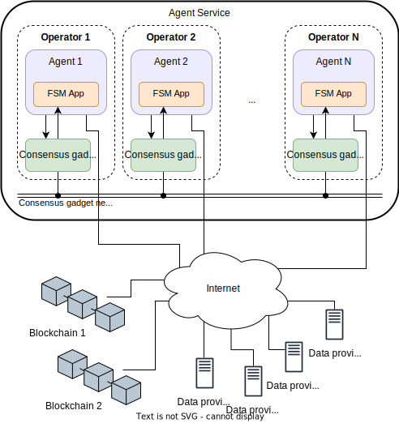
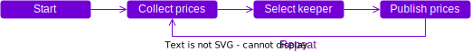

An **agent service** is an off-chain autonomous service which runs as a multi-agent-system (MAS) and is crypto-economically secured on a public blockchain.

Agent services enable complex processing, take action on their own and run continuously. Moreover, agent services are crypto-native by construction, that is, they are **decentralized**, **trust-minimized**, **transparent**, and **robust**.

See [some use cases](./use_cases.md) of agent services that can be built with the {{open_autonomy}} framework.

## Architecture

The {{open_aea}} framework provides the necessary components for building single agents. {{open_autonomy}} extends this framework to a service architecture, making possible to build applications as distributed systems (that is, agent services) that can be run by multiple, independent operators.

The internal state of an agent service is replicated across all the agents in the service through a **consensus gadget** (a sort of short-lived blockchain).

This is what an agent service looks like:

<figure markdown>

</figure>

* **Agent service**: The decentralized off-chain service that implements a certain functionality. It is composed of $N$ agents, where $N$ is a parameter that is defined by the owner of the service.

* **Operator**: An entity or individual that owns the infrastructure where an agent is run. Each operator manages an agent instance and a consensus gadget node.

* **Agent**: The software unit that aggregates the runtime and functionalities to execute the service. Each agent is made up of a number of components that implement different functionalities, for example, what communication protocols the agent understands.

* **{{fsm_app}}**: The core component inside an agent that defines the business logic of the service. {{fsm_app}} implements the underlying mechanisms for agents to synchronize their internal state and run the business logic in a decentralized fashion.

* **Consensus gadget:** The infrastructure that enables agents to synchronize the service state and reach consensus on certain important decisions. From a technical point of view, the consensus gadget implements a blockchain based on [Tendermint](https://tendermint.com/) that is pruned periodically. By consensus gadget we usually refer to the collection of consensus nodes + consensus network.

* **Agent service multisig [Safe](https://safe.global/):** Smart contract based Multisig  that secures the service by requiring a threshold of agents to sign any transaction before it is executed.

## How it works

The {{fsm_app}}, which encodes the business logic of the service, is structured as a [finite-state machine](../key_concepts/fsm.md) defining a series of steps that each agent in the service must follow in order to achieve the intended functionality.

!!! example

    This is a _toy example_ of how an {{fsm_app}} defines the business logic of an oracle service that collects prices from a source and publishes it on a blockchain:

    <figure markdown>
    
    </figure>

The {{fsm_app}} replicates automatically the state and transitions across agents using the consensus gadget. This ensures that the execution flow of the service, its inputs and outputs are synchronized across all agents, creating a distributed (and decentralized) application with shared state that is fault tolerant.

!!! tip

    When developing an agent service, the developer can focus on defining the steps of the service in the {{fsm_app}} as if it were a standalone application, and get the replication mechanism "for free".

    The {{open_autonomy}} framework will provide most of the machinery to ensure that the agents' state is replicated as the service is executed.

If at some point the service needs to execute an action involving an external service, e.g., settling a transaction on a blockchain, then the following occurs:

1. The agents in the service nominate by consensus an agent (known as **keeper**) to perform the action.
2. A threshold of agents has to approve and sign the transaction, using the service multisig [Safe](https://safe.global/). This prevents a malicious agent from executing an external action on its own.
3. Furthermore, the agents in the service verify that the transaction was executed successfully. Otherwise, a new keeper will be nominated and the transaction will be retried.

The threshold on the minimum number of agents required to sign is typically, but not exclusively, set at 2/3 of the total of agents.
