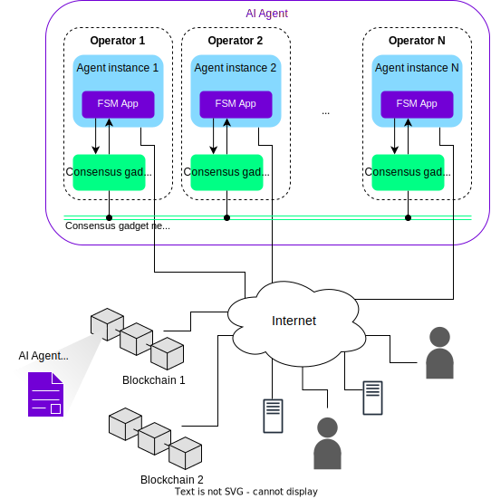

An **agent service** is an off-chain autonomous service which runs as a multi-agent-system (MAS) and is replicated on a **consensus gadget** (a sort of short-lived blockchain) while being crypto-economically secured on a public blockchain. Agent services enable complex processing, take action on their own and run continuously. Moreover, agent services are crypto-native by construction, that is, they are **decentralized**, **trust-minimized**, **transparent**, and **robust**.

The {{open_autonomy}} framework allows to define such services by means of a special component called [{{fsm_app}}](../key_concepts/fsm_app_introduction.md). These dynamic, decentralized apps run inside the agents defining the agent service, and implement the underlying mechanisms that allow agents to synchronize their internal state.

## Architecture of an agent service

Single-agent applications can be built with the {{open_aea}} framework. {{open_autonomy}} extends {{open_aea}} to a service architecture, making possible to build applications as distributed systems (agent services) implemented as sets of agents.

This is a brief summary on the architecture of an agent service:

* Each agent service is composed of a number of $N$ **agents**. This number is determined upon definition of the concrete agent service.

* In turn, each agent is made up of a number of **components** defined by the {{open_aea}} framework. These components define, for example, what protocols the agent is able to process.

* A component called **skill** implements the **{{fsm_app}}**, which defines the business logic of the agent service. Each agent in the service has a copy of the {{fsm_app}}. The {{fsm_app}} is defined through the {{open_autonomy}} framework.

* **Agent operators** are the entities or individuals that own the infrastructure where the agents run. Each operator executes an **agent instance** and a **consensus gadget node**.

* The **consensus gadget** (i.e., the consensus gadget nodes + the consensus gadget network) is the agent service component that enables the agents to maintain the service state and reach consensus on certain important decisions. From a technical point of view, the consensus gadget implements a blockchain based on [Tendermint](https://tendermint.com/).

<figure markdown>

<figcaption>Overview of the architecture of an agent service</figcaption>
</figure>

## How it works

The business logic of the service is encoded in the {{fsm_app}}, and it can define anything, from a price oracle to a complex investment strategy using machine learning algorithms. See [some examples](./use_cases.md) on what can be built with the framework.

The {{fsm_app}} is structured as a series of steps that each agent in the service must follow in order to achieve the service functionality. Using the consensus gadget, the {{open_autonomy}} framework provides most of the machinery so that the shared state is replicated across agents automatically as the service is executed. This ensures that the execution flow of the service, its inputs and outputs are synchronized across all agents, creating a distributed (and decentralized) application with shared state that is fault tolerant. The developer can focus exclusively on defining the steps of the service, and get the replication mechanism "for free".

The service is secured through a **multi-signature safe**. If at some point the service needs to execute an action involving an external service, e.g., settling a transaction on a blockchain, then the following occurs:

1. The agents in the service nominate by consensus an agent (known as **keeper**) to perform the action.
2. A minimum number of agents has to approve and sign the transaction, using the multi-signature safe. This prevents a malicious agent from executing an external action on its own.
3. Also, the agents in the service verify that indeed, the transaction has been executed successfully. Otherwise, a new agent keeper will be selected.

The threshold on the minimum number of agents is typically, but not exclusively, set at 2/3 of the total of agents.
