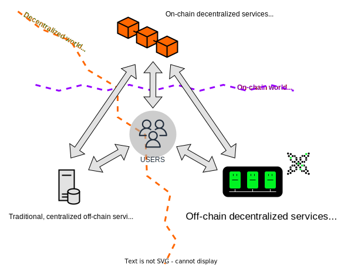

Decentralized ledger technologies (DLTs), such as blockchains, face several challenges, for example:

* [the blockchain trilemma](https://www.ledger.com/academy/what-is-the-blockchain-trilemma),
* [the oracle problem](https://encyclopedia.pub/entry/2959),
* [privacy issues](https://en.wikipedia.org/wiki/Privacy_and_blockchain),
* [ledger storage space](https://cointelegraph.com/news/how-can-blockchain-improve-data-storage),
* [cross chain compatibility](https://101blockchains.com/blockchain-interoperability/),
* ... and the sheer complexity of the user experience!

In contrast with the increasing growth of on-chain applications (particularly in DeFi), **the off-chain design space has seen a lack of innovation**. A lot of the technology is centralized, lacks fault tolerance, the code is often opaque and offers little composability.

Currently, a standardised approach for off-chain application development is missing in the blockchain space. This is where the {{open_aea}} and the {{open_autonomy}} frameworks come in, as open-source frameworks for developers to implement off-chain services which are secured on-chain and can interact with smart contracts.

<figure markdown>

<figcaption>Location of agent services in the crypto ecosystem</figcaption>
</figure>

Agent services go beyond simple, purely
reactive applications (like smart contracts) and can show **complex**, **proactive behaviours** that contain off-chain logic without giving up on decentralization. Examples include, but are not limited to, triggering specific actions on external events, or executing machine learning models.
