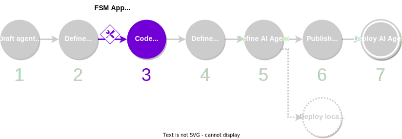

Recall that the [{{fsm_app}} skill](../key_concepts/fsm_app_introduction.md) is the core part of the agent that encodes the business logic of the service. Developing the {{fsm_app}} is possibly most demanding step in the development process.

<figure markdown>

<figcaption>Part of the development process covered in this guide</figcaption>
</figure>

In order to simplify and speed up the development, the {{open_autonomy}} framework provides an **{{fsm_app}} scaffold tool** that auto-generates functional, template classes with all the boilerplate code in place. Therefore, you can focus on completing the actual operations executed at each state of the service.

## What you will learn

This guide covers step 3 of the [development process](./overview_of_the_development_process.md). You will learn how to use the {{fsm_app}} scaffold tool to transform an FSM specification into template classes for the {{fsm_app}} skill, and identify what methods you need to implement to have a functional skill.

You must ensure that your machine satisfies the [framework requirements](./set_up.md#requirements), you have [set up the framework](./set_up.md#set-up-the-framework), and you have a local registry [populated with some default components](./overview_of_the_development_process.md#populate-the-local-registry-for-the-guides). As a result you should have a Pipenv workspace folder with an initialized local registry (`./packages`) in it.

## Step-by-step instructions

1. **Generate the {{fsm_app}} template classes.** Place the FSM specification `fsm_specification.yaml` [that you have created in the previous step](./draft_service_idea_and_define_fsm_specification.md#define-the-fsm-specification) in the workspace folder. Use the scaffold tool to generate an {{fsm_app}} with template classes:

    ```bash
    autonomy scaffold -tlr fsm your_fsm_app --spec fsm_specification.yaml
    ```

    This command will download the required packages to the local registry, and generate the {{fsm_app}} skill with a template for the [required classes](../key_concepts/fsm_app_introduction.md). The `-tlr` flag indicates that the {{fsm_app}} skill will be generated in the local registry (`./packages`). The actual path will be

    ```
    ./packages/your_name/skills/your_fsm_app/
    ```

    You can explore this path and take a look at the generated classes.

2. **Fill in the business logic code of your {{fsm_app}}.** By default, the generated classes don't execute any operation. It is your turn to define what actions are occurring at each state of the service, by filling up the code of the template classes generated above. You can identify the main places where you should populate code by browsing for `# TODO` comments. These are the main files that you should edit:

      * `behaviours.py`,
      * `rounds.py`,
      * `payloads.py`.

    You should also define a number of test classes. You can review how the [demo services](https://docs.autonolas.network/demos/) are implemented, or read about the [internals of {{fsm_app}}s](../key_concepts/fsm_app_introduction.md) to learn how to populate the template classes.
    
    !!! tip
    	
    	If you are a new user and want to skip coding the {{fsm_app}}, in the next guides we show you how you can use an existing {{fsm_app}} or an existing agent from the default [packages shipped with the framework](../package_list.md).
