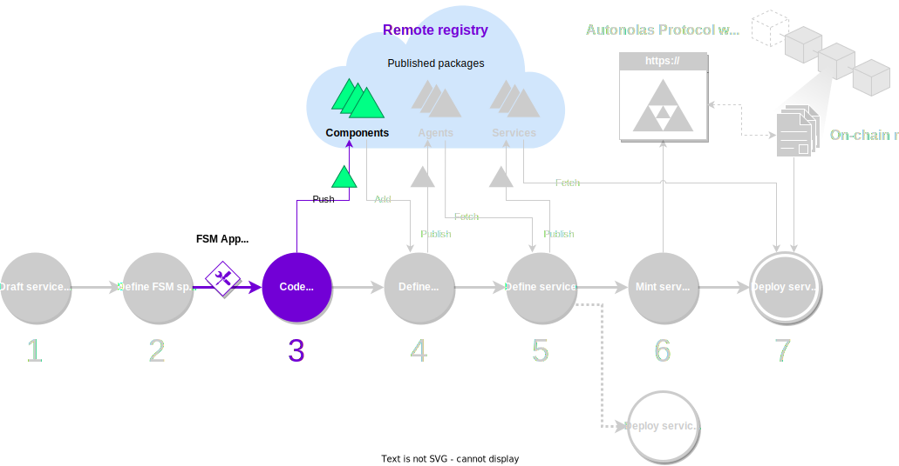

Recall that an **{{fsm_app}}** is the core part of an agent forming a service. Developing the {{fsm_app}} is perhaps the most challenging step from the [development process](./overview_of_the_development_process.md) pipeline.

For this reason, in order to simplify and speed up the development of agent services, the {{open_autonomy}} framework provides an **{{fsm_app}} scaffold tool** that allows you to auto-generate functional, skeleton classes with all the boilerplate code in place. Therefore, you can focus on implementing the actual business logic of the of the service itself.


<figure markdown>

<figcaption>Part of the development process covered in this guide</figcaption>
</figure>


##What you will learn

In this guide, you will learn how to use the {{fsm_app}} scaffold tool to generate the skeleton classes that define the {{fsm_app}} skill of an agent service.

Before starting this guide, ensure that your machine satisfies the framework requirements and that you have followed the [set up guide](./set_up.md). As a result you should have a Pipenv workspace folder.


## Step-by-step instructions

1. **Create an empty agent.** Use the {{open_autonomy}} CLI to create an empty agent as follows:
    ```bash
    autonomy create <agent_name>
    cd <agent_name>
    ```
    This will create the agent directory, that will contain folders for connections, contracts, protocols and skills.

2. **Create the FSM specification file.** Within the agent folder, define the `fsm_specification.yaml` file, which encodes the [states, transitions and transition function](../key_concepts/fsm.md) of the FSM that defines the business logic of the service.

    ??? example "Example of an `fsm_specification.yaml` file"
        Given a sketch of the FSM, the structure of the `fsm_specification.yaml` file is quite straightforward. Below we show the FSM specification file of the [Hello World](../demos/hello_world_demo.md) demo service.

        ```yaml
        alphabet_in:
        - DONE
        - NO_MAJORITY
        - RESET_TIMEOUT
        - ROUND_TIMEOUT
        default_start_state: RegistrationRound
        final_states: []
        label: packages.valory.skills.hello_world_abci.rounds.HelloWorldAbciApp
        start_states:
        - RegistrationRound
        states:
        - PrintMessageRound
        - RegistrationRound
        - ResetAndPauseRound
        - SelectKeeperRound
        transition_func:
            (PrintMessageRound, DONE): ResetAndPauseRound
            (PrintMessageRound, ROUND_TIMEOUT): RegistrationRound
            (RegistrationRound, DONE): SelectKeeperRound
            (ResetAndPauseRound, DONE): SelectKeeperRound
            (ResetAndPauseRound, NO_MAJORITY): RegistrationRound
            (ResetAndPauseRound, RESET_TIMEOUT): RegistrationRound
            (SelectKeeperRound, DONE): PrintMessageRound
            (SelectKeeperRound, NO_MAJORITY): RegistrationRound
            (SelectKeeperRound, ROUND_TIMEOUT): RegistrationRound
        ```


3. **Generate the template classes.** Using the scaffold tool to generate the skeleton for the classes for the skill:
    ```bash
    autonomy scaffold fsm <fsm_app_skill_name> --spec fsm_specification.yaml
    ```
    This command will populate the agent with the required components and generate the {{fsm_app}} skill with its corresponding classes: rounds, payloads, behaviours, and the [`AbciApp` class](../key_concepts/abci_app_class.md). The {{fsm_app}} skill will be generated in the `/skills/<fsm_app_skill_name>` folder.


4. **Fill in the business logic code of the {{fsm_app}}.** By default, the generated classes are initialized to empty values. It is your turn to define what actions are occurring at each state of the service, by filling up the code of the template {{fsm_app}} skill generated above. You should also define a number of test classes. You can review how the [demo services](../demos/index.md) are implemented, or read about the [internals of {{fsm_app}}s](../key_concepts/fsm_app_introduction.md) to learn more.


5. **Push the generated skill to the local registry.** Once you have finished coding and testing the {{fsm_app}} skill, you can [push it to a local or remote registry](./publish_fetch_packages.md#publish-and-fetch-services) for future reuse of the component.

6. **Clean up.** If you are only interested in the {{fsm_app}} skill created, you don't need the agent any more, so it can be safely deleted:
    ```bash
    cd ..
    autonomy delete <agent_name>
    ```
