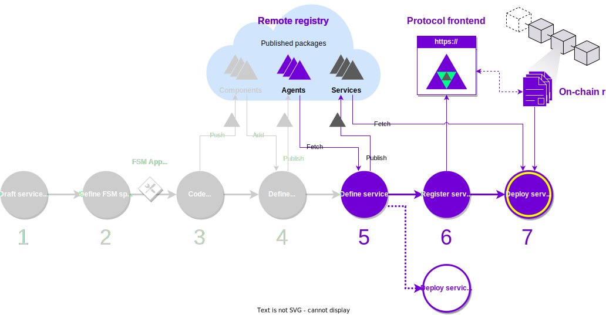

The typical use case that this guide intends to illustrate is where a service owner wants to use existing agents to run its own service
with a custom configuration. For example, an oracle service customized to serve data of their interest.


<figure markdown>

<figcaption>Part of the development process covered in this guide</figcaption>
</figure>

##What you will learn
In this guide, you will learn how to:

  - Create a service configuration using an already available agent on the  [IPFS](https://ipfs.io/).
  - Test the service using a local deployment.
  - Publish the service on the [IPFS](https://ipfs.io/).
  - Register the service in the on-chain protocol. We will be using the [Görli testnet](https://goerli.net/).
  - Deploy the registered service.

If you recall the [overview of the development process](./overview_of_the_development_process.md), this roughly consists in steps 4, 5, and 6. For illustration purposes, we will also be using the agents from the [Hello World agent service](../demos/hello_world_demo.md) and we will create a new (but functionally equivalent) "Hello World 2 agent service".

Before starting this guide, ensure that your machine satisfies the framework requirements and that you have followed the [set up guide](./set_up.md). As a result you should have a Pipenv workspace folder.

## Step-by-step instructions

To create a service with an existing agent published on a local or remote repository you need to identify the **public ID** and the **package hash** of the agent. It can be some agent that you have developed, or you can reuse an existing agent from a repository.
You can browse the [list of default packages](../package_list.md) of the {{open_autonomy}} framework available on the default remote IPFS registry.
For this example, we consider the `hello_world` agent, whose public ID and hash are

```
valory/hello_world:0.1.0:bafybeicealdcbxjdejskntddizntwqmlpyxa2ujaxnw2cgy73x3swldwcq
```

You can view the agent contents stored in the IPFS [here](https://gateway.autonolas.tech/ipfs/bafybeicealdcbxjdejskntddizntwqmlpyxa2ujaxnw2cgy73x3swldwcq/hello_world/).

!!! note
    Future releases of the {{open_autonomy}} framework will provide convenient commands to browse and discover existing registered components. For now, we assume that we already know the IPFS hash of the agent.


1. **Define the service.** Create an empty folder with the service name. Inside that folder, create:
    * a `README.md` file, where you can write a description of the service, and
    * a service configuration file `service.yaml`, where you will indicate the [IPFS](https://ipfs.io/) hash of the agent.

    ```bash
    mkdir <service_name>
    cd <service_name>
    touch README.md
    touch service.yaml
    ```

    ??? example "Example of a service configuration file `service.yaml`"
        The service configuration file `service.yaml` is where
        the parameters of the agent service are defined, including the particular agent that composes the service. Below you can find an exampe for the [Hello World agent service](../demos/hello_world_demo.md). You can read the [service configuration file section](./service_configuration_file.md) to understand its structure.
        ```yaml
        name: hello_world
        author: valory
        version: 0.1.0
        description: A simple demonstration of a simple ABCI application
        aea_version: '>=1.0.0, <2.0.0'
        license: Apache-2.0
        fingerprint:
          README.md: bafybeiapubcoersqnsnh3acia5hd7otzt7kjxekr6gkbrlumv6tkajl6jm
        fingerprint_ignore_patterns: []
        agent: valory/hello_world:0.1.0:bafybeihqzkncz7r563lfkots4fphb7abdymdna4ir7in7fsbzjtx6yyndq
        number_of_agents: 4
        ---
        extra:
          benchmark_persistence_params:
            args: &id001
              log_dir: /benchmarks
        overide_type: multiple
        public_id: valory/hello_world_abci:0.1.0
        type: skill
        0:
          models:
            params:
              args:
                hello_world_message: ${SERVICE_HELLO_WORLD_HELLO_WORLD_STRING:str:HELLO_WORLD!}
            benchmark_tool:
              args: *id001
        1:
          models:
            params:
              args:
                hello_world_message: ${SERVICE_HELLO_WORLD_HELLO_WORLD_STRING:str:HELLO_WORLD!}
            benchmark_tool:
              args: *id001
        2:
          models:
            params:
              args:
                hello_world_message: ${SERVICE_HELLO_WORLD_HELLO_WORLD_STRING:str:HELLO_WORLD!}
            benchmark_tool:
              args: *id001
        3:
          models:
            params:
              args:
                hello_world_message: ${SERVICE_HELLO_WORLD_HELLO_WORLD_STRING:str:HELLO_WORLD!}
            benchmark_tool:
              args: *id001
        ---
        public_id: valory/ledger:0.19.0
        type: connection
        config:
          ledger_apis:
            ethereum:
              address: http://host.docker.internal:8545
              chain_id: 31337
              poa_chain: false
              default_gas_price_strategy: eip1559

        ```


2. **Use a local deployment to test the service.** This is the recommended approach in order to test your agent service before you publish it to a remote registry. Follow the instructions in the [local deployment guide](./deploy_service.md#local-deployment) to run the local deployment. Note that this process should be somewhat familiar to you if you have followed the [quick start guide](./quick_start.md).

3. **Publish the service on a remote registry.** This will make the service available for other developers to fetch and use it. This step is also recommended if you want to register the service in the on-chain registry. Read the guide to
[publish an agent on a registry](./publish_fetch_packages.md#publish-an-agent-on-a-registry) to learn more.

4. **Register the service in the on-chain registry.** By registering the service in the on-chain registry you ensure that it is crypto-economically secured through the on-chain protocol. Follow the instructions in the [on-chain service registration guide](./register_packages_on_chain.md#register-a-service).

5. **Deploy the registered service.** Finally, you can try to run a deployment for the on-chain service that you just have registered. Follow the [on-chain deployment guide](./deploy_service.md#on-chain-deployment) to have your service up and running.
