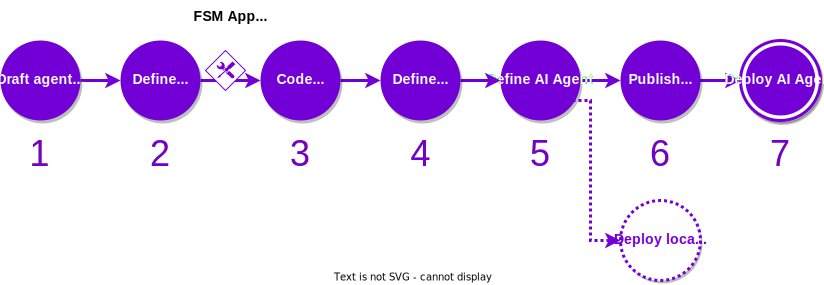

Developing a new service with the {{open_autonomy}} framework almost surely requires to build a dedicated agent for it, especially when the business logic of existing agents do not fit for the functionality of the service. This process requires to execute most of the [development process](./overview_of_the_development_process.md) pipeline, which is what we will be covering in this guide.

<!---
This involves reusing or creating the packages that the new agents need: skills, connections, protocols, etc. This can seem a bit overwhelming at the beginning, as new developers might not be familiar with the structure of each one of those.
-->

<figure markdown>

<figcaption>Part of the development process covered in this guide</figcaption>
</figure>


##What you will learn
In this guide, you will learn how to execute the main steps of the [development process](./overview_of_the_development_process.md) to create and deploy a new agent service.


Before starting this guide, ensure that your machine satisfies the framework requirements and that you have followed the [set up guide](./set_up.md). As a result you should have a Pipenv workspace folder.

## Step-by-step instructions

1. **Draft the service idea.**  Define the business logic of your service as an [FSM](../key_concepts/fsm.md). Determine what are the states, events and transitions that the service needs to transition in order to achieve the desired functionality. Define what kind of consensus need agents to transit from one state to another (e.g., all agents must share a different value, or a threshold of agents need to agree on a common value).

    ??? example "Example of a service FSM"
        Below we show the sketch of the FSM of the [Hello World](../demos/hello_world_demo.md) demo service. You can learn more about the purpose of each of the individual states and transitions in its [dedicated section](../demos/hello_world_demo.md).

        <figure markdown>
        
        <figcaption>FSM of the Hello World agent service</figcaption>
        </figure>

2. **Write the FSM specification file.** This file formally encodes the FSM designed in the previous step in a language that is understood by the framework.

    ??? example "Example of an `fsm_specification.yaml` file"
        Given a sketch of the FSM, the structure of the `fsm_specification.yaml` file is quite straightforward. Below we show the FSM specification file of the [Hello World](../demos/hello_world_demo.md) service.

        ```yaml
        alphabet_in:
        - DONE
        - NO_MAJORITY
        - RESET_TIMEOUT
        - ROUND_TIMEOUT
        default_start_state: RegistrationRound
        final_states: []
        label: packages.valory.skills.hello_world_abci.rounds.HelloWorldAbciApp
        start_states:
        - RegistrationRound
        states:
        - CollectRandomnessRound
        - PrintMessageRound
        - RegistrationRound
        - ResetAndPauseRound
        - SelectKeeperRound
        transition_func:
            (CollectRandomnessRound, DONE): SelectKeeperRound
            (CollectRandomnessRound, NO_MAJORITY): CollectRandomnessRound
            (CollectRandomnessRound, ROUND_TIMEOUT): CollectRandomnessRound
            (PrintMessageRound, DONE): ResetAndPauseRound
            (PrintMessageRound, ROUND_TIMEOUT): RegistrationRound
            (RegistrationRound, DONE): CollectRandomnessRound
            (ResetAndPauseRound, DONE): CollectRandomnessRound
            (ResetAndPauseRound, NO_MAJORITY): RegistrationRound
            (ResetAndPauseRound, RESET_TIMEOUT): RegistrationRound
            (SelectKeeperRound, DONE): PrintMessageRound
            (SelectKeeperRound, NO_MAJORITY): RegistrationRound
            (SelectKeeperRound, ROUND_TIMEOUT): RegistrationRound
        ```

3. **Code the {{fsm_app}} skill.** This is the core component of every agent belonging to a service. It consists of a number of classes that implement the business logic of the service as an FSM. The framework provides a scaffold tool that will help you to create most of the boilerplate code. You can follow the [guide to create an {{fsm_app}} skill](./create_fsm_app.md) to learn. Alternatively, you can also use the [developer template repository](https://github.com/valory-xyz/dev-template) as the starting point. It includes the recommended linters, continuous integration and several other files so that you start from scratch.

    Once you have finished coding and testing the {{fsm_app}} skill, you can [push it on a local or remote registry](./publish_fetch_packages.md#publish-and-fetch-services) for future reuse of the component. Note down the skill public ID and the package hash.

    !!! note
        We recommend that your developed components have exhaustive tests and pass the library linters before pushing them to a remote repository.

4. **Define the agent.** Create the agent and add the necessary components (connections, contracts, protocols and skills), including the {{fsm_app}} skill that you have created in the previous step. You can achieve this through the commands
    ```bash
    autonomy create <agent_name>
    cd <agent_name>
    autonomy add skill <fsm_app_package>
    ...
    autonomy add <component_type> <component_package>
    ```

    You can browse the [list of default packages](../package_list.md) of the {{open_autonomy}} framework available on the default remote IPFS registry.
    If you require to develop other kind of custom components, you can browse the {{open_aea_doc}} for further guidance. For example, have a look at how to create and interact with contracts in our [contract development guide](https://open-aea.docs.autonolas.tech/creating-contracts/).

    Once you have finished coding and testing the agent, [pubish it on a local or remote registry](./publish_fetch_packages.md#publish-an-agent-on-a-registry) for future reuse of the agent. Note down the agent public ID and the package hash.

    !!! note
        When adding a component, it will automatically add all its dependencies to the agent. For this reason, it might be the case that you don't need additional components after adding the {{fsm_app}} skill.


At this point, you will have an agent implementing the desired service functionality. Now, you can continue with **Steps 5, 6 and 7** in the [guide to create a service with an existing agent](./create_service_existing_agent.md) to define and deploy the corresponding agent service.
