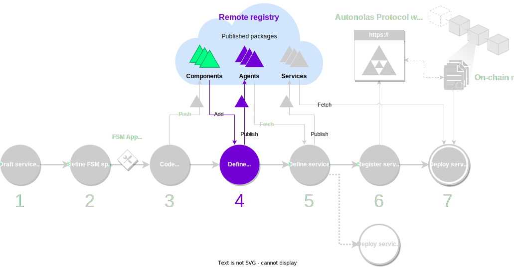

The next step consists in defining the service agent. All agents in the service share the same code base.
However, each operator can configure their agent instance. For example, in an oracle service,
each operator can define a different data provider.

<figure markdown>

<figcaption>Part of the development process covered in this guide</figcaption>
</figure>

## What you will learn

This guide covers step 3 of the [development process](./overview_of_the_development_process.md). You will learn how to define the service agent, how to add the {{fsm_app}}, and how to add other existing components required by your agent.

You must ensure that your machine satisfies the [framework requirements](./set_up.md#requirements), you have [set up the framework](./set_up.md#set-up-the-framework), and you have a local registry [populated with some default components](./overview_of_the_development_process.md#populate-the-local-registry-for-the-guides). As a result you should have a Pipenv workspace folder with an initialized local registry (`./packages`) in it.

## Step-by-step instructions

In order to deploy and run a service you need an agent with a working {{fsm_app}}. We base this guide on a default {{fsm_app}} available in the remote registry, namely, the `hello_world_abci` {{fsm_app}}. As a result, we will define an agent implementing a functionality equivalent to the [Hello World service](https://docs.autonolas.network/demos/hello-world/). You can, of course, use your own {{fsm_app}} to define your agent.

!!! warning "Important"

    If you have just [scaffolded an {{fsm_app}} in the previous step](./code_fsm_app_skill.md) but you didn't complete coding the business logic, then an agent that uses that {{fsm_app}} will fail to run. For this reason, we recommend that you use the `hello_world_abci` {{fsm_app}} in a first read of this guide.

1. **Ensure that the components required by your agent are in the local registry.** All the required components by your agent and their dependencies must be downloaded to the local registry. You can read [how to add missing components to the local registry](#).
If you have [populated the local registry](./overview_of_the_development_process.md#populate-the-local-registry-for-the-guides) with the required components to follow these guides, you do not need to take any further action.

2. **Create the agent configuration file.** Create a folder for your agent in the local registry (`./packages`). Pay attention to the correct format of the folder:

    ```bash
    mkdir -p ./packages/your_name/agents/your_agent/
    ```

    Within the agent folder, create the agent configuration file `aea-config.yaml`:

    ```bash
    touch ./packages/your_name/agents/your_agent/aea-config.yaml
    ```

    This file must contain:

      * A number of mandatory parameters.

        !!! warning "Important"

            Ensure that `author` and `agent_name` match the path within the local registry.

      * A reference to the {{fsm_app}} skill.
      * References to other components required by the agent (or dependencies of the {{fsm_app}} skill), under the relevant sections.

        !!! warning "Important"

            There are a number of components which are mandatory for agents that are part of a service:

            * Connections: `valory/abci`.
            * Protocols: `open_aea/signing`, `valory/abci`, `valory/acn`(*).
            * Skills: `valory/abstract_abci`, `valory/abstract_round_abci`, `valory/termination_abci`(*).

            (*) Components required only if the service is minted in the {{ autonolas_protocol }}.

      * Configuration overrides that specify values for component parameters. These overrides are separated by YAML document separators `---` and will be discussed in a further section.

    ???+ example "Example of an `aea-config.yaml` file"

        This is a complete example of an agent configuration file that uses the `hello_world_abci` {{fsm_app}} and overrides some required component parameters. 

        You will notice that there are a lot of parameters to be configured for the required components. For an initial read of this guide, you can ignore these parameters, but it is important that you identify how the references to the particular component parameter being overridden.

        ```yaml title="aea-config.yaml"
        agent_name: your_agent
        author: your_name
        version: 0.1.0
        license: Apache-2.0
        description: Example of an agent.
        aea_version: '>=1.0.0, <2.0.0'
        fingerprint: {}
        fingerprint_ignore_patterns: []
        connections:
        - valory/abci:0.1.0
        - valory/http_client:0.23.0
        - valory/ipfs:0.1.0
        - valory/ledger:0.19.0
        - valory/p2p_libp2p_client:0.1.0
        contracts: []
        protocols:
        - open_aea/signing:1.0.0
        - valory/abci:0.1.0
        - valory/http:1.0.0
        - valory/ipfs:0.1.0
        skills:
        - valory/abstract_abci:0.1.0
        - valory/abstract_round_abci:0.1.0
        - valory/hello_world_abci:0.1.0
        default_ledger: ethereum
        required_ledgers:
        - ethereum
        default_routing: {}
        connection_private_key_paths: {}
        private_key_paths: {}
        logging_config:
          version: 1
          disable_existing_loggers: false
          formatters:
            standard:
              format: '[%(asctime)s] [%(levelname)s] %(message)s'
          handlers:
            logfile:
              class: logging.FileHandler
              formatter: standard
              filename: ${LOG_FILE:str:log.txt}
              level: INFO
            console:
              class: logging.StreamHandler
              formatter: standard
              stream: ext://sys.stdout
          loggers:
            aea:
              handlers:
              - logfile
              - console
              propagate: true
        dependencies:
          open-aea-ledger-ethereum:
            version: ==1.56.0
          open-aea-test-autonomy:
            version: ==0.12.1.post1
        default_connection: null
        ---
        public_id: valory/hello_world_abci:0.1.0
        type: skill
        models:
          benchmark_tool:
            args:
              log_dir: ${str:/benchmarks}
          params:
            args:
              hello_world_message: ${str:HELLO_WORLD!}
              service_registry_address: ${str:null}
              share_tm_config_on_startup: ${bool:false}
              on_chain_service_id: ${int:null}
              setup:
                all_participants: ${list:[]}
                safe_contract_address: ${str:'0x0000000000000000000000000000000000000000'}
                consensus_threshold: ${int:null}
              tendermint_url: ${str:http://localhost:26657}
              tendermint_com_url: ${str:http://localhost:8080}
        ---
        public_id: valory/abci:0.1.0
        type: connection
        config:
          target_skill_id: valory/hello_world_abci:0.1.0
          host: ${str:localhost}
          port: ${int:26658}
          use_tendermint: ${bool:false}
        ---
        public_id: valory/ledger:0.19.0
        type: connection
        config:
          ledger_apis:
            ethereum:
              address: ${str:http://localhost:8545}
              chain_id: ${int:31337}
              poa_chain: ${bool:false}
              default_gas_price_strategy: ${str:eip1559}
        ---
        public_id: valory/p2p_libp2p_client:0.1.0
        type: connection
        config:
          nodes:
          - uri: ${str:acn.staging.autonolas.tech:9005}
            public_key: ${str:02d3a830c9d6ea1ae91936951430dee11f4662f33118b02190693be835359a9d77}
          - uri: ${str:acn.staging.autonolas.tech:9006}
            public_key: ${str:02e741c62d706e1dcf6986bf37fa74b98681bc32669623ac9ee6ff72488d4f59e8}
        cert_requests:
        - identifier: acn
          ledger_id: ethereum
          message_format: '{public_key}'
          not_after: '2025-01-01'
          not_before: '2024-01-01'
          public_key: ${str:02d3a830c9d6ea1ae91936951430dee11f4662f33118b02190693be835359a9d77}
          save_path: .certs/acn_cosmos_9005.txt
        - identifier: acn
          ledger_id: ethereum
          message_format: '{public_key}'
          not_after: '2025-01-01'
          not_before: '2024-01-01'
          public_key: ${str:02e741c62d706e1dcf6986bf37fa74b98681bc32669623ac9ee6ff72488d4f59e8}
          save_path: .certs/acn_cosmos_9006.txt
        is_abstract: true
        ```

    You should also create a `README.md` file with the description of your agent in plain text or Markdown format:

    ```bash
    echo "Your agent description." > ./packages/your_name/agents/your_agent/README.md
    ```

3. **Create an entry for your agent in the local registry.** Add the corresponding entry to the local registry index file (`./packages/packages.json`). You must add the entry to the `dev` section, because it is a component being developed by you. You can use a placeholder for its hash value, as it will be corrected afterwards:

    <!-- Use js instead of json lexer to support mkdocs-material comment features -->
    ```js
    {
      "dev": {
        "agent/your_name/your_agent/0.1.0": "bafybei0000000000000000000000000000000000000000000000000000",
        /* (1)! */
      },
      "third_party": {
        /* (2)! */
      }
    }
    ```

    1. Any other `dev` entries that you have go here. Entries must be comma-separated (`,`).
    2. Any other `third_party` entries that you have go here. Entries must be comma-separated (`,`).

    Update the package hashes. The command below will correct any hash mismatch in the `aea-config.yaml` file, as well as in the local registry index file (`./packages/packages.json`):

    ```bash
    autonomy packages lock
    ```

4. **(Optional) Run and test the agent locally.** We will show you how to run a service deployment with multiple agents in the next guide. However, you can also run a standalone version (that is, without being part of a service) of the agent you have created. This can be useful to test and debug certain features quickly. Below we will be using the `valory/hello_world` agent, but you can replace it by `your_name/your_agent` accordingly.

      1. In the workspace folder, fetch the agent from the local registry:

         ```bash
         autonomy fetch valory/hello_world:0.1.0 --local
         ```

      2. Provision your agent with an Ethereum private key:

         ```bash
         cd hello_world
         echo -n "0x47e179ec197488593b187f80a00eb0da91f1b9d0b13f8733639f19c30a34926a" > your_agent_key.txt
         autonomy add-key ethereum your_agent_key.txt
         ```

         If your agent is using an {{fsm_app}}, you also need to override the variable `all_participants` in the `aea-config.yaml` file with the wallet address of this private key as follows:

         ```yaml title="aea-config.yaml"
         # (...)
         all_participants: ${list:["0x15d34AAf54267DB7D7c367839AAf71A00a2C6A65"]}
         ```

         <span style="color:red">**WARNING: Use this key for testing purposes only. Never use keys or addresses provided in this example in a production environment or for personal use.**</span>

      3. Run your agent:

         ```bash
         autonomy -s run #(1)!
         ```

         1. The `-s` flag will skip consistency checks of agent during command execution. This is required because the `aea-config.yaml` file was modified.

         At this point, you may notice that your agent requires specific Python packages to be installed. For the `valory/hello_world` agent, you can do so by executing:

         ```bash
         pip install hypothesis grpcio typing-extensions py-ecc asn1crypto
         ```

         You can retry running your agent afterwards.

      4. On a separate terminal, open a Tendermint node:

         ```bash
         rm -rf ~/.tendermint #(1)!
         tendermint init
         tendermint node --proxy_app=tcp://127.0.0.1:26658 --rpc.laddr=tcp://127.0.0.1:26657 --p2p.laddr=tcp://0.0.0.0:26656 --p2p.seeds= --consensus.create_empty_blocks=true
         ```

         1. This will prevent errors caused by dirty files from earlier executions of Tendermint. Ensure that you don't want to keep these files.

    At this point, you should see how your agent runs and exchanges messages with the Tendermint node. Note that, while running an isolated agent might be useful to quickly test and debug certain functionalities, you need to build and test a whole service deployment to ensure that it works as intended.


