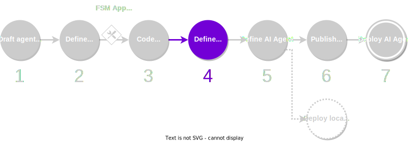

The next step consists in defining the service agent. All agents in the service share the same code base.
However, each operator can configure each agent instance. For example, in an oracle service,
each operator can define a different data provider.

<figure markdown>

<figcaption>Part of the development process covered in this guide</figcaption>
</figure>

## What you will learn

This guide covers step 3 of the [development process](./overview_of_the_development_process.md). You will learn how to define the service agent, how to add {{fsm_app}} to the agent, and how to add other existing components.

## Step-by-step instructions

1. **Create a temporary empty agent.** Use the CLI to create an empty runtime agent in the workspace folder:

    ```bash
    autonomy create your_agent
    ```

    You will notice that a number of files and folders have already been created in the folder `./your_agent`. Take a moment to look at the agent configuration file `aea-config.yaml`, which defines all the component dependencies for the agent.

2. **Publish the agent to the local registry.** Use the CLI to publish the agent configuration to the local registry:

    ```bash
    cd your_agent
    autonomy --registry-path=../packages publish --local
    ```

    This will copy the agent configuration file to the local registry (`workspace_folder/packages`). The actual path will be

    ```
    workspace_folder/packages/your_name/agents/your_agent/
    ```

    Now, you can delete the temporary runtime agent:

    ```bash
    cd ..
    rm -rf your_agent
    ```

    !!! warning "Important"

        In the remaining steps, we will be working directly with the files stored in the local registry (`workspace_folder/packages`).

3. **Ensure that the components you require are in the local registry.** Before continue with the definition of the agent, you must ensure that the components you are interested are stored in the local registry. To do this, you must

      1. Find the public ID and hash of the components (skills, contracts, protocols or connections) that you require for your agent. For example

        ```
        skill/valory/hello_world_abci:0.1.0:bafybeiav5iwsrhgohlx7npkhyn27f2dcensw2tenfw3ci2hxi7m4qrqy4i
        ```

        You can browse the [list of packages](../package_list.md) shipped by default with the framework.

      2. Add the corresponding entries to the local registry index file (`workspace_folder/packages/packages.json`). You must add the entry to either the `dev` section (if it is a component currently being developed by you), or `third_party` section (if it is a finalized component). Pay attention to the correct formatting. For example:

        ```json
        {
            "dev": {
                (...)
             },
            "third_party": {
                "skill/valory/hello_world_abci/0.1.0": "bafybeiav5iwsrhgohlx7npkhyn27f2dcensw2tenfw3ci2hxi7m4qrqy4i"
            }
        }        
        ```

      3. Synchronize the local registry and download the missing packages:

        ```bash
        autonomy packages sync
        ```

4. **Add the required components to your agent.** Once your local registry is appropriately populated, you can now edit the agent configuration file from the local registry. You must edit the following file:

    ```
    workspace_folder/packages/your_name/agents/your_agent/aea-config.yaml
    ```

    And add the required components (skills, contracts, protocols or connections) under the corresponding section. For example, to add the `hello_world_abci` {{fsm_app}} skill:

    ```yaml
    agent_name: your_agent
    author: your_name
    version: 0.1.0
    license: Apache-2.0
    description: ''
    aea_version: '>=1.29.0, <2.0.0'
    fingerprint: {}
    fingerprint_ignore_patterns: []
    connections: []
    contracts: []
    protocols:
    - open_aea/signing:1.0.0:bafybeibqlfmikg5hk4phzak6gqzhpkt6akckx7xppbp53mvwt6r73h7tk4
    skills:
    - valory/hello_world_abci:0.1.0:bafybeiav5iwsrhgohlx7npkhyn27f2dcensw2tenfw3ci2hxi7m4qrqy4i
    default_connection: null
    default_ledger: ethereum
    required_ledgers:
    - ethereum
    default_routing: {}
    connection_private_key_paths: {}
    private_key_paths: {}
    logging_config:
    disable_existing_loggers: false
    version: 1
    dependencies:
    open-aea-ledger-ethereum: {}
    ```

5. **Publish the agent to the remote registry.** Once you have finished coding and testing the agent, [pubish it on the remote registry](./publish_fetch_packages.md#publish-an-agent-on-a-registry).

    ```bash
    cd packages/your_name/agents/your_agent
    autonomy publish
    ```

    Note down the agent public ID and the package hash.

!!! tip

    If your service agent requires to develop other kind of custom components, you can browse the {{open_aea_doc}} for further guidance. For example, take a look at how to create and interact with contracts in our [contract development guide](https://open-aea.docs.autonolas.tech/creating-contracts/).

