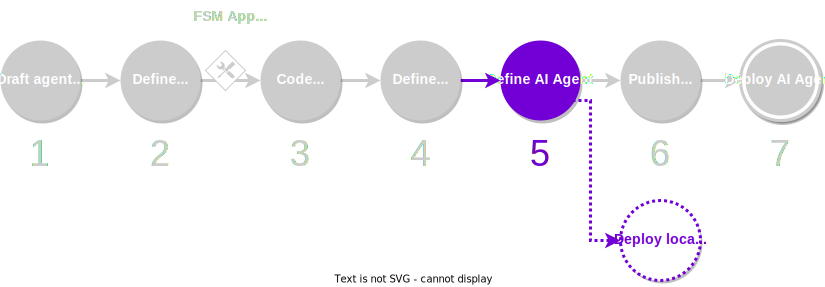

Given an existing agent, either developed by yourself on the previous step and stored in the local registry, or an agent fetch from the remote registry, the next step consists in defining the service and tuning its configuration options.

<figure markdown>

<figcaption>Part of the development process covered in this guide</figcaption>
</figure>

## What you will learn

This guide covers step 4 of the [development process](./overview_of_the_development_process.md). You will learn how to define the agent service itself. This consists in indicating what agent will the service be using, and configuring the service parameters through service-level overrides.

You must ensure that your machine satisfies the [framework requirements](./set_up.md#requirements), you have [set up the framework](./set_up.md#set-up-the-framework), and you have a local registry [populated with some default components](./overview_of_the_development_process.md#populate-the-local-registry-for-the-guides). As a result you should have a Pipenv workspace folder with an initialized local registry (`./packages`) in it.

## Step-by-step instructions

The process to define a service configuration is similar if you are using an agent being developed by you (for example, [the agent created in the previous guide](./define_agent.md)), or an existing, third-party agent downloaded from the remote registry. In the example below, we will be using the `hello_world` agent from the remote registry, which can be found in the [list of packages shipped with the framework](../package_list.md), but you can replace it with your own agent.

1. **Ensure that the agent required by your service is in the local registry.** Your service agent, all its required components and their dependencies must be downloaded to the local registry. You can read [how to add missing components to the local registry](#).
If you have [populated the local registry](./overview_of_the_development_process.md#populate-the-local-registry-for-the-guides) with the required components to follow these guides, you do not need to take any further action.

2. **Create the service configuration file.** Create a folder for your service in the local registry (`./packages`). Pay attention to the correct format of the folder:

    ```bash
    mkdir -p ./packages/your_name/services/your_service/
    ```

    Within the service folder, create the service configuration file `service.yaml`:
    ```bash
    touch ./packages/your_name/services/your_service/service.yaml
    ```

    This file must contain:

      * A number of mandatory parameters.

        !!! warning "Important"

            Ensure that `author` and service `name` match the path within the local registry.

      * A reference to the agent that the service will be using.
      * Configuration overrides that specify values for component parameters. These overrides are separated by YAML document separators `---` and will be discussed in a further section.

    ???+ example "Example of a `service.yaml` file"

        This is a complete example of a service configuration file that uses the `hello_world` agent and overrides some required component parameters.

        ```yaml title="service.yaml"
        name: your_service
        author: your_name
        version: 0.1.0
        description: A demonstration of a simple service
        aea_version: '>=1.0.0, <2.0.0'
        license: Apache-2.0
        fingerprint: {}
        fingerprint_ignore_patterns: []
        agent: valory/hello_world:0.1.0
        number_of_agents: 4
        deployment: {}
        ---
        public_id: valory/hello_world_abci:0.1.0
        type: skill
        models:
          params:
            args:
              service_registry_address: null
              share_tm_config_on_startup: false
              on_chain_service_id: null
              setup:
                all_participants: ${ALL_PARTICIPANTS:list:["0x0000000000000000000000000000000000000000"]}
                safe_contract_address: '0x0000000000000000000000000000000000000000'
                consensus_threshold: null
              hello_world_message: ${HELLO_WORLD_STRING_0:str:HELLO_WORLD!}
          benchmark_tool:
            args:
              log_dir: /benchmarks
        ---
        public_id: valory/ledger:0.19.0
        type: connection
        config:
          ledger_apis:
            ethereum:
              address: ${SERVICE_HELLO_WORLD_RPC:str:"http://host.docker.internal:8545"}
              chain_id: 31337
              poa_chain: false
              default_gas_price_strategy: eip1559
        ```

    You should also create a `README.md` file with the description of your service in plain text or Markdown format:

    ```bash
    echo "Your service description." > ./packages/your_name/services/your_service/README.md
    ```

3. **Create an entry for your service in the local registry.** Add the corresponding entry to the local registry index file (`./packages/packages.json`). You must add the entry to the `dev` section, because it is a component being developed by you. You can use a placeholder for its hash value, as it will be corrected afterwards:

	<!-- Use js instead of json lexer to support mkdocs-material comment features -->
    ```js
    {
      "dev": {
        "service/your_name/your_service/0.1.0": "bafybei0000000000000000000000000000000000000000000000000000",
        /* (1)! */
      },
      "third_party": {
        /* (2)! */
      }
    }
    ```
    
    1. Any other `dev` entries that you have go here. Entries must be comma-separated (`,`).
    2. Any other `third_party` entries that you have go here. Entries must be comma-separated (`,`).
    
    Update the package hashes. The command below will correct any hash mismatch in the `service.yaml` file, as well as in the local registry index file (`./packages/packages.json`):

    ```bash
    autonomy packages lock
    ```

4. **Perform a sanity-check verification for the service definition.** The command below ensures that the service satisfies a number of [requirements to be deployed](../configure_service/on-chain_deployment_checklist.md):

    ```bash
    autonomy analyse service --public-id your_name/your_service:0.1.0
    ```

    For now, you can ignore any warnings you see. You should see the message:

    ```
    Service is ready to be deployed.
    ```

5. **Use a local deployment to test the service.** This is the recommended approach in order to test your agent service before you publish it to a remote registry. Follow the instructions in the [local deployment guide](./deploy_service.md#local-deployment-full-workflow). Note that this process should be somewhat familiar to you if you have followed the [quick start guide](./quick_start.md).
