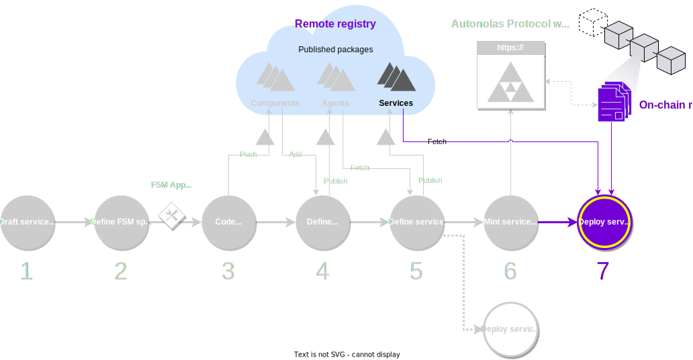

# Deploy the service

The final step in the development process is [deploying the service](./overview_of_the_development_process.md). There are multiple deployment options to consider, such as deploying on your local machine for testing, deploying on a cluster within your own infrastructure, or deploying on a cloud provider.

<figure markdown>

<figcaption>Part of the development process covered in this guide</figcaption>
</figure>

The framework supports Docker Compose and Kubernetes cluster deployments. Additionally, the framework automates several steps in the deployment process for services registered in the {{ autonolas_protocol }}.

!!! tip

    Local service deployments are commonly used for testing services during active development. These deployments allow you to test and validate your service before minting it in the {{ autonolas_protocol }}, ensuring its readiness for production use.

## What you will learn

This guide covers step 6 of the [development process](./overview_of_the_development_process.md). You will learn the different types of service deployments offered by the framework.

You must ensure that your machine satisfies the [framework requirements](./set_up.md#requirements), you have [set up the framework](./set_up.md#set-up-the-framework), and you have a local registry [populated with some default components](./overview_of_the_development_process.md#populate-the-local-registry-for-the-guides). As a result you should have a Pipenv workspace folder with an initialized local registry (`./packages`) in it.

## Local deployment - full workflow

We illustrate the full local deployment workflow using the `hello_world` service as an example, both for Docker Compose and a simple Kubernetes cluster.

1. **Fetch the service.** In the workspace folder, fetch the service from the corresponding registry:

    === "Local registry"
        <!-- TODO FIXME: packages lock + push all should not be necessary here, but otherwise it cannot build the image. -->
        ```bash
        autonomy packages lock
        autonomy push-all
        autonomy fetch valory/hello_world:0.1.0 --service --local
        ```

    === "Remote registry"
        ```bash
        autonomy fetch valory/hello_world:0.1.0:bafybeihl6j7ihkytk4t4ca2ffhctpzydwi6r4a354ubjasttuv2pw4oaci --service
        ```

2. **Build the agents' image.** Navigate to the service runtime folder that you have just created and build the Docker image of the agents of the service:

    ```bash
    cd hello_world
    autonomy build-image #(1)!
    ```

    1. Check out the [`autonomy build-image`](../../../advanced_reference/commands/autonomy_build-image) command documentation to learn more about its parameters and options.

    After the command finishes, you can check that the image has been created by executing:

    ```bash
    docker image ls | grep <agent_name>
    ```

    You can find the `agent_name` within the service configuration file `service.yaml`.

3. **Prepare the keys file.** Prepare a JSON file `keys.json` containing the wallet address and the private key for each of the agents that you wish to deploy in the local machine.

    ???+ example "Example of a `keys.json` file"

        <span style="color:red">**WARNING: Use this file for testing purposes only. Never use the keys or addresses provided in this example in a production environment or for personal use.**</span>

        ```json title="keys.json"
        [
          {
              "address": "0x15d34AAf54267DB7D7c367839AAf71A00a2C6A65",
              "private_key": "0x47e179ec197488593b187f80a00eb0da91f1b9d0b13f8733639f19c30a34926a"
          },
          {
              "address": "0x9965507D1a55bcC2695C58ba16FB37d819B0A4dc",
              "private_key": "0x8b3a350cf5c34c9194ca85829a2df0ec3153be0318b5e2d3348e872092edffba"
          },
          {
              "address": "0x976EA74026E726554dB657fA54763abd0C3a0aa9",
              "private_key": "0x92db14e403b83dfe3df233f83dfa3a0d7096f21ca9b0d6d6b8d88b2b4ec1564e"
          },
          {
              "address": "0x14dC79964da2C08b23698B3D3cc7Ca32193d9955",
              "private_key": "0x4bbbf85ce3377467afe5d46f804f221813b2bb87f24d81f60f1fcdbf7cbf4356"
          }
        ]
        ```

    You also need to export the environment variable `ALL_PARTICIPANTS` with the addresses of **all** the agents in the service. In other words, the addresses of the agents you are deploying (in the `keys.json` file) must be a subset of  the addresses in `ALL_PARTICIPANTS`, which might contain additional addresses:

    ```bash
    export ALL_PARTICIPANTS='[
        "0x15d34AAf54267DB7D7c367839AAf71A00a2C6A65",
        "0x9965507D1a55bcC2695C58ba16FB37d819B0A4dc",
        "0x976EA74026E726554dB657fA54763abd0C3a0aa9",
        "0x14dC79964da2C08b23698B3D3cc7Ca32193d9955"
    ]'
    ```

    If you have a situation where you need to define keys for multiple ledgers you can define them using the following format

    ```json title="keys.json"
    [
        [
            {
                "address": "4Si...",
                "private_key": "5P1...",
                "ledger": "solana"
            },
            {
                "address": "0x1...",
                "private_key": "0x1...",
                "ledger": "ethereum"
            }
        ],
        [
            {
                "address": "H1R...",
                "private_key": "2T1...",
                "ledger": "solana"
            },
            {
                "address": "0x6...",
                "private_key": "0xc...",
                "ledger": "ethereum"
            }
        ],
        [
            {
                "address": "3bq...",
                "private_key": "5r5...",
                "ledger": "solana"
            },
            {
                "address": "0x5...",
                "private_key": "0x7...",
                "ledger": "ethereum"
            }
        ],
        [
            {
                "address": "6Gq...",
                "private_key": "25c...",
                "ledger": "solana"
            },
            {
                "address": "0x5...",
                "private_key": "0x7...",
                "ledger": "ethereum"
            }
        ]
    ]
    ```

4. **Build the deployment.** Within the service runtime folder, execute the command below to build the service deployment:

    === "Docker Compose"

        ```bash
        rm -rf abci_build #(1)!
        autonomy deploy build keys.json -ltm #(2)!
        ```

        1. Delete previous deployments, if necessary.
        2. `-ltm` stands for "use local Tendermint node". Check out the [`autonomy deploy build`](../../../advanced_reference/commands/autonomy_deploy/#autonomy-deploy-build) command documentation to learn more about its parameters and options.

        This will create a deployment environment within the `./abci_build` folder with the following structure:

        ```bash
        abci_build/
        ├── agent_keys
        │   ├── agent_0
        │   ├── agent_1
        │   |   ...
        │   └── agent_<N-1>
        ├── nodes
        │   ├── node0
        │   ├── node1
        │   |   ...
        │   └── node<N-1>
        ├── persistent_data
        │   ├── benchmarks
        │   ├── logs
        │   ├── tm_state
        │   └── venvs
        └── docker-compose.yaml
        ```

    === "Kubernetes"

        ```bash
        rm -rf abci_build #(1)!
        autonomy deploy build keys.json -ltm --kubernetes #(2)!
        ```

        1. Delete previous deployments, if necessary.
        2. `-ltm` stands for "use local Tendermint node". Check out the [`autonomy deploy build`](../../../advanced_reference/commands/autonomy_deploy/#autonomy-deploy-build) command documentation to learn more about its parameters and options.

        This will create a deployment environment within the `./abci_build` folder with the following structure:

        ```
        abci_build/
        ├── agent_keys
        │   ├── agent_0_private_key.yaml
        │   ├── agent_1_private_key.yaml
        │   |   ...
        │   └── agent_<N-1>_private_key.yaml
        ├── build.yaml
        └── persistent_data
            ├── benchmarks
            ├── logs
            ├── tm_state
            └── venvs
        ```

5. **Execute the deployment.** Navigate to the deployment environment folder (`./abci_build`) and run the deployment locally.

    === "Docker Compose"

        ```bash
        cd abci_build
        autonomy deploy run #(1)!
        ```

        1. Check out the [`autonomy deploy run`](../../advanced_reference/commands/autonomy_deploy/#autonomy-deploy-run) command documentation to learn more about its parameters and options.

        This will spawn in the local machine:

        * $N$ agents containers, each one running an instance of the corresponding {{fsm_app}}.
        * a network of $N$ Tendermint nodes, one per agent.

    === "Kubernetes"

        We show how to run the service deployment using a local [minikube](https://minikube.sigs.k8s.io/docs/start/) cluster. You might want to consider other local cluster options such as [kind](https://kind.sigs.k8s.io/).

        1. Create the minikube Kubernetes cluster.
            ```bash
            cd abci_build
            minikube start --driver=docker
            ```

        2. Install chart
        
            ```bash
            helm repo add nfs-ganesha-server-and-external-provisioner https://kubernetes-sigs.github.io/nfs-ganesha-server-and-external-provisioner/
            helm install nfs-provisioner nfs-ganesha-server-and-external-provisioner/nfs-server-provisioner \
                --set=image.tag=v3.0.0,resources.limits.cpu=200m,storageClass.name=nfs-ephemeral -n nfs-local --create-namespace
            ```

        2. Make sure your image is pushed to Docker Hub (`docker push`).
            If this is not the case, you need to provision the cluster with the agent image so that it is available for the cluster pods.
            This step might take a while, depending on the size of the image.
            ```bash
            minikube image load <repository>:<tag> # (1)!
            ```

            1. You can get the `<repository>` and `<tag>` by inspecting the output of `docker image ls`.

            In this case, you also might need to change all the instances of `imagePullPolicy: Always` to `imagePullPolicy: IfNotPresent` in the deployment file `build.yaml`.


        3. Define the StorageClass. Replace with your NFS provisioner and adjust per your requirements. We use `minikube-hostpath` as an example.
            ```bash 
            cat <<EOF > storageclass.yaml
            apiVersion: storage.k8s.io/v1
            kind: StorageClass
            metadata:
                name: nfs-ephemeral
            provisioner: kubernetes.io/no-provisioner
            volumeBindingMode: WaitForFirstConsumer
            reclaimPolicy: Retain
            EOF
            ```

        4. Apply all the deployment files to the cluster
           ```bash 
           kubectl apply --recursive -f .
           ```

        After executing these commands, the minikube cluster will start provisioning and starting $N$ pods in the cluster. Each pod contains:

        * one agent container, running an instance of the corresponding {{fsm_app}}.
        * one Tendermint node associated to the agent.

6. **Examine the deployment.**

    === "Docker Compose"

        To inspect the logs of a single agent or Tendermint node you can execute `docker logs <container_id> --follow` in a separate terminal.

        You can cancel the local execution at any time by pressing ++ctrl+c++.   

    === "Kubernetes"

        You can access the cluster dashboard by executing `minikube dashboard` in a separate terminal. To examine the logs of a single agent or Tendermint node you can execute:

        1. Get the Kubernetes pod names.
            ```bash
            kubectl get pod
            ```

        2. Access the logs of the agent in pod `<pod-name>`.
            ```bash 
            kubectl exec -it <pod-name> -c aea -- /bin/sh
            ```

        3. Access the logs of the Tendermint node in pod `<pod-name>`.
            ```bash 
            kubectl exec -it <pod-name> -c node0 -- /bin/sh
            ```

        You can delete the local cluster by executing `minikube delete`.

## Local deployment of minted services

The framework provides a convenient method to deploy agent services minted in the {{ autonolas_protocol }}. This has the benefit that some configuration parameters of the {{fsm_app}} skill will be overridden automatically with values obtained on-chain. Namely:

```yaml title="skill.yaml"
# (...)
models:
    params:
    args:
        setup:
        all_participants:      # Overridden with the registered values in the Autonolas protocol
        safe_contract_address: # Overridden with the registered values in the Autonolas protocol
        consensus_threshold:   # Overridden with the registered values in the Autonolas protocol
```

This means, in particular, that there is no need to define the `ALL_PARTICIPANTS` environment variable.

1. **Find the service ID.** Explore the [services section]({{ autonolas_protocol_registry_dapp_link }}/services) in the {{ autonolas_protocol_registry_dapp }}, and note the token ID of the service that you want to deploy. The service must be in [Deployed state](https://docs.autonolas.network/protocol/life_cycle_of_a_service/#deployed).

2. **Prepare the keys file.** Prepare a JSON file `keys.json` containing the wallet address and the private key for each of the agents that you wish to deploy in the local machine.

    ???+ example "Example of a `keys.json` file"

        <span style="color:red">**WARNING: Use this file for testing purposes only. Never use the keys or addresses provided in this example in a production environment or for personal use.**</span>

        ```json title="keys.json"
        [
          {
              "address": "0x15d34AAf54267DB7D7c367839AAf71A00a2C6A65",
              "private_key": "0x47e179ec197488593b187f80a00eb0da91f1b9d0b13f8733639f19c30a34926a"
          },
          {
              "address": "0x9965507D1a55bcC2695C58ba16FB37d819B0A4dc",
              "private_key": "0x8b3a350cf5c34c9194ca85829a2df0ec3153be0318b5e2d3348e872092edffba"
          },
          {
              "address": "0x976EA74026E726554dB657fA54763abd0C3a0aa9",
              "private_key": "0x92db14e403b83dfe3df233f83dfa3a0d7096f21ca9b0d6d6b8d88b2b4ec1564e"
          },
          {
              "address": "0x14dC79964da2C08b23698B3D3cc7Ca32193d9955",
              "private_key": "0x4bbbf85ce3377467afe5d46f804f221813b2bb87f24d81f60f1fcdbf7cbf4356"
          }
        ]
        ```

3. **Deploy the service.** Execute the following command:

    === "Docker Compose"

        ```bash
        autonomy deploy from-token <ID> keys.json --use-goerli # (1)!
        ```

        1. `--use-goerli` indicates that the service is registered in the Görli testnet. Check out the [`autonomy deploy from-token`](../../../advanced_reference/commands/autonomy_deploy/#autonomy-deploy-from-token) command documentation to learn more about its parameters and options.

        The Docker Compose deployment will be built and run for the agents whose keys are defined in the `keys.json` file. If you just want to build the deployment without running it, simply add the flag `--no-deploy`.

    === "Kubernetes"

        ```bash
        autonomy deploy from-token <ID> keys.json --use-goerli --kubernetes # (1)!
        ```

        2. `--use-goerli` indicates that the service is registered in the Görli testnet. Check out the [`autonomy deploy from-token`](../../../advanced_reference/commands/autonomy_deploy/#autonomy-deploy-from-token) command documentation to learn more about its parameters and options.

        The Kubernetes deployment will be built for the agents whose keys are defined in the `keys.json` file. You need to deploy the service in the local cluster manually. Follow the instructions in Step 5 of the [local deployment - full workflow](#local-deployment-full-workflow) section.

## Cloud deployment

The sections above for local deployments provide a fundamental understanding of how to deploy agent services in general. The [Open Operator](https://github.com/valory-xyz/open-operator) repository provides the necessary resources and guidelines for seamless cloud deployments of agent services based on the Open Autonomy framework.
