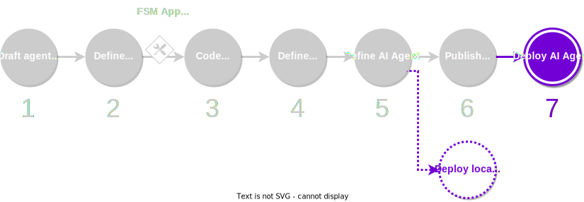

# Deploy the service

The last step in the [development process](../overview_of_the_development_process.md) consists in deploying the service. The framework offers a few alternatives to deploy services, depending on what is its current status: from local deployments for testing services being developed to cloud deployment for production-ready services.

<figure markdown>

<figcaption>Part of the development process covered in this guide</figcaption>
</figure>

!!! warning "Important"

    If your service is stored in a local registry, we recommend that you fetch it outside the registry (to an independent service runtime folder) before you start with the deployment process. This is to avoid publishing unintended files (e.g., temporary files or private keys) on the remote registry.

## What you will learn

This guide covers step 6 of the [development process](../overview_of_the_development_process.md). You will learn the different types of service deployment offered by the framework.

You must ensure that your machine satisfies the [framework requirements](../set_up.md#requirements), you have [set up the framework](../set_up.md#set-up-the-framework), and you have a local registry [populated with some default components](../set_up.md#populate-the-local-registry-for-the-guides). As a result you should have a Pipenv workspace folder with an initialized local registry (`./packages`) in it.
