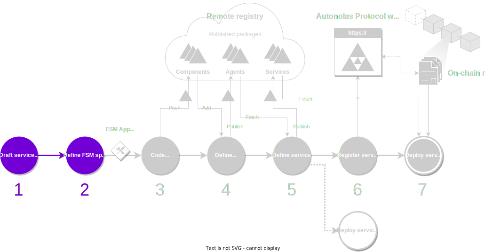

We will be covering the first two steps of the development process in this guide. We will use as an example the [Hello World service](../demos/hello_world_demo.md), where a set of 4 agents coordinate and take turns to print a "Hello World" message in their respective console.

<figure markdown>

<figcaption>Part of the development process covered in this guide</figcaption>
</figure>

## What you will learn

In this guide, you will learn how to write the {{fsm_app}} specification that defines the main steps in the business logic of your service. You will complete the actual actions of each state in the next step of the development process.

Before starting this guide, ensure that your machine satisfies the framework requirements and that you have followed the [set up guide](./set_up.md). As a result you should have a Pipenv workspace folder.

## Draft the service idea

Define the business logic of your service as a [finite-state machine (FSM)](../key_concepts/fsm.md). That is, determine, at high-level, what are the states, events and transitions of the service:

* **States** define points where actions are executed (e.g., an agent sends a transaction on-chain).
* **Events** represent observed conditions (e.g., all agents have responded with a value, or an error has occurred).
* **Transitions** define how to move from one state to another based on the events observed (e.g., if the service observes an error event in a certain state, move back to the initial state).

???+ example "Example of a service FSM"
    This is a draft of the FSM of the [Hello World service](../demos/hello_world_demo.md). You can learn more about the purpose of each of the individual states, events and transitions in its [dedicated section](../demos/hello_world_demo.md).

    <figure markdown>
    
    </figure>

!!! warning "Important"

    You will need to consider what kind of consensus is required to transit from one state to another. For example:

    * Do agents have to put in common the same value (e.g., a value observed from the same service provider) or a different value (e.g., each agent collects a value from a different service provider)?
    * Do all agents need to participate in the consensus step, or it is enough a threshold of agents to transit to the next state?.

## Define the FSM specification

In the workspace folder, define the `fsm_specification.yaml` file that formally encodes the FSM that you have designed in the previous step. This file must adhere to a syntax that is understood by the framework. The example below is self-explanatory.

???+ example "Example of an `fsm_specification.yaml` file"
    Given a draft of the FSM, the structure of the `fsm_specification.yaml` file is quite straightforward. Below we show the FSM specification file of the [Hello World service](../demos/hello_world_demo.md).

    ```yaml
    alphabet_in:
    - DONE
    - NO_MAJORITY
    - RESET_TIMEOUT
    - ROUND_TIMEOUT
    default_start_state: RegistrationRound
    final_states: []
    label: HelloWorldAbciApp
    start_states:
    - RegistrationRound
    states:
    - CollectRandomnessRound
    - PrintMessageRound
    - RegistrationRound
    - ResetAndPauseRound
    - SelectKeeperRound
    transition_func:
        (CollectRandomnessRound, DONE): SelectKeeperRound
        (CollectRandomnessRound, NO_MAJORITY): CollectRandomnessRound
        (CollectRandomnessRound, ROUND_TIMEOUT): CollectRandomnessRound
        (PrintMessageRound, DONE): ResetAndPauseRound
        (PrintMessageRound, ROUND_TIMEOUT): RegistrationRound
        (RegistrationRound, DONE): CollectRandomnessRound
        (ResetAndPauseRound, DONE): CollectRandomnessRound
        (ResetAndPauseRound, NO_MAJORITY): RegistrationRound
        (ResetAndPauseRound, RESET_TIMEOUT): RegistrationRound
        (SelectKeeperRound, DONE): PrintMessageRound
        (SelectKeeperRound, NO_MAJORITY): RegistrationRound
        (SelectKeeperRound, ROUND_TIMEOUT): RegistrationRound
    ```
