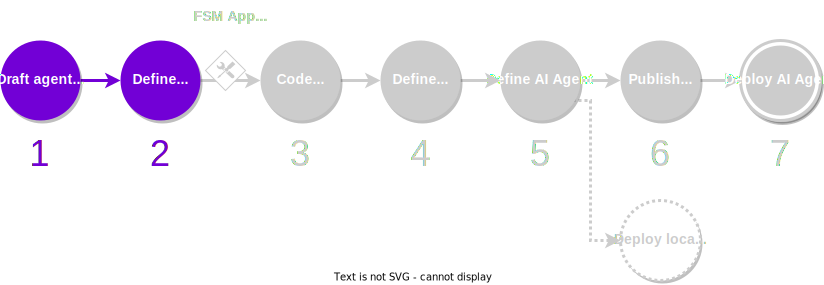
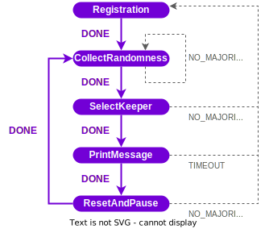

The first task when designing an AI agent is to describe its business logic into a [finite-state machine (FSM)](../key_concepts/fsm.md). You must be able to identify the different states of the AI agent, and what are the events that trigger a change from one state to another.

<figure markdown>

<figcaption>Part of the development process covered in this guide</figcaption>
</figure>

## What you will learn

This guide covers steps 1 and 2 of the [development process](./overview_of_the_development_process.md). You will learn how to write the {{fsm_app}} specification that defines the main steps in the business logic of your AI agent. The actual coding of the {{fsm_app}} will be covered in the next step.

We will use as an example the FSM used in the [Hello World AI agent](https://stack.olas.network/demos/hello-world/), where a set of 4 agents coordinate and take turns to print a "Hello World" message in their local console.

You must ensure that your machine satisfies the [framework requirements](./set_up.md#requirements), you have [set up the framework](./set_up.md#set-up-the-framework), and you have a local registry [populated with some default components](./overview_of_the_development_process.md#populate-the-local-registry-for-the-guides). As a result you should have a Pipenv workspace folder with an initialized local registry (`./packages`) in it.

## Draft the AI agent idea

Describe the business logic of your AI agent as an FSM. That is, determine, at a high level, what are the states, events and transitions of the AI agent:

* **States** define points where actions are executed (e.g., an agent instance sends a transaction on-chain).
* **Events** represent observed conditions (e.g., all agent instances have shared a value, or a timeout has occurred).
* **Transitions** define how to move from one state to another based on the events observed (e.g., if the AI agent observes an error event in a certain state, then move back to the initial state).

???+ example "Example of an AI agent FSM"
    This is an example of the FSM of the [Hello World AI agent](https://stack.olas.network/demos/hello-world/), at high level. You can learn more about the purpose of each of the states, events and transitions in [its documentation page](https://stack.olas.network/demos/hello-world/).

    <figure markdown>
    
    </figure>

!!! warning "Important"

    An important decision when designing your AI agent is to determine what kind of agreement is required to transit from one state to another. For example:

    * Do agent instances have to collect and share a common value (e.g., a value observed from the same service provider) or a different value (e.g., each agent instance collects a value from a different service provider)?
    * Do all agent instances need to participate in the agreement to transit to another state, or is it enough that only a threshold of agent instances participate?

## Define the FSM specification

In the workspace folder, create a file `fsm_specification.yaml`, which formally encodes the FSM that you have designed in the previous step. This file must adhere to a syntax that is understood by the framework. Hopefully, the example below is self-explanatory.

???+ example "Example of an `fsm_specification.yaml` file"
    Given a draft of the FSM, the structure of the `fsm_specification.yaml` file is quite straightforward. Below we show the FSM specification file of the [Hello World AI agent](https://stack.olas.network/demos/hello-world/).

    ```yaml title="fsm_specification.yaml"
    alphabet_in:
    - DONE
    - NONE
    - NO_MAJORITY
    - RESET_TIMEOUT
    - ROUND_TIMEOUT
    default_start_state: RegistrationRound
    final_states: []
    label: HelloWorldAbciApp
    start_states:
    - RegistrationRound
    states:
    - CollectRandomnessRound
    - PrintMessageRound
    - RegistrationRound
    - ResetAndPauseRound
    - SelectKeeperRound
    transition_func:
        (CollectRandomnessRound, DONE): SelectKeeperRound
        (CollectRandomnessRound, NONE): CollectRandomnessRound
        (CollectRandomnessRound, NO_MAJORITY): CollectRandomnessRound
        (CollectRandomnessRound, ROUND_TIMEOUT): CollectRandomnessRound
        (PrintMessageRound, DONE): ResetAndPauseRound
        (PrintMessageRound, ROUND_TIMEOUT): RegistrationRound
        (RegistrationRound, DONE): CollectRandomnessRound
        (ResetAndPauseRound, DONE): CollectRandomnessRound
        (ResetAndPauseRound, NO_MAJORITY): RegistrationRound
        (ResetAndPauseRound, RESET_TIMEOUT): RegistrationRound
        (SelectKeeperRound, DONE): PrintMessageRound
        (SelectKeeperRound, NONE): RegistrationRound
        (SelectKeeperRound, NO_MAJORITY): RegistrationRound
        (SelectKeeperRound, ROUND_TIMEOUT): RegistrationRound
    ```
