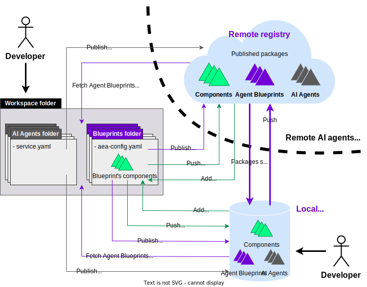

During the development of agents and services, users need to manage other packages, either developing them themselves or fetching already available ones. This guide will show you which are the relevant directories during development and how to get, use and publish packages.

The first thing you need to know is that there are different types of packages: services, agents, connections, contracts, protocols and skills. Services are composed of agents, and agents are composed of connections, contracts, protocols and skills. All these packages can live in different places:

- Inside an agent if they are being used by that agent, with the exception of services which never live inside an agent.
- In the local registry (packages folder), a local directory that stores packages classified by vendor.
- In the remote registry, a remote machine that serves packages over IPFS or HTTP.

You can see that this setup is not that different from the one git uses.

<figure markdown>
{ width="85%" height="85%" style="display: block; margin: 0 auto" }
<figcaption>Overview of the package managing flows with the Open Autonomy framework</figcaption>
</figure>

This package organization lets users develop in two different ways:

- Create an agent and develop inside it. In this case you will have a vendor folder inside the agent containing all packages from other developers, and it is not recommended to modify anything inside it. Packages under development will live inside the agent's component specific folders `skills`, `connections`, `contracts` and `protocols`  (see green box on the diagram).

- Develop the needed packages independently from the agent, inside the local registry (packages folder) and later add them to an agent. **This is the recommended method as it improves separation of concerns and offers the cleanest developer experience.**

## The agent structure

The first thing a developer needs to do before they start writing code is setting up the project. Instead of starting from scratch, we recommend to use our [developer template](https://github.com/valory-xyz/dev-template). Once setup, it will generate a virtual environment with {{open_autonomy}} installed, an empty local registry, some useful tools for checking packages and dummy tests. After this, in the same fashion git asks to initialize its configuration using `git config`, {{open_autonomy}} asks the user to set the user name, whether we are using a local or remote registry as well as the type of registry (IPFS by default). For example, initialize your registry running the following command:

```bash
autonomy init --reset --author john_doe --remote --ipfs --ipfs-node "/dns/registry.autonolas.tech/tcp/443/https"
```

Now we are in the position of creating our first agent:

```bash
autonomy create my_agent
cd my_agent
```

If you explore the newly created `my_agent` directory, you'll see it contains the following structure:

```bash
my_agent
    ├── aea-config.yaml
    ├── connections
    ├── contracts
    ├── protocols
    ├── skills
    └── vendor
           ├── __init__.py__
           └── open_aea
                   └── protocols
                         └── signing
```

So your new agent just contains the basic signing protocol from `open_aea` inside the `vendor` directory. Remember that you are not expected to modify these third party packages inside this directory. All your packages go inside `my_agent/connections`, `my_agent/contracts`, `my_agent/protocols` and `my_agent/skills`.


## Adding a remote package to the agent

Let's say we now want to add a new feature to this agent, for instance the ability to communicate using the Tendermint protocol. Since that package is already available on the Autonolas IPFS registry, we'll use the `add command` with the `--remote` flag:

```bash
# Remote flag is not needed here as we initialized the default registry to remote
autonomy add protocol valory/tendermint:0.1.0:bafybeihcnjhovvyyfbkuw5sjyfx2lfd4soeocfqzxz54g67333m6nk5gxq
```

You can check your new protocol package at the following location:

```bash
my_agent
    └── vendor
           └── valory
                   └── protocols
                           └── tendermint
```

It is useful to add these third party vendor path to the `.gitignore` so your repository just tracks your own packages. For the local registry, paths like `packages/valory` should also be added to it.

After adding a vendor package, you can also move it from the vendor into the non-vendor directories by:
```bash
autonomy eject protocol valory/tendermint:0.1.0
```

## Creating a new package inside the agent

Now we might want to develop our own package, for example a cool skill. We could do it writing all the skill structure from scratch, but fortunately the CLI also provides a scaffolding option that will create a lot of boilerplate for us:

```bash
autonomy scaffold skill my_skill
```

You can learn more on scaffolding by reading the [scaffolding guide](../guides/scaffolding.md).

Since this is not a third party package, it will live in the `my_agent/skills` directory instead of the vendor one.

```bash
my_agent
    └── skills
           └── my_skill
```

You can now start coding the skill. At some point, you will might want to send this new package to the local registry so it is available for other agents:

```bash
autonomy push skill john_doe/my_skill:0.1.0 --local
```

Now your skill lives in two places: inside the agent but also inside the packages folder or local registry.

```bash
dev-template
     ├── my_agent
     │      └── skills
     │             └── my_skill
     │
     └── packages
            └── john_doe
                   └── skills
                          └── my_skill
```

Even if the skill is now in the local registry, there is another task we need to perform: update the `packages/packages.json` file. This file contains a list of all packages in the registry, as well as their hashes. It's useful to detect when packages change, are added or removed. If you open that file you will see it is empty. To reflect our latest changes, run:

```bash
autonomy packages lock
```

This will add the new skill hash to it:

```json
{
    "skill/john_doe/my_skill/0.1.0": "bafybeiadky26ikfirmffr6hw5qyoudu37y25gabyaqpimuprqlbwq4fvae"
}
```

While developing, each change will make this hash out of date. You can run the following to check whether you need to update `autonomy packages lock` again:

```bash
autonomy packages lock --check
```

If we would like to remove the non-vendor package from the agent:

```bash
autonomy remove skill john_doe/my_skill:0.1.0
```


## Creating a new package inside the local registry

If you have been paying attention, you might have noticed that we have been following the first of the development flows explained in the introduction section. We have been developing inside the agent before pushing our packages to the local registry. But the recommended method is to develop directly in the local registry, and then add the package to the agent. Nonetheless, even if we do it the recommended way we still need to run the `scaffold` command from inside the agent folder:

```bash
autonomy scaffold --to-local-registry skill my_other_skill
autonomy packages lock
```

The new skill only lives in the local registry now, and `packages.json` should reflect both skills:

```json
{
    "skill/john_doe/my_other_skill/0.1.0": "bafybeihsxafmpvtqpr4ytdochaka7jqontg2jehujujedv7krjqodwuhkq",
    "skill/john_doe/my_skill/0.1.0": "bafybeiadky26ikfirmffr6hw5qyoudu37y25gabyaqpimuprqlbwq4fvae"
}
```

If we would like the agent to use this new skill, then we need to add it similarly to how we did it for the tendermint protocol earlier, but using the flag for the local registry:

```bash
autonomy add skill john_doe/my_other_skill:0.1.0 --local
```

This time, since we are importing it from the registry, the skill will live inside the vendor folder.

## Publishing an agent

Until now, we have been fetching, adding and pushing packages. But eventually we will want to push our finished agent as well. Agents are packages, but a special type of package that is not pushed but published instead. To send the agent and all its dependencies to the local registry:

```bash
autonomy publish --local --push-missing
```

As it happened when we pushed our skill, now the agent lives in two different places.

```bash
dev-template
     ├── my_agent
     │
     └── packages
            └── john_doe
                   └── agents
                          └── my_agent
```

But since we encourage developing inside the local registry, we might as well delete the original agent running the following from the original agent folder:

```bash
cd ..
autonomy delete my_agent
```

## Fetching agents and services

Now you know how to publish your own agent, but what if you actually want to get one agent or service from the registry? We have you covered. To get your previously pushed agent from the local registry, run:

```bash
autonomy fetch john_doe/my_agent --local
```

If you run the previous command, you will see that you now have the `my_agent` folder again, but this time it only contains the agent configuration and the `vendor` folder because we are fetching from the registry.

Fetching works for services as well:

```bash
autonomy fetch valory/hello_world:0.1.0:bafybeihrng5d73bsctkjilgc2lxkn4ditsbf3c7vqmt6wpi45zglq42i2e --service --remote
```

Sometimes agents and services share the same name, so the `--service` and `--agent` flags are useful to break any ambiguity.


## The remote registry

We have been mostly working with the local registry, but for other developers to be able of fetching your packages you will need to push them to the remote registry: `push`, `publish`, `add` and `fetch` commands work with the `--remote` flag. When you specify it instead of the `--local` one, operations will be performed against a remote server. You can also push a package directly from the local registry to the remote one:

```bash
# Remove all cache files before running
autonomy push skill packages/john_doe/skills/my_skill/ --remote
```

Or maybe you prefer to push all your packages in one step:

```bash
# Remove all cache files before running
autonomy push-all --remote
```

Remember how we updated the package hashes when we pushed to the local registry? It is good practice to keep your `packages.json` updated so it matches the state of your packages. This also applies to the remote registry. Sometimes you want to be sure that a package you have fetched has not been modified. When a package is out of sync, you have two options:


- Update your local hashes to match the remote package:
```bash
autonomy packages sync --update-hashes
```

- Re-download the packages whose hashes do not match:
```bash
autonomy packages sync --update-packages
```