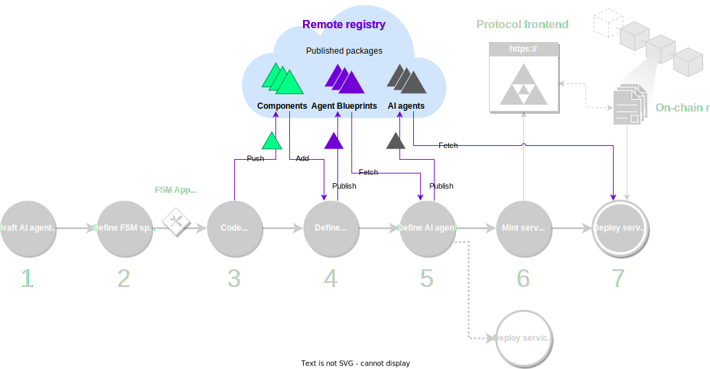
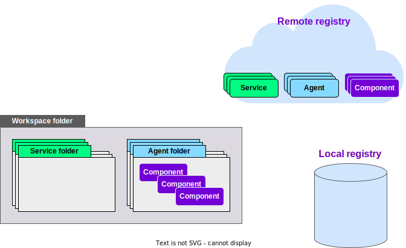

The {{open_autonomy}} framework works with the concept of **package**: a collection of files that implement a specific component or functionality.
Publishing a package is simply the process of storing the package into a registry (or in other words, a repository), either locally or remotely.

<figure markdown>

<figcaption>Part of the development process covered in this guide</figcaption>
</figure>

By publishing a package on a remote repository, its code is available for other developers to reuse it. Moreover, publishing a package on a public repository also facilitates [minting the package in the Autonolas Protocol](./publish_mint_packages.md).

!!! note
      It is not a strict requirement that a package be publicly available in a remote repository to register it in the on-chain protocol. The developer might want to keep the code private (and share it by different means), and still be able to register the package in the on-chain protocol.

## What will you learn

In this guide, you will learn to:

* Manage the life cycle of packages with the framework.
* Publish and retrieve packages from local and remote registries.

## How the local and remote registries work

Currently, the {{open_autonomy}} framework supports two types of registries:

  * local, and
  * remote [IPFS](https://ipfs.io/).

There are three main types of packages that can be stored in these registries:

  * services,
  * agents, and
  * components (which include connections, contracts, protocols and skills).

Services use agent packages, and agents use component packages. Packages are developed locally and stored in a registry to be retrieved and reused in a later stage. Every package has a **public package ID** that follows the naming convention `<author_name>/<package_name>:<version>`.

You can browse the [list of default packages](../package_list.md) of the {{open_autonomy}} framework available on the default remote IPFS registry.

Packages live in a different space when being used by the developer, and they are stored on and retrieved from a registry using different commands. The table below presents a summary.

| **Package type** | **Command to store on a registry** | **Command to retrieve from a registry** |
|--------------|----------------------------------|-------------------------------------|
| Service      | `autonomy publish`               | `autonomy fetch`                    |
| Agent        | `autonomy publish`               | `autonomy fetch`                    |
| Component    | `autonomy push`                  | `autonomy add`                      |


### Workspace folder vs local registry

The figure below shows a typical setup, where you might identify some common traits with the Git methodology. Within the workspace folder, the arrows in the diagram point to the locations where the different operations can be executed in the local machine.

<figure markdown>
{ width="85%" height="85%" style="display: block; margin: 0 auto" }
<figcaption>Overview of the package management flow with the Open Autonomy framework</figcaption>
</figure>

It is important not to confuse a **local registry** with a local **workspace folder**. The local registry is simply a repository to store finalized packages, mimicking the role of a remote registry on the local machine. A workspace folder is any folder where you can retrieve the contents of a registry (local or remote). The table below summarizes the main differences between these two locations.

|                            | **Workspace folder**                                                              | **Local registry**                                                                                                                    |
|----------------------------|-------------------------------------------------------------------------------|-----------------------------------------------------------------------------------------------------------------------------------|
| Location                   | Any folder                                                                    | Parent or child `/packages` folder of active folder (default). Alternatively, specified through `--registry-path` top-level flag. |
| Service package location   | `./<service_package>`                                                         | `./<author_name>/agents/<service_package>`                                                                                        |
| Agent package location     | `./<agent_package>`                                                           | `./<author_name>/agents/<agent_package>`                                                                                          |
| Component package location | `./<agent_package>/vendor/<author_name>/<component_type>/<component_package>` | `./<author_name>/<component_type>/<component_package>`                                                                            |


You can either:

1.  Develop a package in a workspace folder by retrieving a certain component from a registry, modify it and then store it in a local registry.
2.  Or develop a component directly in a local registry.  **This is the recommended approach.** You can have as many local registries as you want, and you can always store finalized components on a remote registry.

Regardless of the methodology that you choose to develop your packages, it is important that they are developed with a clear separation of concerns, so that they can be reused in other projects.

## How to tell the framework what registry to use
The `push`, `add`, `publish` and `fetch` commands use, by default, the registry specified when the framework was initiated (command `autonomy init`). See for example the [set up guide](./set_up#set-up), where we initialized the framework to use the default remote [IPFS](https://ipfs.io) registry.

Additionally, the framework configuration can be overridden per command by using the flags `--local` or `--remote` in any of the commands  `push`, `add`, `publish` or `fetch`.

The framework assumes that the location of the local registry is the subfolder `./packages`, or alternatively, the parent folder `../packages`. Alternatively, you can specify the local registry folder with the top-level flag `--registry-path`, for example:
```bash
autonomy --registry-path=../my_registry publish --local
```


## Push and add components
This section assumes that you have a newly created component, e.g., an {{fsm_app}} skill, within an agent folder. It is out of the scope of this guide how to create agent components. You can review the [guide to create an {{fsm_app}}](./code_fsm_app_skill.md), or the {{open_aea_doc}}. Your component should be located within an agent folder (i.e., a folder containing the file `aea-config.yaml`) in
```
<agent_folder>/vendor/<author_name>/<component_type>/<package_name>.
```
Here, `<component_type>` is one of `connections`, `contracts`, `protocols` or `skills`.

### Push a component on a registry

1. Ensure that the framework has been [initialized with the desired registry](#how-to-tell-the-framework-what-registry-to-use) (local or remote).

2. Within the agent folder, run the command
    ```bash
    autonomy push <component_type> ./vendor/<author_name>/<component_type>/<component_name>
    ```
3. You should see a message
    ```bash
    Pushed component with:
    	PublicId: <author_name>/<package_name>:<version>
    	Package hash: <hash>
    ```

If you are using the default remote IPFS registry (`/dns/registry.autonolas.tech/tcp/443/https`), you can check that the service has been successfully pushed by accessing the gateway https://gateway.autonolas.tech/ipfs/`<hash>`, by substituting the appropriate `<hash>` value.

### Add a component from a registry

1. Ensure that the framework has been [initialized with the desired registry](#how-to-tell-the-framework-what-registry-to-use) (local or remote).

2. Within the agent folder, run the command
    ```bash
    autonomy add <component_type> <author_name>/<package_name>:<version>:<hash>
    ```
3. You should see a message
    ```bash
    Adding item from hash: <hash>
    Successfully added <component_type> '<author_name>/<package_name>:<version>'.
    ```

## Publish and fetch agents
This section assumes that you have a newly created agent in a workspace folder. It is out of the scope of this guide how to create agents. You can review the [guide to define an agent](./define_agent.md), or the {{open_aea_doc}}. Your agent should be located in an agent folder (i.e., a folder containing the file `aea-config.yaml`).

### Publish an agent on a registry

1. Ensure that the framework has been [initialized with the desired registry](#how-to-tell-the-framework-what-registry-to-use) (local or remote).

2. Within the agent folder, run the command
    ```bash
    autonomy publish
    ```

3. You should see the message
    ```bash
    Successfully published agent <package_name> to the Registry with.
    	Public ID: <author_name>/<package_name>:<version>
    	Package hash: <hash>
    ```
!!!! warning
    In case the agent contains components not yet pushed, it might be required that you run the command `autonomy publish --push-missing`, which automatically will push any missing component package.

If you are using the default remote IPFS registry (`/dns/registry.autonolas.tech/tcp/443/https`), you can check that the agent has been successfully published by accessing the gateway https://gateway.autonolas.tech/ipfs/`<hash>`, by substituting the appropriate `<hash>` value.

### Fetch an agent from a registry

1. Ensure that the framework has been [initialized with the desired registry](#how-to-tell-the-framework-what-registry-to-use) (local or remote).

2. Within the workspace folder, run the command
    ```bash
    autonomy fetch <author_name>/<package_name>:<version>:<hash>
    ```

3. You should see a series of messages
    ```bash
    Adding item from hash: <hash>
    Successfully added <component_type> '<author_name>/<package_name>:<version>'.
    (...)
    ```
    for each agent component being added, and a final message
    ```bash
    Agent <package_name> successfully fetched.
    ```
    indicating that the agent has been successfully fetched.


## Publish and fetch services
This section assumes that you have a newly created service in a workspace folder. It is out of the scope of this guide how to create services. You can review the [guide to create a service with an existing agent](./define_service.md), or the [guide to define a service](./define_service.md). Your service should be located in an service folder (i.e., a folder containing the file `service.yaml`).

### Publish a service on a registry

1. Ensure that the framework has been [initialized with the desired registry](#how-to-tell-the-framework-what-registry-to-use) (local or remote).

2. Within the service folder, run the command
    ```bash
    autonomy publish
    ```

3. You should see the message
    ```bash
    Published service package with
    	PublicId: <author_name>/<package_name>:<version>
    	Package hash: <hash>
    ```

If you are using the default remote IPFS registry (`/dns/registry.autonolas.tech/tcp/443/https`), you can check that the service has been successfully published by accessing the gateway https://gateway.autonolas.tech/ipfs/`<hash>`, by substituting the appropriate `<hash>` value.

### Fetch a service from a registry

1. Ensure that the framework has been [initialized with the desired registry](#how-to-tell-the-framework-what-registry-to-use) (local or remote).

2. Within the workspace folder, run the command
    ```bash
    autonomy fetch <author_name>/<package_name>:<version>:<hash> --service
    ```

3. You should see the message
    ```bash
    Downloaded service package <author_name>/<package_name>:<version> @ <workspace_path>
    ```
