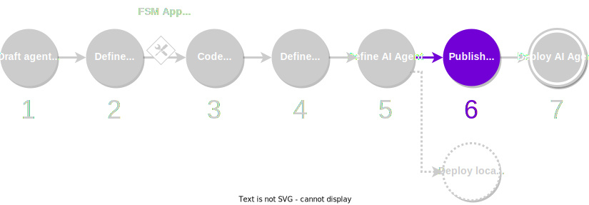

Once you have finished developing and testing your service locally, you can publish your software packages to the remote registry and mint them in the {{ autonolas_protocol }}. Minting software packages will produce a representation of them on-chain, in the form of NFTs.

<figure markdown>

<figcaption>Part of the development process covered in this guide</figcaption>
</figure>

You can mint packages using the {{ autonolas_protocol_registry_dapp }} or using the Open Autonomy CLI.

## What will you learn

This guide covers step 6 of the [development process](./overview_of_the_development_process.md). You will learn how to publish the software packages developed in the local registry (components, agents and services) to the remote registry, and how to mint them in the {{ autonolas_protocol }}.

You must ensure that your machine satisfies the [framework requirements](./set_up.md#requirements), you have [set up the framework](./set_up.md#set-up-the-framework), and you have a local registry [populated with some default components](./overview_of_the_development_process.md#populate-the-local-registry-for-the-guides). As a result you should have a Pipenv workspace folder with an initialized local registry (`./packages`) in it.

## Publish packages to the remote registry

The components developed in the local registry have to be referenced in the index file (`./packages/packages.json`) under the `dev` section. For example:

<!-- Use js instead of json lexer to support mkdocs-material comment features -->
```js title="packages.json"
{
    "dev": {
        "service/your_name/your_service/0.1.0": "bafybei0000000000000000000000000000000000000000000000000000",
        "agent/your_name/your_agent/0.1.0": "bafybei0000000000000000000000000000000000000000000000000000",
        "skill/your_name/your_fsm_app/0.1.0": "bafybei0000000000000000000000000000000000000000000000000000"
        /* (1)! */
    },
    "third_party": {
        /* (2)! */
    }
}
```

1. Any other `dev` entries that you have go here. Entries must be comma-separated (`,`).
2. Any other `third_party` entries that you have go here. Entries must be comma-separated (`,`).

You can now have your components published on the remote registry as follows:

```bash
autonomy packages lock #(1)!
autonomy push-all #(2)!
```

1. This command will correct the hash values in component configuration files, as well as in the local registry index file `packages.json`.
2. This command will push all the `dev` components to the remote registry. The output of the command will show an entry for each pushed component, which includes the package hash.

## Mint packages in the Autonolas Protocol

To mint a software package, all the packages it depends on must be minted first. For example, you need that an agent be minted before minting the corresponding service, and you need that the agent components are minted before minting the agent. You will need:

* An **address** associated to either
    * a crypto wallet (e.g., [Metamask](https://metamask.io/) or a cold wallet), or
    * a multisig contract (like [Safe](https://safe.global/)) which allows to connect via [Wallet Connect](https://walletconnect.com/).
  
    In either case, the address must have funds for the chain that you wish to mint the package on.

* The **hash of the package** that you want to mint, and which must have been published into a remote registry.

* An **NFT image URL**. This image will be used to represent the minted NFT for the package on marketplaces such as [OpenSea](https://opensea.io/). You can use [this sample image URL](https://gateway.autonolas.tech/ipfs/Qmbh9SQLbNRawh9Km3PMEDSxo77k1wib8fYZUdZkhPBiev) for testing purposes.

!!! tip

    If you are a new user of the framework, we recommend that you follow the instructions under the section [Testing the Autonolas Protocol locally](#testing-the-autonolas-protocol-locally).

### Using the Autonolas Protocol web app

The {{ autonolas_protocol_registry_dapp }} is a front-end that provides an intuitive GUI to mint components, agents and services, and manage the life cycle of services in the Autonolas Protocol.

We refer to the [Autonolas Protocol docs](https://docs.autonolas.network/protocol/), where you can find instructions on how to mint [components](https://docs.autonolas.network/protocol/mint_packages_nfts/#mint-a-component) (including the {{fsm_app}} skill), [agents](https://docs.autonolas.network/protocol/mint_packages_nfts/#mint-an-agent), and [services](https://docs.autonolas.network/protocol/mint_packages_nfts/#mint-a-service).

### Using the Open Autonomy CLI

You can also mint packages using the [`autonomy mint` command](../advanced_reference/cli/../commands/autonomy_mint.md).

1. **Prepare the key file.** Prepare a file with the private key of the account used to mint the transactions.

    ```bash
    echo -n <private_key_hexadecimal> > minting_key.txt
    ```

    This account will pay the transaction fees for the minted NFTs.

2. **Mint the packages.** Mint the components, agent and service NFTs, indicating the owner address of each one. You can declare any address you want as owner for each component. Recall that all the dependencies of a given component must be minted beforehand.

    1. Mint components:

        ```bash
        autonomy mint --use-ethereum protocol --key minting_key.txt --nft <nft_ipfs_hash_or_image_path> --owner <owner_address> <component_path>
        autonomy mint --use-ethereum connection --key minting_key.txt --nft <nft_ipfs_hash_or_image_path> --owner <owner_address> <component_path>
        autonomy mint --use-ethereum contract --key minting_key.txt --nft <nft_ipfs_hash_or_image_path> --owner <owner_address> <component_path>
        autonomy mint --use-ethereum skill --key minting_key.txt --nft <nft_ipfs_hash_or_image_path> --owner <owner_address> <component_path>        
        ```

    2. Mint the agent:

        ```bash
        autonomy mint --use-ethereum agent --key minting_key.txt --nft <nft_ipfs_hash_or_image_path> --owner <owner_address> <agent_path>   
        ```

    3. Mint the service:

        ```bash
        autonomy mint --use-ethereum service --key minting_key.txt --nft <nft_ipfs_hash_or_image_path> --owner <owner_address> --agent-id <agent_id> --number-of-slots <number_of_slots> --cost-of-bond <cost_of_bond_in_wei> --threshold 3 <service_path>
        ```

Refer to the documentation on the [`autonomy mint` command](../advanced_reference/cli/../commands/autonomy_mint.md) to learn more about its parameters and options.

### Testing the Autonolas Protocol locally

If you are new to the framework, we provide a way to help you test the {{ autonolas_protocol }} without spending any token on a real chain.
Namely, we provide a Docker image (`valory/autonolas-registries`) containing a local blockchain (a Hardhat node) with the Autonolas Protocol registry contracts deployed on it. The image also contains a few testing keys and addresses.

Below we show the steps to register the `hello_world` service and all its required packages.

1. **Start the local blockchain.** On a separate terminal, run the `valory/autonolas-registries` Docker image:

    ```bash
    docker run -p 8545:8545 valory/autonolas-registries:latest
    ```

    You will see a message indicating a number of funded, testing keys and addresses for this chain.

    !!! warning "Important"
    
        <span style="color:red">**WARNING: Use these keys for testing purposes only. Never use the keys or addresses provided in this example in a production environment or for personal use.**</span>

2. **Configure your browser and wallet.** To explore the status of the protocol in this local blockchain using the {{ autonolas_protocol_registry_dapp }}, you need to configure a software wallet in your browser, for example [Metamask](https://metamask.io/). Add a new chain with the following parameters:

    * RPC URL: http://localhost:8545
    * Chain ID: 31337
    * Currency symbol: GO

    Import an account using one of the private keys listed above. For example, `0x59c6995e998f97a5a0044966f0945389dc9e86dae88c7a8412f4603b6b78690d`.

3. **Prepare the key file.** Prepare a file with the private key of the account used to mint the transactions.

    ```bash
    echo -n 0x59c6995e998f97a5a0044966f0945389dc9e86dae88c7a8412f4603b6b78690d > minting_key.txt
    ```

    This account will pay the transaction fees for the minted NFTs.

4. **Mint the packages.** Mint the components, agent and service NFTs, indicating the owner address of each one.
    For simplicity, we are indicating the address `0x70997970C51812dc3A010C7d01b50e0d17dc79C8` as owner for all the components, which corresponds to the private key above. However, you can declare any address as owner for each component.

    Also, we are using [this sample image URL](https://gateway.autonolas.tech/ipfs/Qmbh9SQLbNRawh9Km3PMEDSxo77k1wib8fYZUdZkhPBiev) as the NFT image for all the components. You can use any URL pointing to an image, or a local image file.

    !!! warning "Important"

        The commands shown below assume a fresh run of the `valory/autonolas-registries` Docker image. If you have a different number of components minted in your local blockchain, the required token IDs might be different in your case.
        
        You can always kill and restart a fresh run of the `valory/autonolas-registries` Docker image if you experience any issue.

        Also, note that the example below is exhaustive. In a real scenario you might reuse already minted components in the Autonolas Protocol.

    <!-- These variables define the number of already minted components in the `valory/autonolas-registries` image. These variables are used to indicate the appropriate token ID in the commands below. -->
    
    
    

    ```bash
    # Mint components that don't have dependencies
    autonomy mint --use-local contract --key minting_key.txt --nft Qmbh9SQLbNRawh9Km3PMEDSxo77k1wib8fYZUdZkhPBiev --owner 0x70997970C51812dc3A010C7d01b50e0d17dc79C8 ./packages/valory/contracts/service_registry/ 
    autonomy mint --use-local protocol --key minting_key.txt --nft Qmbh9SQLbNRawh9Km3PMEDSxo77k1wib8fYZUdZkhPBiev --owner 0x70997970C51812dc3A010C7d01b50e0d17dc79C8 ./packages/open_aea/protocols/signing/
    autonomy mint --use-local protocol --key minting_key.txt --nft Qmbh9SQLbNRawh9Km3PMEDSxo77k1wib8fYZUdZkhPBiev --owner 0x70997970C51812dc3A010C7d01b50e0d17dc79C8 ./packages/valory/protocols/abci/
    autonomy mint --use-local protocol --key minting_key.txt --nft Qmbh9SQLbNRawh9Km3PMEDSxo77k1wib8fYZUdZkhPBiev --owner 0x70997970C51812dc3A010C7d01b50e0d17dc79C8 ./packages/valory/protocols/acn/
    autonomy mint --use-local protocol --key minting_key.txt --nft Qmbh9SQLbNRawh9Km3PMEDSxo77k1wib8fYZUdZkhPBiev --owner 0x70997970C51812dc3A010C7d01b50e0d17dc79C8 ./packages/valory/protocols/contract_api/
    autonomy mint --use-local protocol --key minting_key.txt --nft Qmbh9SQLbNRawh9Km3PMEDSxo77k1wib8fYZUdZkhPBiev --owner 0x70997970C51812dc3A010C7d01b50e0d17dc79C8 ./packages/valory/protocols/http/
    autonomy mint --use-local protocol --key minting_key.txt --nft Qmbh9SQLbNRawh9Km3PMEDSxo77k1wib8fYZUdZkhPBiev --owner 0x70997970C51812dc3A010C7d01b50e0d17dc79C8 ./packages/valory/protocols/ipfs/
    autonomy mint --use-local protocol --key minting_key.txt --nft Qmbh9SQLbNRawh9Km3PMEDSxo77k1wib8fYZUdZkhPBiev --owner 0x70997970C51812dc3A010C7d01b50e0d17dc79C8 ./packages/valory/protocols/ledger_api/
    autonomy mint --use-local protocol --key minting_key.txt --nft Qmbh9SQLbNRawh9Km3PMEDSxo77k1wib8fYZUdZkhPBiev --owner 0x70997970C51812dc3A010C7d01b50e0d17dc79C8 ./packages/valory/protocols/tendermint/

    # Mint components with dependencies
    autonomy mint --use-local connection --key minting_key.txt --nft Qmbh9SQLbNRawh9Km3PMEDSxo77k1wib8fYZUdZkhPBiev --owner 0x70997970C51812dc3A010C7d01b50e0d17dc79C8 ./packages/valory/connections/abci/
    autonomy mint --use-local connection --key minting_key.txt --nft Qmbh9SQLbNRawh9Km3PMEDSxo77k1wib8fYZUdZkhPBiev --owner 0x70997970C51812dc3A010C7d01b50e0d17dc79C8 ./packages/valory/connections/http_client/
    autonomy mint --use-local connection --key minting_key.txt --nft Qmbh9SQLbNRawh9Km3PMEDSxo77k1wib8fYZUdZkhPBiev --owner 0x70997970C51812dc3A010C7d01b50e0d17dc79C8 ./packages/valory/connections/ipfs/
    autonomy mint --use-local connection --key minting_key.txt --nft Qmbh9SQLbNRawh9Km3PMEDSxo77k1wib8fYZUdZkhPBiev --owner 0x70997970C51812dc3A010C7d01b50e0d17dc79C8 ./packages/valory/connections/ledger/
    autonomy mint --use-local connection --key minting_key.txt --nft Qmbh9SQLbNRawh9Km3PMEDSxo77k1wib8fYZUdZkhPBiev --owner 0x70997970C51812dc3A010C7d01b50e0d17dc79C8 ./packages/valory/connections/p2p_libp2p_client/
    autonomy mint --use-local skill --key minting_key.txt --nft Qmbh9SQLbNRawh9Km3PMEDSxo77k1wib8fYZUdZkhPBiev --owner 0x70997970C51812dc3A010C7d01b50e0d17dc79C8 ./packages/valory/skills/abstract_abci/
    autonomy mint --use-local skill --key minting_key.txt --nft Qmbh9SQLbNRawh9Km3PMEDSxo77k1wib8fYZUdZkhPBiev --owner 0x70997970C51812dc3A010C7d01b50e0d17dc79C8 ./packages/valory/skills/abstract_round_abci/
    autonomy mint --use-local skill --key minting_key.txt --nft Qmbh9SQLbNRawh9Km3PMEDSxo77k1wib8fYZUdZkhPBiev --owner 0x70997970C51812dc3A010C7d01b50e0d17dc79C8 ./packages/valory/skills/hello_world_abci/    

    # Mint the agent 
    autonomy mint --use-local agent --key minting_key.txt --nft Qmbh9SQLbNRawh9Km3PMEDSxo77k1wib8fYZUdZkhPBiev --owner 0x70997970C51812dc3A010C7d01b50e0d17dc79C8             ./packages/valory/agents/hello_world/

    # Mint the service
    autonomy mint --use-local service --key minting_key.txt --nft Qmbh9SQLbNRawh9Km3PMEDSxo77k1wib8fYZUdZkhPBiev --owner 0x70997970C51812dc3A010C7d01b50e0d17dc79C8 --agent-id {{ num_minted_agents + 1 }} --number-of-slots 4 --cost-of-bond 10000000000000000 --threshold 3 ./packages/valory/services/hello_world/
    ```

5. **Explore the protocol using the web app.** Use the {{ autonolas_protocol_registry_dapp }} to explore the packages that you have minted. Ensure that you are connected to the local  blockchain configured in Step 2 above through Metamask.

    !!! warning "Important"

        Once you have finished working with the local blockchain, we recommend that you connect your Metamask plugin to a regular chain (e.g., Ethereum). This is to prevent Metamask from getting stuck searching for the local blockchain once the Docker image `valory/autonolas-registries` is terminated.
