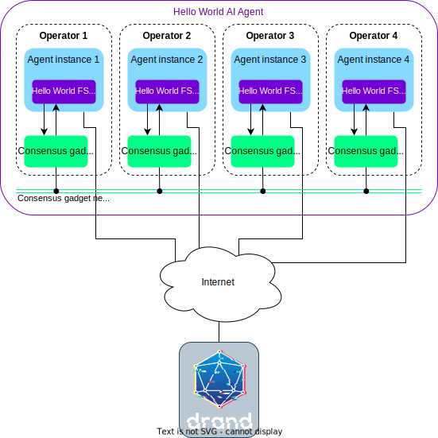

The purpose of this guide is to provide step-by-step instructions to gain familiarity with the [overall development process](./overview_of_the_development_process.md) of the {{open_autonomy}} framework.

We will show how to use the CLI to run a local deployment of the [Hello World service](https://docs.autonolas.network/demos/hello-world/), which comprises:

- 4 Docker containers implementing the 4 agents of the service, and
- 4 Docker containers implementing a Tendermint node for each agent.

<figure markdown>
  {align=center}
</figure>

Before starting this guide, ensure that your machine satisfies the framework requirements and that you have followed the [set up guide](./set_up.md). As a result you should have a Pipenv workspace folder.

## Step-by-step instructions

!!! note
    On **MacOS** and **Windows**, running Docker containers requires having Docker Desktop running as well. If you're using one of those operating systems, remember to start Docker Desktop
    before you run agent services.

1. Fetch the [Hello World service](https://docs.autonolas.network/demos/hello-world/) from the remote registry. Within the workspace folder (not the local registry) run:

    <div class="dynamic-hash" packages-json-url="https://raw.githubusercontent.com/valory-xyz/hello-world/main/packages/packages.json" key="service/valory/hello_world/0.1.0">
    ```bash
    autonomy fetch valory/hello_world:0.1.0:<hash> --service
    ```
    </div>

    This command will download the service package corresponding to the specified hash from the remote IPFS registry and store it in the `hello_world` folder locally.

2. Build the Docker image of the service agents:

    ```bash
    cd hello_world
    autonomy build-image
    ```

    This command reads the contents of the `service.yaml` file, which specifies the agent(s) that compose the service, together with some configuration parameters. With this information, the command builds the Docker image of the agent by downloading the appropriate components from the remote registry.
    After the command finishes, check that the image has been created:

    ```bash
    docker image ls | grep hello_world
    ```

3. Prepare and build the service deployment:

    1. Prepare a `keys.json` file containing wallet address and the private key for each of the agents. This file must specify as many keys as agents you want to deploy for the service.

        ??? example "Example of a `keys.json` file"

            <span style="color:red">**WARNING: Use this file for testing purposes only. Never use the keys or addresses provided in this example in a production environment or for personal use.**</span>

            ```json title="keys.json"
            [
            {
                "address": "0x15d34AAf54267DB7D7c367839AAf71A00a2C6A65",
                "private_key": "0x47e179ec197488593b187f80a00eb0da91f1b9d0b13f8733639f19c30a34926a"
            },
            {
                "address": "0x9965507D1a55bcC2695C58ba16FB37d819B0A4dc",
                "private_key": "0x8b3a350cf5c34c9194ca85829a2df0ec3153be0318b5e2d3348e872092edffba"
            },
            {
                "address": "0x976EA74026E726554dB657fA54763abd0C3a0aa9",
                "private_key": "0x92db14e403b83dfe3df233f83dfa3a0d7096f21ca9b0d6d6b8d88b2b4ec1564e"
            },
            {
                "address": "0x14dC79964da2C08b23698B3D3cc7Ca32193d9955",
                "private_key": "0x4bbbf85ce3377467afe5d46f804f221813b2bb87f24d81f60f1fcdbf7cbf4356"
            }
            ]
            ```

    2. Export the environment variable `ALL_PARTICIPANTS` with all the agents' addresses:
        ```bash
        export ALL_PARTICIPANTS='[
            "0x15d34AAf54267DB7D7c367839AAf71A00a2C6A65",
            "0x9965507D1a55bcC2695C58ba16FB37d819B0A4dc",
            "0x976EA74026E726554dB657fA54763abd0C3a0aa9",
            "0x14dC79964da2C08b23698B3D3cc7Ca32193d9955"
        ]'
        ```

    3. (Optional) Export environment variables to customize the service configuration.

        ??? example "Example of exported environment variables"

            ```bash
            export HELLO_WORLD_STRING_0="Your HELLO WORLD message for Agent 0"
            export HELLO_WORLD_STRING_1="Your HELLO WORLD message for Agent 1"
            export HELLO_WORLD_STRING_2="Your HELLO WORLD message for Agent 2"
            export HELLO_WORLD_STRING_3="Your HELLO WORLD message for Agent 3"
            ```

    4. Build the service deployment:

        ```bash
        autonomy deploy build keys.json -ltm
        ```

        This command takes the configuration parameters specified inside the `service.yaml` and overrides them with the environment variables defined above. With the parameters defined, and the agent image ready, the output of this command is a Docker Compose deployment stored in the `abci_build` folder. The command takes care of configuring the necessary Tendermint images connected to each of the agents.

4. Run the service:

    ```bash
    cd abci_build
    autonomy deploy run
    ```

    This command runs the Docker Compose deployment for the [Hello World service](https://docs.autonolas.network/demos/hello-world/) locally with four agents connected to four Tendermint nodes.

    You can cancel the local execution at any time by pressing ++ctrl+c++.

At this point you should see a (verbose) output of the agent logs, which should look something like this:

```bash
(...)

abci0    | [2022-01-01 00:00:00,000] [INFO] [agent] arrived block with timestamp: 2022-00-00 00:00:00.000000
abci0    | [2022-01-01 00:00:00,000] [INFO] [agent] current AbciApp time: 2022-00-00 00:00:00.000000
abci0    | [2022-01-01 00:00:00,000] [INFO] Created a new local deadline for the next `begin_block` request from the Tendermint node: 2022-00-00 00:00:00.000000
abci2    | [2022-01-01 00:00:00,000] [INFO] [agent] 'select_keeper' round is done with event: Event.DONE
abci2    | [2022-01-01 00:00:00,000] [INFO] [agent] scheduling timeout of 30.0 seconds for event Event.ROUND_TIMEOUT with deadline 2022-00-00 00:00:00.000000
abci2    | [2022-01-01 00:00:00,000] [INFO] [agent] Entered in the 'print_message' round for period 2
abci2    | [2022-01-01 00:00:00,000] [INFO] [agent] Entered in the 'print_message' behaviour
abci2    | Agent agent (address 0x976EA74026E726554dB657fA54763abd0C3a0aa9) in period 2 says: HELLO_WORLD!
abci2    | [2022-01-01 00:00:00,000] [INFO] [agent] printed_message=Agent agent (address 0x976EA74026E726554dB657fA54763abd0C3a0aa9) in period 2 says: HELLO_WORLD!

(...)
```

The logs of a single agent or [Tendermint](https://tendermint.com/) node can be inspected in another terminal with, e.g.,

```bash
docker logs <container_id> --follow
```

where `<container_id>` refers to the Docker container ID for an agent
(`abci0`, `abci1`, `abci2` and `abci3`) or a [Tendermint](https://tendermint.com/) node (`node0`, `node1`, `node2` and `node3`).

Try to inspect the service agent logs yourself and identify when they say the default "HELLO_WORLD!" message or your custom message.
