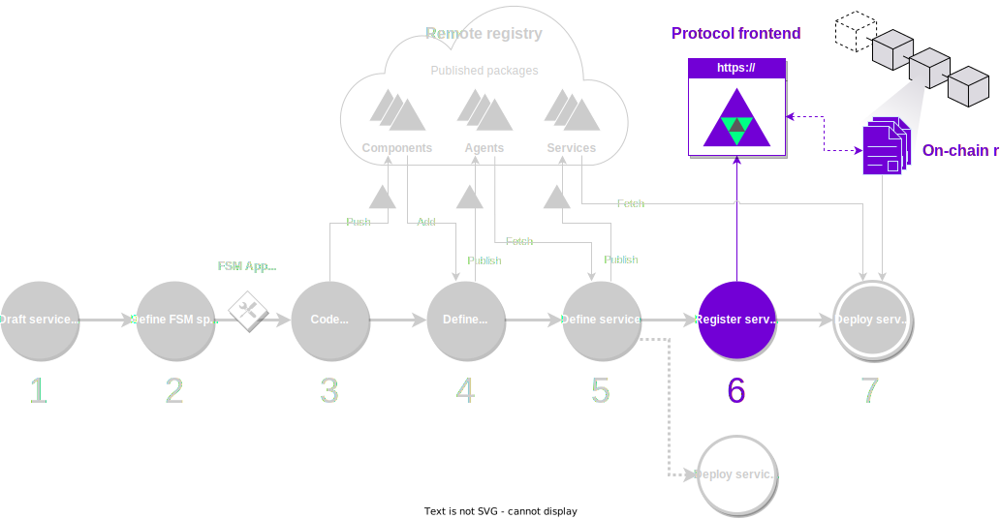

The on-chain [Autonolas Protocol](https://docs.autonolas.network/protocol/) provides primitives to create, operate and secure agent services on a blockchain. It also provides a mechanism that incentivizes their creation and rewards developers and service operators proportionally for their efforts to support the growth of the Autonolas ecosystem.

The protocol comprises the **on-chain registry**, a collection of ERC721 smart contracts that manage the registration of software package (components, agents and services). The registry stores a representation of the packages minted in the form of NFTs.
Registering packages in the on-chain registry is a requirement to secure and use them in the Autonolas Protocol.

You can register packages using the [Autonolas Protocol web app](https://protocol.autonolas.network/) or the Open Autonomy CLI.

<figure markdown>

<figcaption>Part of the development process covered in this guide</figcaption>
</figure>

## What will you learn

In this guide, you will learn how to register packages (components, agents and services) in the on-chain registry.

## Requirements

In order to register a software package, you must ensure that you have:

* An **address** associated to either

  * a crypto wallet (e.g., [Metamask](https://metamask.io/) or a cold wallet), or
  * a multisig contract (like [Safe](https://safe.global/)) which allows to connect via [Wallet Connect](https://walletconnect.com/).
  
    In either case, the address must have funds for the chain that you wish to register the package.

* The **hash of the package** that you want to register on-chain, and which must have been published into a remote registry.

    !!! info
        If you have followed the [guide to publish packages](./publish_fetch_packages.md), the package hash will be in the output of `autonomy push` and `autonomy publish`.

* An **NFT image URL**. This image will be used to represent the minted NFT for the package on marketplaces such as [OpenSea](https://opensea.io/). You can use [this sample image URL](https://gateway.autonolas.tech/ipfs/Qmbh9SQLbNRawh9Km3PMEDSxo77k1wib8fYZUdZkhPBiev) for testing purposes.

## Register packages using the Autonolas Protocol web app

The [Autonolas Protocol web app](https://protocol.autonolas.network/) provides an intuitive GUI to register components, agents and services, and manage the life cycle of services in the Autonolas Ecosystem.

Read the [Autonolas Protocol docs](https://docs.autonolas.network/protocol/), and follow the corresponding instructions to get your software package registered and minted as an NFT.

* [Register a component.](https://docs.autonolas.network/protocol/register_packages_on-chain/#register-a-component)
* [Register an agent.](https://docs.autonolas.network/protocol/register_packages_on-chain/#register-an-agent)
* [Register a service.](https://docs.autonolas.network/protocol/register_packages_on-chain/#register-a-service)

## Register packages using the CLI

You can also register packages using the [`autonomy mint` command](../advanced_reference/cli/../commands/autonomy_mint.md).

!!! info
    This section will be added soon.
