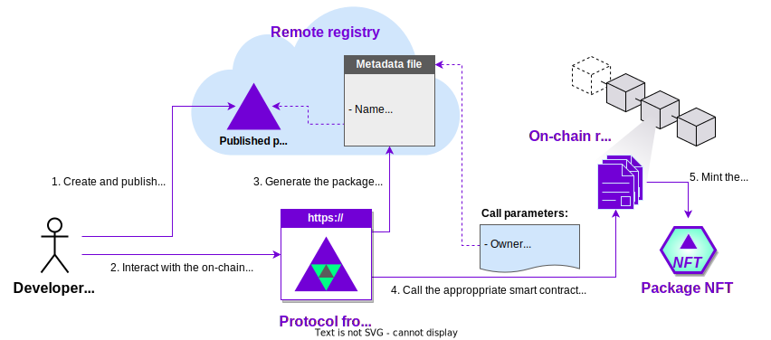

The Autonolas ecosystem has an **on-chain protocol** that provides primitives to create, operate and secure agent services on a blockchain. It also provides a mechanism that incentivizes their creation and rewards developers and service operators proportionally for their efforts to support the growth of the Autonolas ecosystem.

The **on-chain registry** is a collection of ERC721 smart contracts (eventually deployed on all major blockchains) that handle the life cycle of **packages** (that is, agent components, agents and agent services) within the on-chain protocol. These contracts store a representation of the code developed in the form of an NFT.
Therefore, registering and securing a package in the on-chain registry is the required step so that they can be used in the on-chain protocol.

The on-chain registry can be accessed through the {{on_chain_frontend}}.

<figure markdown>

<figcaption>Part of the development process covered in this guide</figcaption>
</figure>

## What will you learn
In this guide, you will learn how to:

  * Register packages (agent components, agents and agent services) in the on-chain registry.
  * Manage the life cycle of an agent service on-chain.

## Requirements
This guide is based in the on-chain registry currently deployed in the [Görli testnet](https://goerli.net/). Ensure that you have:

  * A **[Görli testnet](https://goerli.net/) wallet address** (e.g., [Metamask](https://metamask.io/)) with some GörliETH funds in it. You can use, for example, a [Görli POW faucet](https://goerli-faucet.pk910.de/) to earn some free GörliETH.
  * The **package hash** of the agent component, agent or agent service that you want to register on-chain, and which should be already published in a remote registry. See the corresponding guides in case you are in doubt on how to create and publish a package.
  * An **NFT image URL**. This image will be used to represent the NFT on marketplaces such as [OpenSea](https://opensea.io/). You can use [this sample image URL](https://gateway.autonolas.tech/ipfs/Qmbh9SQLbNRawh9Km3PMEDSxo77k1wib8fYZUdZkhPBiev) for testing purposes.
  * If you are registering an agent service, you will also need the [Görli testnet](https://goerli.net/) **addresses of the agents** that are part of the service.

## How packages are registered using the protocol frontend
There are two objects published in the remote registry that need to be considered when registering packages in the on-chain registry:

  * The **developed package** itself. This object contains the developed code, and is the object whose hash has been obtained by pushing or publishing the package with the commands `autonomy push` and `autonomy publish`, respectively.
  * The **metadata file**. This object contains a reference to the package hash above, plus some additional metadata required for the on-chain protocol to work (which depends on the particular type of package being registered).

Once the user fills the required information for the package, the {{on_chain_frontend}} automatically generates and publishes the metadata file, therefore releasing the user from this routine process. The image below summarizes this process.

<figure markdown>

<figcaption>How a package is registered with the protocol frontend</figcaption>
</figure>

The metadata file is, therefore, the piece of information that is passed to the smart contract representing the corresponding on-chain registry.

## Register an agent component
Ensure that you meet the [requirements](#requirements) stated above.
Navigate to the [components section](https://protocol.autonolas.network/components) of the protocol frontend, and press the button _Register_.
There are some data that need to be input directly in this form, whereas additional metadata needs to be filled by pressing the button _Generate Hash & File_:

  1. **Owner Address.** Your wallet address (or whoever you want to declare the owner of the component), starting by `0x...`.

  2. **Generate the metadata file.** By pressing the button _Generate Hash & File_ you need to input further data:

      - **Name.** A name for the component.
      - **Description.** A description of the component.
      - **Version.** The component version number, for example, 0.1.0.
      - **Package hash.** This is the remote registry package hash starting by `bafybei...` that you obtained when published the component in the remote registry.
      - **NFT Image URL.** An URL pointing to an image. You can use [this sample image URL](https://gateway.autonolas.tech/ipfs/Qmbh9SQLbNRawh9Km3PMEDSxo77k1wib8fYZUdZkhPBiev) for testing purposes.

      By pressing _Save File & Generate Hash_ a metadada file with this information will be automatically generated and uploaded in the remote registry. You will notice that the hash will be populated in the component registration form.      

  3. **Dependencies.** Comma-separated list of component IDs which the component requires. You can find the IDs by browsing the [components section](https://protocol.autonolas.network/components).

Press the button _Submit_. Your  [Metamask](https://metamask.io/) wallet will ask you to approve the transaction.
Once the transaction is settled, you should see a message indicating that the component has been registered successfully.

## Register an agent
Ensure that you meet the [requirements](#requirements) stated above.
Navigate to the [agents section](https://protocol.autonolas.network/agents) of the protocol frontend, and press the button _Register_.
There are some data that need to be input directly in this form, whereas additional metadata needs to be filled by pressing the button _Generate Hash & File_:

  1. **Owner Address.** Your wallet address (or whoever you want to declare the owner of the agent), starting by `0x...`.

  2. **Generate the metadata file.** By pressing the button _Generate Hash & File_ you need to input further data:

      - **Name.** A name for the agent.
      - **Description.** A description of the agent.
      - **Version.** The agent version number, for example, 0.1.0.
      - **Package hash.** This is the remote registry package hash starting by `bafybei...` that you obtained when published the agent in the remote registry.
      - **NFT Image URL.** An URL pointing to an image. You can use [this sample image URL](https://gateway.autonolas.tech/ipfs/Qmbh9SQLbNRawh9Km3PMEDSxo77k1wib8fYZUdZkhPBiev) for testing purposes.

      By pressing _Save File & Generate Hash_ a metadada file with this information will be automatically generated and uploaded in the remote registry. You will notice that the hash will be populated in the agent registration form.

  3. **Dependencies.** Comma-separated list of component IDs which the agent requires. You can find the IDs by browsing the [components section](https://protocol.autonolas.network/components).

Press the button _Submit_. Your  [Metamask](https://metamask.io/) wallet will ask you to approve the transaction.
Once the transaction is settled, you should see a message indicating that the agent has been registered successfully.

## Register a service
The goal of this section is to show not only how to register a service in the on-chain registry, but also how to bring the service to the **Deployed** status.
Ensure that you meet the [requirements](#requirements) stated above.

### Preliminary steps
  1. **Connect your wallet.** Access the {{on_chain_frontend}}, and connect your [Metamask](https://metamask.io/) wallet.

  2. **Find the agent's canonical ID.** Explore the [agents section](https://protocol.autonolas.network/agents), and note the ID of the agent that make up your service. If your service is composed of different agents, you must note the IDs of all of them.

### Fill-in the service data

Navigate to the [services section](https://protocol.autonolas.network/services) of the protocol frontend, and press the button _Register_.
There are some data that need to be input directly in this form, whereas additional metadata needs to be filled by pressing the button _Generate Hash & File_:

  1. **Owner Address.** Your wallet address (or whoever you want to declare the owner of the service), starting by `0x...`.
  2. **Generate the metadata file.** By pressing the button _Generate Hash & File_ you need to input further data:

      - **Name.** A name for the service.
      - **Description.** A description of the service.
      - **Version.** The service version number, for example, 0.1.0.
      - **Package hash.** This is the remote registry package hash starting by `bafybei...` that you obtained when published the service in the remote registry.
      - **NFT Image URL.** An URL pointing to an image. You can use [this sample image URL](https://gateway.autonolas.tech/ipfs/Qmbh9SQLbNRawh9Km3PMEDSxo77k1wib8fYZUdZkhPBiev) for testing purposes.

      By pressing _Save File & Generate Hash_ a metadada file with this information will be automatically generated and uploaded in the remote registry. You will notice that the hash will be populated in the service registration form.

  3. **Canonical agent Ids.** Comma-separated list of agent ID(s) which the service requires. These are the ID(s) that you found in an earlier step above.

  4. **No. of slots to canonical agent Ids.** Specify the number of agent instances for each agent ID listed above.

  5. **Cost of agent instance bond.** Specify (in wei units) what is the bond per each agent instance  joining the service. If you are using it for testing purposes, we suggest that you use a small value (e.g., 1000000000000000 GörliWei = 0.001 GörliETH).

  6. **Threshold.** Specify the threshold of agents required to sign.

Press the button _Submit_. Your  [Metamask](https://metamask.io/) wallet will ask you to approve the transaction.
Once the transaction is settled, you should see a message indicating that the service has been registered successfully, and you should see that it is in **Pre-Registration** state.

### Activate service registration
Within the **Pre-Registration** state you should press _Activate Registration_ to advance to the next state (**Active Registration**). In case you require to make any amendments in the service you have just registered, you can do so through the _Update_ button. In either case, you should authorize the transaction through your [Metamask](https://metamask.io/) wallet.

### Register agent instances
In the **Active registration** state you should specify the [Görli testnet](https://goerli.net/) addresses (starting by `0x...`) of the agent instances that are part of the service. Press _Register Agents_ to associate them with the service. Once you have finished, press _Terminate_ to proceed to the **Finished Registration** state. Again, you will need authorization from your wallet to complete the transaction.

### Deploy the multisig contract for the service
The goal of the **Finished Registration** state is to deploy the Gnosis safe multisig contract that will be associated to the service. The parameters you see in this screen are associated to the creation of the safe (check the `setup` method [here](https://github.com/safe-global/safe-contracts/blob/main/contracts/GnosisSafe.sol)). If you are not familiar with the setup of such contract, you can leave the default values and press _Submit_. Once again, you will be prompted for authorization.

 Congratulations! Your service is should be now in **Deployed** state in the on-chain protocol!
