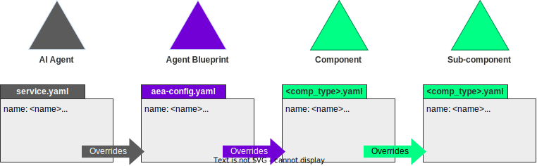

The service configuration file `service.yaml` is a YAML file where the main attributes of the agent service are set up, including the particular agent that composes the service. Service configuration files can also override attributes defined in agent or component configurations. Below there is an example of the service configuration file for the [Hello World service](../demos/hello_world_demo.md):

```yaml
name: hello_world
author: valory
version: 0.1.0
description: A simple demonstration of a simple ABCI application
aea_version: '>=1.0.0, <2.0.0'
license: Apache-2.0
fingerprint:
  README.md: bafybeiapubcoersqnsnh3acia5hd7otzt7kjxekr6gkbrlumv6tkajl6jm
fingerprint_ignore_patterns: []
agent: valory/hello_world:0.1.0:bafybeihqzkncz7r563lfkots4fphb7abdymdna4ir7in7fsbzjtx6yyndq
number_of_agents: 4
---
extra:
  benchmark_persistence_params:
    args: &id001
      log_dir: /benchmarks
overide_type: multiple
public_id: valory/hello_world_abci:0.1.0
type: skill
0:
  models:
    params:
      args:
        hello_world_message: ${SERVICE_HELLO_WORLD_HELLO_WORLD_STRING:str:HELLO_WORLD!}
    benchmark_tool:
      args: *id001
1:
  models:
    params:
      args:
        hello_world_message: ${SERVICE_HELLO_WORLD_HELLO_WORLD_STRING:str:HELLO_WORLD!}
    benchmark_tool:
      args: *id001
2:
  models:
    params:
      args:
        hello_world_message: ${SERVICE_HELLO_WORLD_HELLO_WORLD_STRING:str:HELLO_WORLD!}
    benchmark_tool:
      args: *id001
3:
  models:
    params:
      args:
        hello_world_message: ${SERVICE_HELLO_WORLD_HELLO_WORLD_STRING:str:HELLO_WORLD!}
    benchmark_tool:
      args: *id001
---
public_id: valory/ledger:0.19.0
type: connection
config:
  ledger_apis:
    ethereum:
      address: http://host.docker.internal:8545
      chain_id: 31337
      poa_chain: false
      default_gas_price_strategy: eip1559

```

## The structure of the service configuration file

The service configuration file is typically composed of service-specific attributes followed by additional YAML documents. These additional documents begin with `---`, and override attributes from agent or component configuration files of agents and components, respectively, used by the service. In the example above, the service configuration file for the [Hello World service](../demos/hello_world_demo.md) is overriding some attributes for the skill `valory/hello_world_abci` and the connection `valory/ledger`.

The attributes that define the service are summarized in the table below:

| Attribute                     | Description                                                                                                                                                                                           |
|-------------------------------|-------------------------------------------------------------------------------------------------------------------------------------------------------------------------------------------------------|
| `name`                        | Agent service name. It shall not contain spaces.                                                                                                                                                      |
| `author`                      | Author name.                                                                                                                                                                                          |
| `version`                     | Agent service version, in the format `<major>.<minor>.<patch>`.                                                                                                                                       |
| `description`                 | Description of the agent service.                                                                                                                                                                     |
| `aea_version`                 | {{open_aea}} version supported by the service.                                                                                                                                                        |
| `license`                     | License identifier.                                                                                                                                                                                   |
| `fingerprint`                 | List with entries `<file>: <hash>` for all the files that compose the agent service. Read [how to use the command `autonomy hash`](../autonomy.md) to automatically generate this list. |
| `fingerprint_ignore_patterns` | Filename patterns to be ignored.                                                                                                                                                                      |
| `agent`                       | Canonical agent, in the form `<agent_public_id>:<version>:<hash>`.                                                                                                                                    |
| `number_of_agents`            | Number of agent instances that the service is composed of.                                                                                                                                            |                                                                                                                                         |

Following the service-specific attributes it follows the service-level overrides.
You can, for example, override the default `HELLO_WORLD!` string that each agent prints on their console in the [Hello World service](../demos/hello_world_demo.md).


## Service-level overrides

The {{open_aea}} framework already has the notion of [component overrides](https://open-aea.docs.autonolas.tech/overrides/): if a component uses another component, the former can override configuration values of the latter.

Similarly, the {{open_autonomy}} framework has the notion of service-level overrides. You can define them in the service configuration file `service.yaml`, which will be used to generate the deployment environment for the agents:

```yaml
name: hello_world
author: valory
version: 0.1.0
description: A simple demonstration of a simple ABCI application
aea_version: '>=1.0.0, <2.0.0'
license: Apache-2.0
fingerprint:
  README.md: bafybeiapubcoersqnsnh3acia5hd7otzt7kjxekr6gkbrlumv6tkajl6jm
fingerprint_ignore_patterns: []
agent: valory/hello_world:0.1.0:bafybeiaotnukv7oq2sknot73a4zssrrnjezh6nd2fwptrznxtnovy2rusm
number_of_agents: 4
---
public_id: valory/hello_world_abci:0.1.0
type: skill
models:
  params:
    args:
      hello_world_message: HELLO_WORLD!
```

Note that service-level overrides take precedence over agent-level overrides, and agent-level overrides take precedence over component-level overrides.

<figure markdown>

<figcaption>Service-level overrides</figcaption>
</figure>


The framework associates each overridden attribute to a system environment variable. Therefore, you can either:

1. Directly assign a specific value to an overridden attribute, for example,
   ```yaml
   hello_world_message: HELLO_WORLD!
   ```

2. Or assign the associated environment variable to the overridden attribute, in this case,
   ```yaml
   hello_world_message: ${SERVICE_HELLO_WORLD_HELLO_WORLD_STRING:str:HI_WORLD!}   
   ```
   The corresponding environment variable `SERVICE_HELLO_WORLD_HELLO_WORLD_STRING`will be read by the agent in runtime. If not found, the default value `HI_WORLD!` will be taken by the agent.

!!! note
    Observe that the environment variable associated to an overridden attribute has the form  `<COMPONENT_TYPE>_<UPPERCASE_ATTRIBUTE_PATH>`, since they are generated from the `json` path to the attribute. Moreover, we recommend using the overridden format
    ```yaml
    <overridden_attribute>: ${<ENVIRONMENT_VARIABLE>:<type>:<default_value>}
    ```
    as in the example above to fallback into a safe default value in case the environment variable is not defined.

### Multiple overrides

In the service configuration file, you can override different values for different agents using the multiple override feature, using the pattern below:

```yaml
(...)
---
public_id: valory/hello_world_abci:0.1.0
type: skill
<agent_number>:
  <overridden_attributes>
```

For example, if we wish that each agent in the [Hello World service](../demos/hello_world_demo.md) outputs a different message, we can achieve this as follows:

```yaml
(...)
---
public_id: valory/hello_world_abci:0.1.0
type: skill
0:
  models:
    params:
      args:
        hello_world_message: Hello, from agent 0
1:
  models:
    params:
      args:
        hello_world_message: Hello, from agent 1
2:
  models:
    params:
      args:
        hello_world_message: Hello, from agent 2
3:
  models:
    params:
      args:
        hello_world_message: Hello, from agent 3
```

!!! warning "Important"
    If you choose to use the multiple override feature, you have to define overrides for **every** single agent that composes the service.

If you have repetitive overridden parameters, you can define them using [YAML anchors](https://yaml.org/spec/1.2.2/) under the section `extra`, and reference them when defining overrides for different agents.

```yaml
(...)
---
extra:
  benchmark_tool:
    args: &id001
      log_dir: /benchmarks
public_id: valory/hello_world_abci:0.1.0
type: skill
0:
  models:
    params:
      args:
        hello_world_message: Hello, from agent 0
    benchmark_tool:
      args: *id001
1:
  models:
    params:
      args:
        hello_world_message: Hello, from agent 1
    benchmark_tool:
      args: *id001
2:
  models:
    params:
      args:
        hello_world_message: Hello, from agent 2
    benchmark_tool:
      args: *id001
3:
  models:
    params:
      args:
        hello_world_message: Hello, from agent 3
    benchmark_tool:
      args: *id001
```
