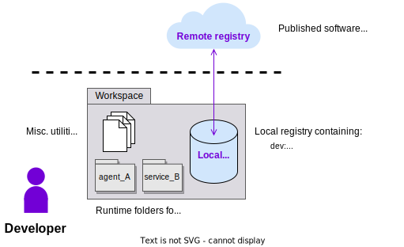

The purpose of this guide is to set up your system to work with the {{open_autonomy}} framework. All the remaining guides assume that you have followed these set up instructions.

## Requirements

Ensure that your machine satisfies the following requirements:

- [Python](https://www.python.org/) `>= 3.8` (recommended `>= 3.10`)
- [Pip](https://pip.pypa.io/en/stable/installation/)
- [Pipenv](https://pipenv.pypa.io/en/latest/installation.html) `>=2021.x.xx`
- [Docker Engine](https://docs.docker.com/engine/install/)
- [Docker Compose](https://docs.docker.com/compose/install/)

Additionally, if you wish to deploy your service in a Kubernetes cluster:

- [Kubernetes CLI](https://kubernetes.io/docs/tasks/tools/)
- [minikube](https://minikube.sigs.k8s.io/docs/)


!!! note
    On raspberry-pi currently `Raspberry Pi OS (Legacy, 64-bit, Debian Bullseye)` is tested and supported, The base requirements are same as [above](#requirements).

!!! tip
	Although we will use these tools for demonstration purposes only, you might as well consider other local Kubernetes cluster options like [kind](https://kind.sigs.k8s.io/docs/user/quick-start/), or even additional tools like [Skaffold](https://skaffold.dev/) or [Helm](https://helm.sh/) to help you with your cluster deployments.

## Set up the framework

1. **Create a workspace folder:**

    ```bash
    mkdir my_workspace
    cd my_workspace
    ```

    We recommend that you use a Pipenv virtual environment in your workspace folder. Remember to use the Python version you have installed. Here we are using 3.10 as reference:

    ```bash
    touch Pipfile && pipenv --python 3.10 && pipenv shell
    ```

2. **Install the {{open_autonomy}} framework and the [Open AEA Ethereum Ledger Plugin](https://pypi.org/project/open-aea-ledger-ethereum):**

    ```bash
    pip install open-autonomy[all]
    pip install open-aea-ledger-ethereum
    ```

3. **Initialize the framework** to work with the remote [IPFS](https://ipfs.io) registry by default. This means that when the framework will be fetching a component, it will do so from the remote registry:

    ```bash
    autonomy init --remote --ipfs --author your_name
    ```

    If you had previously initialized the framework, you need to use the flag `--reset` to change the configuration. Use only letters, numbers or underscores to specify your author handle.

4. **Initialize the local registry:**

    ```bash
    autonomy packages init
    ```

    This will create an empty local registry in the `./packages` folder. If you plan to execute the tutorial guides, you need to [populate the local registry](#populate-the-local-registry-for-the-guides) with a number of default components.

## The registries and runtime folders

As seen above, the framework works with two registries:

* The **remote registry**, where developers publish finalized software packages, similarly as Docker Hub images.
* The **local registry**, which stores packages being developed (`dev`), or fetched from the remote registry (`third_party`) to be used locally.

Additionally, when running agents or service deployments locally, we recommend that you fetch them outside the local registry. This is because the framework will download any required component (or create auxiliary files and folders) within the **runtime folders** of agents and services. Therefore, we recommend that you keep the copies on the local registry clean to avoid publishing unintended files (e.g., private keys) on the remote registry.

This is roughly how your workspace should look like:

<figure markdown>

</figure>

!!! tip

    You can override the default registry in use (set up with `autonomy init`) for a particular command through the flags `--registry-path` and `--local`. For example, if the framework was initialized with the remote registry, the following command will fetch a runtime folder for the `hello_world` agent from the remote registry:

    ```bash
    autonomy fetch valory/hello_world:0.1.0:bafybeihtmp45mbfs5tyzrgxfoimh552on6dif42ifqidifait3ej2m5zvq
    ```

    On the other hand, if you want to fetch the copy stored in your local registry, then you can use:
    ```bash
    autonomy --registry-path=./packages fetch valory/hello_world:0.1.0 --local
    ```

## The Dev template

For convenience, we provide a **Dev template** repository that you can fork and clone for your Open Autonomy projects, and use it as your workspace folder:

<figure markdown>
[ https://github.com/valory-xyz/dev-template ](https://github.com/valory-xyz/dev-template)
</figure>

The **Dev template** comes with:

* a preconfigured Pipenv environment with required dependencies,
* an empty local registry,
* a number of preconfigured linters via [Tox](https://tox.wiki/en/latest/).
