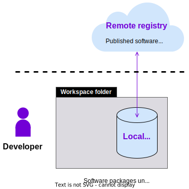

The purpose of this guide is to set up your system to work with the {{open_autonomy}} framework. All the remaining guides assume that you have followed these set up instructions.

## Requirements

Ensure that your machine satisfies the following requirements:

- [Python](https://www.python.org/) `>= 3.7` (recommended `>= 3.10`)
- [Pip](https://pip.pypa.io/en/stable/installation/)
- [Pipenv](https://pipenv.pypa.io/en/latest/installation/) `>=2021.x.xx`
- [Docker Engine](https://docs.docker.com/engine/install/)
- [Docker Compose](https://docs.docker.com/compose/install/)

## Set up the framework

1. Create a workspace folder:

    ```bash
    mkdir my_workspace
    cd my_workspace
    ```

2. Set up the environment. Remember to use the Python version you have installed. Here we are using 3.10 as reference:

    ```bash
    touch Pipfile && pipenv --python 3.10 && pipenv shell
    ```

3. Install the {{open_autonomy}} framework:

    ```bash
    pip install open-autonomy[all]
    ```

4. Initialize the framework to work with the remote [IPFS](https://ipfs.io) registry. This means that when the framework will be fetching a component, it will do so from the [IPFS](https://ipfs.io):

    ```bash
    autonomy init --remote --ipfs
    ```

    !!! info
        The InterPlanetary File System ([IPFS](https://ipfs.io)) is a protocol, hypermedia and file sharing peer-to-peer network for storing and sharing data in a global, distributed file system. {{open_autonomy}} can use components stored in the [IPFS](https://ipfs.io), or stored locally.


## Set up the local registry

The framework works with the concept of *local* and *remote* registries to store software packages. Existing (third-party) components are downloaded from the remote to the local registry, and developed components are pushed from the local to the remote registry so that they become publicly available, similarly as in a Git repository.

<figure markdown>

</figure>

The framework assumes by default that the local registry is in the `./packages` folder. To create an empty local registry, execute:

```bash
mkdir packages
echo '{"dev": {}, "third_party": {}}' > packages/packages.json
```

However, if you plan to follow the guides in the following sections, you need to populate the local registry with a number of default [packages shipped with the framework](../package_list.md). Prepare the local registry as follows:

```bash
mkdir packages
cat > ./packages/packages.json << EOF
{
    "dev": {
    },
    "third_party": {
        "agent/valory/hello_world/0.1.0": "bafybeic3czcb7fpzru3fl4noxdwgwyzirqk6cqh763h6aio7ugl6qm5gha",
        "connection/valory/abci/0.1.0": "bafybeiedhipcrpx7sg7qwitwox6iqrbbb4vfnvqqyok2vc6wq6inrcszey",
        "connection/valory/acn/1.1.0": "bafybeignmc5uh3vgpuckljcj2tgg7hdqyytkm6m5b6v6mxtazdcvubibva",
        "connection/valory/http_client/0.23.0": "bafybeidykl4elwbcjkqn32wt5h4h7tlpeqovrcq3c5bcplt6nhpznhgczi",
        "connection/valory/ipfs/0.1.0": "bafybeia7kzgw4tmkl6k2vjbnss4egvhcf4fmt7cnmpjjjbjogz2bu2j3fu",
        "connection/valory/ledger/0.19.0": "bafybeicxcypcg2lxmtktbmuhqcyluzmasfsdeljyk2pvaabzc3h2jmcsui",
        "connection/valory/p2p_libp2p_client/0.1.0": "bafybeidwcobzb7ut3efegoedad7jfckvt2n6prcmd4g7xnkm6hp6aafrva",
        "contract/valory/service_registry/0.1.0": "bafybeid4wyte27tanmeiyzkjfvtvf5yyjngdsvsqvve5bzxwtzjoioubgi",
        "protocol/open_aea/signing/1.0.0": "bafybeibqlfmikg5hk4phzak6gqzhpkt6akckx7xppbp53mvwt6r73h7tk4",
        "protocol/valory/abci/0.1.0": "bafybeig3dj5jhsowlvg3t73kgobf6xn4nka7rkttakdb2gwsg5bp7rt7q4",
        "protocol/valory/acn/1.1.0": "bafybeignmc5uh3vgpuckljcj2tgg7hdqyytkm6m5b6v6mxtazdcvubibva",
        "protocol/valory/contract_api/1.0.0": "bafybeidv6wxpjyb2sdyibnmmum45et4zcla6tl63bnol6ztyoqvpl4spmy",
        "protocol/valory/http/1.0.0": "bafybeifyoio7nlh5zzyn5yz7krkou56l22to3cwg7gw5v5o3vxwklibhty",
        "protocol/valory/ipfs/0.1.0": "bafybeihlgai5pbmkb6mjhvgy4gkql5uvpwvxbpdowczgz4ovxat6vajrq4",
        "protocol/valory/ledger_api/1.0.0": "bafybeih6hfzj2obw5oajnt6ng6355edgvi5ngoaub44vpuszqoplfvyaom",
        "protocol/valory/tendermint/0.1.0": "bafybeicusvezoqlmyt6iqomcbwaz3xkhk2qf3d56q5zprmj3xdxfy64k54",
        "skill/valory/abstract_abci/0.1.0": "bafybeihkrunmigvlcze7uxhafj2h3kvpf2kifggq7zqj42n2we4mcwuvou",
        "skill/valory/abstract_round_abci/0.1.0": "bafybeib2jw7hjccou42wis35orckwycb2dgjk7yw46anuqysf2h7su3fi4",
        "skill/valory/hello_world_abci/0.1.0": "bafybeidhftdlf24itdpzs456btixret4deeis35jdqesh3xo54ukxegdrq"
    }
}
EOF
autonomy packages sync
```

The framework will fetch components from the remote registry and copy them into the local registry.

!!! info

    In the previous section, we used the command `autonomy init` to initialize the framework to fetch/push software packages from the remote registry by default (recommended option). You can override this decision for particular command through the flags `--registry-path` and `--local`, for example:

    ```bash
    autonomy --registry-path=<path_to_your_local_registry> <command> --local
    ```
