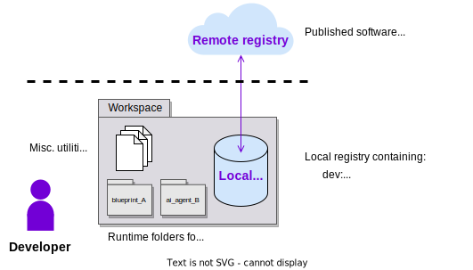

The purpose of this guide is to set up your system to work with the {{open_autonomy}} framework. All the remaining guides assume that you have followed these set up instructions.

## Requirements

Ensure that your machine satisfies the following requirements:

- [Python](https://www.python.org/) `>= 3.7` (recommended `>= 3.10`)
- [Pip](https://pip.pypa.io/en/stable/installation/)
- [Pipenv](https://pipenv.pypa.io/en/latest/installation/) `>=2021.x.xx`
- [Docker Engine](https://docs.docker.com/engine/install/)
- [Docker Compose](https://docs.docker.com/compose/install/)

## Set up the framework

1. Create a workspace folder:

    ```bash
    mkdir my_workspace
    cd my_workspace
    ```

2. Set up the environment. Remember to use the Python version you have installed. Here we are using 3.10 as reference:

    ```bash
    touch Pipfile && pipenv --python 3.10 && pipenv shell
    ```

3. Install the {{open_autonomy}} framework:

    ```bash
    pip install open-autonomy[all]
    ```

4. Initialize the framework to work with the remote [IPFS](https://ipfs.io) registry. This means that when the framework will be fetching a component, it will do so from the [IPFS](https://ipfs.io):

    ```bash
    autonomy init --remote --ipfs
    ```

    If you had previously initialized the framework, you need to use the flag `--reset` to change the configuration.

## Set up the workspace

There are a couple of concepts that you need to know to set up a convenient workspace:

* The framework works with the concept of **local** and **remote registries** to store software packages. You can publish finalized components to the remote registry, similarly as in Docker Hub. The local registry classifies its components into `dev` components being developed and `third_party` components being fetched from the remote registry to be reused. You can create an empty local registry (`./packages` folder) by executing:
    ```bash
    autonomy packages init
    ```

* Running agents or services locally require that they fetch components or create auxiliary files and folders. Therefore, we recommend fetching/copying agents and service folders outside the local registry on dedicated **runtime folders**.

This is roughly how your workspace should look:

<figure markdown>

</figure>

!!! tip "The Open Autonomy Dev template"

    For convenience, we provide a **Dev template** repository that you can fork and clone for your Open Atonomy projects:

    [https://github.com/valory-xyz/dev-template](https://github.com/valory-xyz/dev-template)

    The **Dev template** comes with:

    * a preconfigured Pipenv environment with required dependencies,
    * an empty local registry,
    * a number of preconfigured linting tools via Tox.

## Set up the local registry for the guides

If you plan to follow the guides in the following sections, you need to populate the local registry with a number of default [packages shipped with the framework](../package_list.md). To do so, within the workspace folder, execute:

```bash
cat > ./packages/packages.json << EOF
{
    "dev": {
    },
    "third_party": {
        {{ get_packages_entry("agent/valory/hello_world/0.1.0") }},
        {{ get_packages_entry("connection/valory/abci/0.1.0") }},
        {{ get_packages_entry("connection/valory/http_client/0.23.0") }},
        {{ get_packages_entry("connection/valory/ipfs/0.1.0") }},
        {{ get_packages_entry("connection/valory/ledger/0.19.0") }},
        {{ get_packages_entry("connection/valory/p2p_libp2p_client/0.1.0") }},
        {{ get_packages_entry("contract/valory/service_registry/0.1.0") }},
        {{ get_packages_entry("protocol/open_aea/signing/1.0.0") }},
        {{ get_packages_entry("protocol/valory/abci/0.1.0") }},
        {{ get_packages_entry("protocol/valory/acn/1.1.0") }},
        {{ get_packages_entry("protocol/valory/contract_api/1.0.0") }},
        {{ get_packages_entry("protocol/valory/http/1.0.0") }},
        {{ get_packages_entry("protocol/valory/ipfs/0.1.0") }},
        {{ get_packages_entry("protocol/valory/ledger_api/1.0.0") }},
        {{ get_packages_entry("protocol/valory/tendermint/0.1.0") }},
        {{ get_packages_entry("skill/valory/abstract_abci/0.1.0") }},
        {{ get_packages_entry("skill/valory/abstract_round_abci/0.1.0") }},
        {{ get_packages_entry("skill/valory/hello_world_abci/0.1.0") }}
    }
}
EOF
autonomy packages sync
```

The framework will fetch components from the remote registry and copy them into the local registry.

!!! info

    In the previous section, we used the command `autonomy init` to initialize the framework to fetch/push software packages from the remote registry by default (recommended option). You can override this decision for particular command through the flags `--registry-path` and `--local`, for example:

    ```bash
    autonomy --registry-path=<path_to_your_local_registry> <command> --local
    ```
