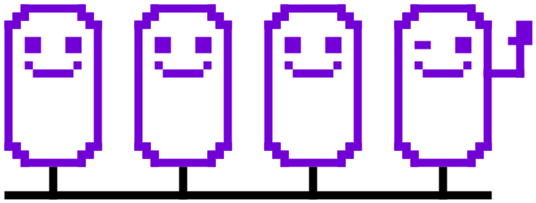

#The Open Autonomy framework

{{open_autonomy}} is a framework for the creation of **agent services**: off-chain
autonomous services which run as a multi-agent-system (MAS) and offer **enhanced functionalities
on-chain**. Agent services expand the range of operations that traditional
smart contracts provide, making it possible to execute arbitrarily complex operations
(such as machine-learning algorithms). Most importantly, agent services are
**decentralized**, **trust-minimized**, **transparent**, and **robust**.

##Browse the docs

Get started with the framework, **learn the main concepts** and get some context on how agent services
fit in the wider crypto ecosystem.

[Get started](./get_started/what_is_the_open_autonomy_framework.md){ .md-button .md-button--primary}

------

Follow the guides to learn how to use the framework to **create and deploy agent services**.

[Guides](./guides/index.md){ .md-button }

------

A tour to **existing agent services** that you can explore and use them as a reference
for your implementations.

[Demos](./demos/index.md){ .md-button }

------

Detailed topics on how the **internal components** of an agent service work with the
framework.

[Key concepts](./key_concepts/index.md){ .md-button }

------

Browse through the CLI and API reference documentation.

[Advanced reference](./advanced_reference/index.md){ .md-button }

------

Browse our FAQ where you can find commonly asked questions about the framework.

[FAQ](./questions-and-answers.md){ .md-button }
