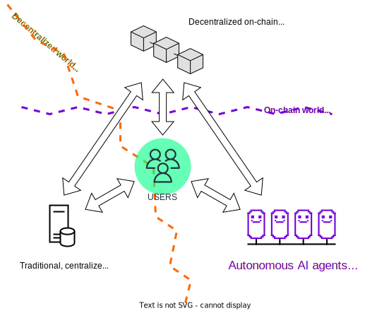

# Open Autonomy

{{open_autonomy}} is a framework for the creation of Agent Services: off-chain services which run as a multi-agent-system (MAS) and are replicated on a consensus gadget (a sort of short-lived blockchain) while being crypto-economically secured on a public blockchain. Agent services enable complex processing, take action on their own and run continuously. Additionally, agent services are crypto-native by construction, that is, they are decentralized, trust-minimized, transparent, and robust.

The {{open_autonomy}} framework allows to define such services by means of _{{fsm_app}}s_. These dynamic, decentralized apps run inside the agents implementing the agent service, and define its business logic. The {{fsm_app}}'s internal state is replicated across agents automatically through the consensus gadget.

The {{open_autonomy}} framework is realized on top of the {{open_aea}} framework, and it consists of:

* A collection of command line tools to build, deploy, publish and  test agent services.
* A collection of packages with base classes to create the {{fsm_app}} that define the service business logic.

<figure markdown>

<figcaption>Agent Services are implemented with the Valory Stack as replicated FSM Apps</figcaption>
</figure>

## Why?
Decentralized ledger technologies (DLTs), such as blockchains, face several challenges, for example:

* [the blockchain trilemma](https://www.ledger.com/academy/what-is-the-blockchain-trilemma)
* [the oracle problem](https://encyclopedia.pub/entry/2959)
* [privacy issues](https://en.wikipedia.org/wiki/Privacy_and_blockchain)
* [ledger storage space](https://cointelegraph.com/news/how-can-blockchain-improve-data-storage)
* [cross chain compatibility](https://101blockchains.com/blockchain-interoperability/)
* ... and the sheer complexity of the user experience!

In contrast with the increasing growth of on-chain applications (particularly in DeFi), the off-chain design space has seen a lack of innovation. A lot of the technology is centralized, lacks fault tolerance, the code is often opaque and offers little composability.

Currently, a standardised approach for off-chain application development is missing in the blockchain space. This is where the Valory stack (i.e., the {{open_aea}} and the {{open_autonomy}} frameworks) comes in, as an open-source framework for developers to implement off-chain services which are secured on-chain and can interact with smart contracts.

<figure markdown>

<figcaption>The Valory Stack allows to develop decentralized, agent services that are run off-chain and are crypto-economically secure</figcaption>
</figure>

Agent services go beyond simple, purely
reactive applications (like smart contracts) and can show complex, proactive behaviours that contain off-chain logic without giving up on decentralization. Examples include, but are not limited to, triggering specific actions on external events, or even executing complex machine learning models.

## How It Works

{{open_aea}} is a MAS framework for building
arbitrary agent-based apps. The {{open_autonomy}} framework extends this framework to a service architecture, where applications are distributed systems that are implemented as sets of agents.

An {{fsm_app}} defines a series of steps that each participating agent in the agent service must agree upon. At the end of every step, the agents must reach consensus on the corresponding output. This ensures that the execution flow, its inputs and outputs are replicated across all agents, creating a distributed (and decentralized) application with shared state that is fault tolerant.

If at some point the application must execute an action involving an external service, e.g.,
settling a transaction on a blockchain, one of the agents is randomly nominated to perform that action. The nominated agent is known as a _keeper_. The nomination process is also agreed by consensus, and multi-signature protocols are used to avoid that a single, malicious agent executes an external action on its own.
For this reason, there is the requirement that a minimum number of agents approve and sign every action before it takes place, and it also must be verified once it has been processed. The threshold on the minimum number of agents is typically, but not exclusively, set at 2/3 of the total of agents.

## Where to Start

The [_Quick start_](./quick_start.md) section gives a general overview of the work pipeline with {{open_autonomy}} framework, as well as an example of deploying and running an already available, very basic service. The [_Example of a service_](./service_example.md) section gives a general overview about how that demonstration agent service is implemented with the stack.

Following these sections, the reader can proceed to explore the core concepts that make agent services possible, presented in the _Concepts_ section:

- [Autonomous economic agents (AEAs) and multi-agent systems (MAS)](./aea.md),
- [Finite-state machines (FSMs)](./fsm.md), and
- the [Application BlockChain Interface (ABCI)](./abci.md).

These concepts constitute the starting point before exploring more advanced parts of the documentation.
