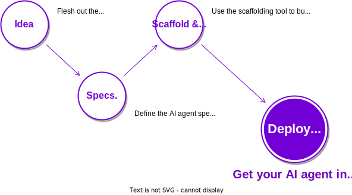

# The Open Autonomy framework

<figure markdown>

</figure>

{{open_autonomy}} is a framework for the creation of [AI agents](./get_started/what_is_an_agent_service.md): off-chain
autonomous AI agents which run as a multi-agent-system (MAS) and offer **enhanced functionalities
on-chain**. AI agents expand the range of operations that traditional
smart contracts offer, making it possible to execute arbitrarily complex operations
(such as machine-learning algorithms). Most importantly, AI agent are
**decentralized**, **trust-minimized**, **transparent**, and **robust**.

The framework provides:

* A collection of **command line tools** to build, deploy, publish and test AI agents.
* A collection of base **packages** to provide agent blueprints the functionalities to become part of an AI agent.

!!! abstract "Read the Whitepaper"

    The {{ autonolas_whitepaper }}, presents a comprehensive discussion on the architecture of the Autonolas stack. The Open Autonomy framework connects with the **Technical Architecture** section therein as a facilitator to build autonomous AI agents.

## Building with Open Autonomy

The framework is designed to speed up the development life cycle of autonomous AI agents, helping you to bring your AI agents from an idea to production as quick as possible. Overall, this is the general path that you should have in mind when working with {{open_autonomy}}:

<figure markdown>

</figure>

Find a more comprehensive description in the [overview of the development process](guides/overview_of_the_development_process.md) section.

## Browse the docs

Get started with {{open_autonomy}}, **learn the main concepts** and get some context on how AI agents fit in the wider crypto ecosystem.

[Get started](./get_started/what_is_an_agent_service.md){ .md-button .md-button--primary}

------

Follow the guides to learn how to use the framework to **create and deploy AI agents**.

[Guides](./guides/index.md){ .md-button }

------

Detailed topics on how the **internal components** of an AI agent work with the
framework.

[Key concepts](./key_concepts/index.md){ .md-button }

------

Browse through the CLI and API **reference documentation**.

[Advanced reference](./advanced_reference/index.md){ .md-button }

------

Browse our FAQ where you can find **commonly asked questions** about the framework.

[FAQ](./questions-and-answers.md){ .md-button }
