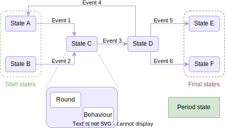
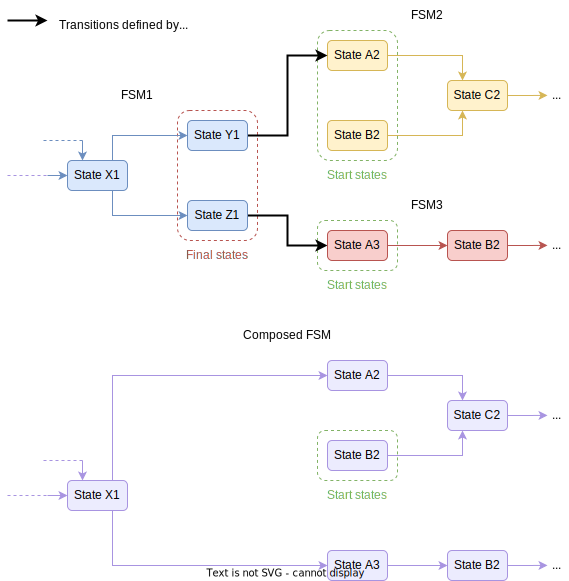
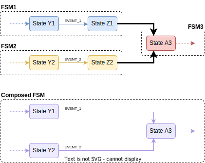

Departing from the notions of [AEA](./aea.md), [FSM](./fsm.md), and [ABCI](./abci.md), we are now in position to describe in more detail what an {{fsm_app}} is.

## Definition of an {{fsm_app}}
An {{fsm_app}} is a replicated application which uses
an underlying consensus engine implementing the [ABCI](./abci.md).
Its internal state takes the form of an FSM, and it exhibits proactive behaviours in each of such states.
{{fsm_app}}s constitute a core part in the {{open_autonomy}} framework to implement agent services.

The figure below depicts an sketch of the internal workings of an {{fsm_app}}, composed of six states (A-F) and six events (1-6):

<figure markdown>
  {align=center}
  <figcaption>Diagram of a Valory stack FSM</figcaption>
</figure>

Note that in an {{fsm_app}}, the responsibility of a state is distributed across two components, as it can be seen in the "zoomed" State C above:

- A _round_ is the component that defines the rules to transition across different
  states. It is a concrete implementation of the `AbstractRound` class. It usually involves
  interactions between participants, although this is not enforced
  at this level of abstraction. A round can validate, store and aggregate data
  coming from different agents by means of transactions. The actual meaning of
  the data depends on the implementation of the specific round. This component
  produces the `Events` that will enable the FSM transit from one state to another, that is, capturing the role of the transition function.

- Each round has an associated _Behaviour_, which is the component that defines the proactive actions to be executed at
  a particular state. It is a concrete implementation of the `BaseBehaviour` class, and contains the application logic for each state. It is scheduled for
  execution by the agents.

We will sometimes use indistinctly the terms "state" or "round" in the context of the {{open_autonomy}} framework.  We also define the concept of _synchronized data_, which is the component that stores persistent data and is accessible from any state. The consensus mechanism ensures that the synchronized data is consistently shared by all the agents. It is updated at the end of each round, where its contents can be updated. It is a concrete implementation of the `BaseSynchronizedData` class.

The framework defines a concept of "period" for the `SynchronizedData`. When a new period starts, the `SynchronizedData` allocates a new slot to store new values for the variables stored within it. This way, the developer has access to the historic values that the {{fsm_app}} has stored (which can be pruned out). New periods are automatically created for the `SynchronizedData` when an {{fsm_app}} traverses the `ResetAndPauseRound` inside _Reset and pause_.

Due to the variety of FSMs that can be defined, the framework does not enforce that an {{fsm_app}} use the period concept, however, it is expected that any production worthy {{fsm_app}} defines it, as it ensures the `SynchronizedData` does not grow in an unbounded fashion.

!!! note

    A round/state might just be a stage in
    the overall flow of the application (e.g., waiting that a sufficient number of participants commit their
    observations to a temporary blockchain), or a voting round (e.g.,
    waiting until at least an observed value has reached $\lceil(2N + 1) / 3\rceil$ of the votes).

    The developer could define the concept of "period" for their FSM as the sequence of stages in the FSM state flow that achieve a specific objective defined by the {{fsm_app}}. Consider the price oracle demo, which aggregates asset prices from different data sources and submits the aggregated result to an L1/L2 blockchain. In this example, the developer could define a period as follows:

    1. Collect observations from external APIs or prior rounds.
    2. Reach consensus on the set of collected observations (i.e., 2/3 of the agents must agree).
    3. Compute a function (e.g., mean) on the set of collected observations, and reach consensus on the computed result.
    4. Construct a transaction that contains the aggregated result.
    5. Sign the transaction (2/3 of the agents must agree to sign).
    6. A single agent, randomly nominated as the keeper, sends the transaction to the chain. If it does not do this before a
    timeout event occurs, another agent is selected to be the
    keeper.
    7. Go to Step 1.

## Composition of {{fsm_app}}s
One of the key features of the {{open_autonomy}} framework is the generation of {{fsm_app}}s whose internal FSM is a composition of different FSMs. The composition mechanism facilitates
rapid development of complex applications, by reusing FSMs already developed for other {{fsm_app}}s, obtaining the aggregated functionality.

Departing from a collection of FSMs, say FSM1, FSM2, ..., FSM$n$, a composed FSM can be constructed following certain rules:

1. when composing FSMs, an FSM$i$ can only transit from a final state to a start state of another FSM$j$, and
2. a given FSM can only be used once in a composition.

We call _FSM composition mapping_ the mapping that indicates how to move from one FSM to another.
For every entry in the FSM composition mapping, e.g., from a final state $Z$ from FSM1 to a start state $A$ from FSM2, the composition mechanism will enforce that all the transitions ending in the final state $Z$ of FSM1 be redirected to the start state $A$ of FSM2. See an example below.

<figure markdown>
  {align=center}
  <figcaption>How the FSM composition process works</figcaption>
</figure>

The figure above depicts an excerpt of a composition of three FSMs into a single one. Note how the finish states of FSM1 are linked to start states of FSM2 and FSM3. We remark that the transitions indicated by the FSM composition mapping are not regular transitions that respond to events, rather they are merely a construct to indicate how the states in the composed FSM are connected.

!!! warning "Important"

    The result of a composition of a collection of FSMs is an FSM whose set of spaces is a subset of the union of state spaces of the constituent FSMs. For this reason is it not possible to "reuse" a given FSM twice in a composition. All the final states of the constituent FSMs that are defined in the transition mapping will be removed, as exemplified in the figure above.

    Therefore, althought it might be useful and intuitive thinking of a composed FSM in terms of its constituent FSMs, the structure is not retained internally by the {{fsm_app}}. For example, consider the following setting:

    <figure markdown>
      {align=center}
      <figcaption>FSM composition with two sources</figcaption>
    </figure>

    Note that in the composed FSM, when transitioning to A3, the FSM loses track of what was the FSM from which it transitioned (either FSM1 or FSM2). Nevertheless, if the business logic in state A3 requires knowledge of what was the history of visited states before reaching it (e.g., in order to execute a different action), the developer has access to that history through the field `_previous_rounds` from the class [`AbciApp`](./abci_app_class.md) which will be discussed in a separate section.

## Considerations to Develop FSM Apps
- agent services and their associated {{fsm_app}}s must be designed with **determinism at their core**. For this reason, in each  round, agents must agree upon their execution outputs in order to make progress. Any source of "uncontrolled" randomness or code inconsistency that leads to non-determinism will undermine the {{fsm_app}}'s ability to achieve its goal. Sources of non-determinism include but not limited to:
    - Non-verifiable randomness libraries.
    - Non deterministic libraries, like ML frameworks that do not guarantee exact same results under the same initial conditions.
    - Using the agent's local time  to make decisions along the execution flow. Agents synchronize using the consensus engine, and that is the only reliable source of "time" that should be used. Sometimes, block timestamp can be a handy property common to all agents and can be used as a `time.now()` equivalent.
    - Using local resources that are not synchronized among all agents to make decisions.
    - Using data serialization, e.g., [`json.dump`](https://docs.python.org/3/library/json.html#json.dump) without sorting the keys and inputs. Try to work with sorted data structures whenever possible (e.g., sorted lists instead of arbitrary lists).
    - Using block metrics in a `Behaviour`, other than those determining round transitions. All other blocks read from behaviours might involve race conditions.
- Sometimes it is required to **retry interactions with external services**. There are generally two ways retries can be implemented: On the behaviour level and on the round level. The default retry should be implemented via round transitions. For instance, when agents cannot finish their behaviour level activities because of failure of an external service they can signal this via the payload (e.g., sending an explicit "None"). Then at the round level the agents can coordinate transition to the next state: either retrying the current state or transitioning to another state. Behaviour level retries should be limited when making calls to external services where the agent is the only one retrieving such information. For example, in an oracle service, each agent interacts with a different external API and the retries are naturally timed out by the round timeout.
- It is desirable that agent `Skills` have their own unit tests. The {{open_aea}} framework offers tools to make easier for developers to write tests for their Skills. Beware that the AEA skill testing framework might have some limitations with respect to idiomatic Python testing. For example, it is a known issue that [patching skill module-level components does not work](https://github.com/valory-xyz/open-autonomy/issues/289), but only instance-based patching is effective (e.g. using [`patch.object`](https://docs.python.org/3/library/unittest.mock.html#unittest.mock.patch.object)).
- When developing agent applications raise exceptions for all branches which are currently unhandled and would cause inconsistencies in the app. These exceptions can then be surgically addressed in separate PRs. Example: on the happy path a file is loaded properly, on the unhappy path an exception is raised by the file not being present. In production handling this can get involved. During development it is best to "park" this issue and focus on the happy case. But the unhappy case should raise so we can capture its prevalence in tests. Logging is the worst approach as it hides this issue!
