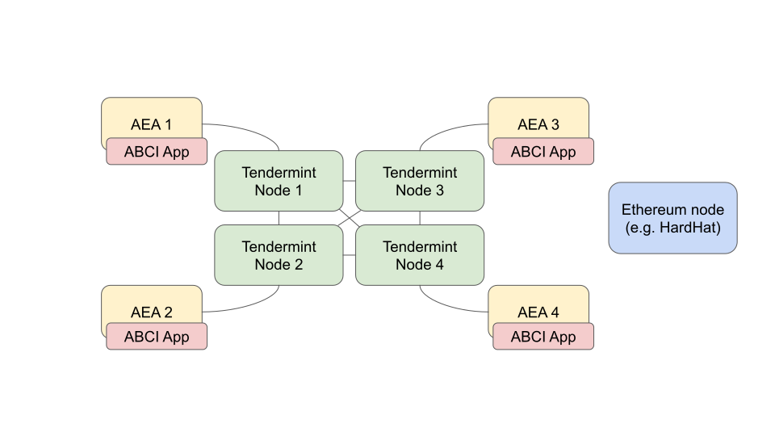

# Price estimation internals

This document describes in more detail how the price estimation demo works.

## Introduction

The estimate is an average of a set of observations
on the Bitcoin price coming from different sources,
e.g. CoinMarketCap, CoinGecko, Binance and Coinbase.
Each AEA shares an observation from one of the sources above
by committing it to a temporary blockchain made with Tendermint.
Once all the observation are settled, each AEA
runs a script to aggregate the observations to compute an estimate,
and we say that the consensus is reached when one estimate
reaches 2/3 of the total voting power committed
on the temporary blockchain.
Once the consensus on an estimate has been reached, a multi-signature transaction with 2/3 of the participants' signature is settled on the Ethereum chain (in the POC this is the hardhat node).

Alongside the finite-state machine behaviour, the AEAs runs
an ABCI application instance which receives all the updates from the 
underlying Tendermint network.

## Periods and phases

We call _period_ a sequence of phases that lead to the consensus
over an estimate. A _phase_ might just be a stage in the 
consensus (e.g. waiting that a sufficient number of participants commit their observations to the temporary tendermint blockchain), or a voting round (e.g. waiting that at least one estimate has reached 2/3 of the votes). 

The POC has the following phases:

- Initialisation phase: each AEA starts up and waits for its Tendermint 
    node to become available.
- Registration phase: the application accepts registrations
    from AEAs to join the period, up to a configured 
    maximum number of participants (in the demo, this limit is 4);
    once this threshold is hit ("registration threshold"), 
    the round goes to the _deploy-safe_ phase.
- Deploy-Safe phase: 
    a designated sender among the participants of the current period
   (determined in the registration phase) deploys a 
   <a href="https://gnosis-safe.io/">Gnosis Safe contract</a>
   with all the participants as owners and with 
  `ceil(2/3 * nb_participants)` as threshold.
- Collect-observation round: the application accepts 
    observations, only one per agent,
    of the target quantity to estimate from only the AEAs
    that joined this round. Once 2/3 of the participants have submitted their observations, and the list of observations are replicated among the different ABCI application instances, the period goes to the next phase.
- Estimate-consensus round: the application waits for votes on 
    estimates. The participants are supposed to run the same script
    to aggregate the set of observations.
    Once the same estimate receives a number of votes greater or equal than
    2/3 of the total voting power, the consensus is reached and the
    period moves to the next phase.
- Tx-Hash phase: a designated sender composes the Safe transaction
    and puts it on the temporary Tendermint-based chain
    (TODO: let participants to vote for transactions).
- Collect-signature phase: the participants send their own signature
    for the Safe transaction. As soon as 2/3 of the signature
    have been committed to the temporary blockchain, 
    the period goes to the next phase.
- Finalization phase: the designated sender adds the set of signatures
    to the transaction and submits it through the Safe contract. 
- Consensus-reached: This is the final state of the period.
    At this point, each AEA has a local copy of the estimate, replicated
    by the Tendermint network, and submitted on the Ethereum chain
    via the Safe transaction.

## Setup

The network is composed of:

- A [HardHat](https://hardhat.org/) node (the local blockchain)
- A set of $n$ Tendermint peers
- A set of $n$ AEAs, in one-to-one connection with one Tendermint peer. 

The AEAs have the following custom components:

- Protocol `valory/abci:0.1.0`: it allows to represent
    ABCI request and response messages.
- Connection `valory/abci:0.1.0`: it accepts ABCI requests
    from a consensus engine module, e.g. the Tendermint node;
- Skill `valory/abstract_abci:0.1.0`: it provides a
    scaffold handler for ABCI requests. It is an abstract skill.
- Skill `valory/abstract_round_abci:0.1.0`: it 
    implements an ABCI handler and provides
    useful code abstractions for creating round-based
    replicated state machines, based on the ABCI protocol
    (e.g. `Period`, `AbstractRound`). It is an abstract skill.

Moreover, it has the following demo-specific components:

- `valory/price_estimation_abci`: it implements the round-based
    ABCI application for price estimation of a cryptocurrency,
    with a finalization step over an Ethereum chain.