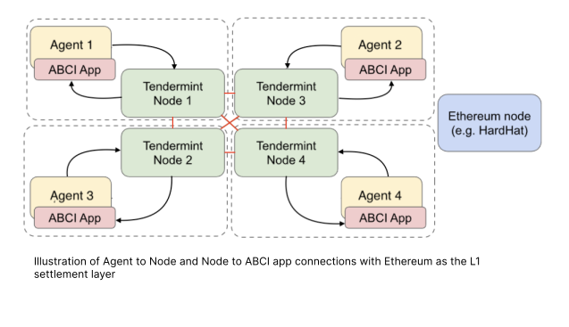

# Price estimation internals

Documentation of the price estimation demo.

## Introduction

The estimate is an average of a set of observations
on the Bitcoin price coming from different sources,
e.g. CoinMarketCap, CoinGecko, Binance and Coinbase.
Each AEA shares an observation from one of the sources above
by committing it to a temporary blockchain made with Tendermint.
Once all the observation are settled, each AEA
runs a script to aggregate the observations to compute an estimate,
and we say that the consensus is reached when one estimate
reaches `ceil((2n + 1) / 3)` of the total voting power committed
on the temporary blockchain.
Once the consensus on an estimate has been reached, a multi-signature transaction 
with `ceil((2n + 1) / 3)` of the participants' signature is settled on the 
Ethereum chain (in the POC this is the hardhat node).

Alongside the finite-state machine behaviour, the AEAs runs
an ABCI application instance which receives all the updates from the
underlying Tendermint network.


## Setup

The network is composed of:

- A [HardHat](https://hardhat.org/) node (the local blockchain)
- A set of $n$ Tendermint nodes
- A set of $n$ AEAs, in one-to-one connection with one Tendermint node.



Agents communicate directly to their local tendermint node, whereas the `ABCIApp` 
is used to handle requests they receive (e.g. in response to their behaviour).

The AEAs have the following custom components:

- Protocol `valory/abci:0.1.0`: it allows representing
    ABCI request and response messages.
- Connection `valory/abci:0.1.0`: it accepts ABCI requests
    from a consensus engine module, e.g. the Tendermint node;
- Skill `valory/abstract_abci:0.1.0`: it provides a
    scaffold handler for ABCI requests. It is an abstract skill.
- Skill `valory/abstract_round_abci:0.1.0`: it
    implements an ABCI handler and provides
    useful code abstractions for creating round-based
    replicated state machines, based on the ABCI protocol
    (e.g. `Period`, `AbstractRound`). It is an abstract skill.

Moreover, it has the following demo-specific components:

- `valory/price_estimation_abci`: it implements the round-based
    ABCI application for price estimation of a cryptocurrency,
    with a finalization step over an Ethereum chain.


## Price estimation as a proof of concept

The ABCI-based replicated FSM (`ABCIApp`) used for price estimation consists 
of several smaller modules, each of which is an `ABCIApp` of its own. Each of 
them is a `Skill`, which implies that they operate independently of each other,
however they can be combined to create a larger `ABCIApp`, provided that the 
developer specifies the required transition mapping to connect these FSMs.
This modularity allows a developer to use a subset of these skills in different 
contexts, potentially in combination with skills they themselves define, to 
create another composite `ABCIApp` that performs according to their particular 
needs. Specifically, the `PriceEstimationAbciApp` is created by combining the 
following parts:

- `AgentRegistrationAbciApp`
- `SafeDeploymentAbciApp`
- `OracleDeploymentAbciApp`
- `PriceAggregationAbciApp`
- `TransactionSubmissionAbciApp`


### The `AgentRegistrationAbciApp`

This `AbciApp` implements the registration of agents to partake in the behaviour
scheduled in subsequent rounds. 

0. `RegistrationStartupRound` <br/>

1. `RegistrationRound` <br/>
   In this round registrations from AEAs to join the period are accepted, up to 
   a configured maximum number of participants (in the demo, this limit is 4); 
   once this threshold is hit ("registration threshold"), the round is finished.

2. `FinishedRegistrationRound` <br/>
   A round that signals agent registration was successful.

3. `FinishedRegistrationFFWRound` <br/>
   A round that signals agent registration was successful.


### The `SafeDeploymentAbciApp`

This `AbciApp` implements the deployments of a Gnosis safe contract, which is
a multisig smart contract wallet that requires a minimum number of people to 
approve a transaction before it can occur. This assures that no single agent 
can compromise the funds contained in it.

0. `RandomnessSafeRound` <br/>
   Some randomness is retrieved to be used in a keeper agent selection. In 
   particular, agents individually request the latest random number from
   [DRAND](https://drand.love), establish consensus on it and then use 
   it as a seed for computations requiring randomness (e.g. keeper selection).

1. `SelectKeeperSafeRound` <br/>
   The agents agree on a new keeper that will be in charge of sending deploying 
   the multisig wallet and settling transactions.

2. `DeploySafeRound` <br/>
   A designated sender among the participants of the current period deploys a
   <a href="https://gnosis-safe.io/">Gnosis Safe contract</a> with all the 
   participants as owners and with `ceil((2n + 1) / 3)` as threshold. If the 
   safe deployment has not been completed after some time, a new keeper will be 
   selected and the safe deployment will be re-run.
    
3. `ValidateSafeRound` <br/>
   All agents validate the previous deployment to ensure that the correct 
   contract with the correct settings has been deployed. If the safe deployment 
   could not be verified, the process will start again from the registration 
   round.

4. `FinishedSafeRound` <br/>
   A round that signals the safe contract was deployed successfully.


### The `OracleDeploymentAbciApp`

This `AbciApp` implements the deployments of an Oracle contract, a Gnosis safe 
multisig smart contract wallet that was forked from [Chainlink](https://chain.link/)
and subsequently stripped from unnecessary data structures and behaviours.

0. `RandomnessOracleRound` <br/>
   Similar as to the `RandomnessSafeRound`, randomness is retrieved here, this 
   time for the selection of an agent to become the oracle keeper.

1. `SelectKeeperOracleRound` <br/>
   The agents select a new keeper that will be in charge of sending deploying 
   the multisig wallet and settling transactions.

2. `DeployOracleRound` <br/>
   The designated keeper deploys a Gnosis safe contract. If a timeout occurs
   before oracle deployment was completed, a new keeper will be selected and
   the oracle deployment will be re-run.

3. `ValidateOracleRound` <br/>
   all agents verify that the Oracle contract has been  deployed using the 
   expected settings. If that's not the case, agents will restart the period.

4. `FinishedOracleRound`
   A round that signals the oracle contract was deployed successfully.


### The `PriceAggregationAbciApp`

0. `CollectObservationRound` <br/>
   Observational data is collected by the AEAs on the target quantity to 
   estimate. Once the agents reach consensus over this data, that is to say at 
   least 2/3rd of them agree on the set of single observations collected by 
   agents (not on individual observations), the shared state gets updated and
   the agents enter the next round.

1. `EstimateConsensusRound` <br/>
   Based on the collected data the actual price of the asset is estimated, which
   could be a simple summary statistic such as the median or the geometric mean.
   Once the same estimate receives a number of votes greater or equal than
   2/3 of the total voting power, consensus is reached and the period moves 
   forward.

2. `TxHashRound` <br/>
   A designated sender composes the transaction and puts it on the temporary 
   Tendermint-based chain. Signing of the transaction for the multisig smart
   contract requires consensus among the agents on the transaction hash to use.  

3. `FinishedPriceAggregationRound` <br/>
   A round that signals price aggregation was completed successfully.


### The `TransactionSubmissionAbciApp`

0. `RandomnessTransactionSubmissionRound` <br/>
   Randomness is retrieved for keeper selection. 

1. `SelectKeeperTransactionSubmissionRoundA` <br/>
   The agents select a keeper that will be in charge of sending the transaction.
    
2. `CollectSignatureRound` <br/>
   Agents sign the transaction to be submitted.

3. `FinalizationRound` <br/>
   The keeper sends off the transaction to be incorporated in the next block.
   A transaction hash is returned.

4. `ValidateTransactionRound` <br/>
   Agents validate whether the transaction has been incorporated in the 
   blockchain.

5. `SelectKeeperTransactionSubmissionRoundB` <br/>
   The agents select a keeper that will be in charge of sending the transaction.    

6. `ResetRound` <br/>
   In case the transaction didn't get included in the last block, the period
   is reset and another transaction submission is attempted with increased gas.

7. `ResetAndPauseRound` <br/>
   A redundant round that should not be here as agents should be directed to
   the `FinishedTransactionSubmissionRound` immediately.

9. `FinishedTransactionSubmissionRound` <br/>
   A round that signals transaction submission was completed successfully.

10. `FailedRound` <br/>
    A round that signals transaction submission has failed.


### Implementation of the `PriceEstimationAbciApp`

In the final implementation the `PriceEstimationAbciApp` is then assembled from
its constituent parts. However, in order to combine the various FSMs previously
discussed, a transition mapping between states of these FSMs also needs to be 
provided. In order to combine the different FSMs we need to connect them by
providing the necessary transition mapping. As per the code implemented in the
[demo](./price_estimation_demo.md), the implementation looks as follows:

```python

abci_app_transition_mapping: AbciAppTransitionMapping = {
    FinishedRegistrationRound: RandomnessSafeRound,
    FinishedSafeRound: RandomnessOracleRound,
    FinishedOracleRound: CollectObservationRound,
    FinishedRegistrationFFWRound: CollectObservationRound,
    FinishedPriceAggregationRound: RandomnessTransactionSubmissionRound,
    FinishedTransactionSubmissionRound: CollectObservationRound,
    FailedRound: RegistrationRound,
}

PriceEstimationAbciApp = chain(
    (
        AgentRegistrationAbciApp,
        SafeDeploymentAbciApp,
        OracleDeploymentAbciApp,
        PriceAggregationAbciApp,
        TransactionSubmissionAbciApp,
    ),
    abci_app_transition_mapping,
)
```

!!! note

    The execution logic of the AbstractRoundBehaviour implemented below
    still requires documention here


```python
class PriceEstimationConsensusBehaviour(AbstractRoundBehaviour):
    """This behaviour manages the consensus stages for the price estimation."""

    initial_state_cls = TendermintHealthcheckBehaviour
    abci_app_cls = PriceEstimationAbciApp
    behaviour_states: Set[Type[BaseState]] = {
        TendermintHealthcheckBehaviour,
        RegistrationBehaviour,
        RegistrationStartupBehaviour,
        RandomnessSafeBehaviour,
        RandomnessOracleBehaviour,
        SelectKeeperSafeBehaviour,
        DeploySafeBehaviour,
        ValidateSafeBehaviour,
        SelectKeeperOracleBehaviour,
        DeployOracleBehaviour,
        ValidateOracleBehaviour,
        RandomnessTransactionSubmissionBehaviour,
        ObserveBehaviour,
        EstimateBehaviour,
        TransactionHashBehaviour,
        SignatureBehaviour,
        FinalizeBehaviour,
        ValidateTransactionBehaviour,
        SelectKeeperTransactionSubmissionBehaviourA,
        SelectKeeperTransactionSubmissionBehaviourB,
        ResetBehaviour,
        ResetAndPauseBehaviour,
    }

```

Have a look at the [FSM diagram](./fsm_diagram.md) of the application in order 
to see what the encoded state transitions in the final composite FSM look like.

!!! warning

    A sequence diagram that shows how AEAs communicate with their environment
    throughout the execution can be found [here](poc-diagram.md). However,
    it is not fully up-to-date with the implementation discussed here.
    
