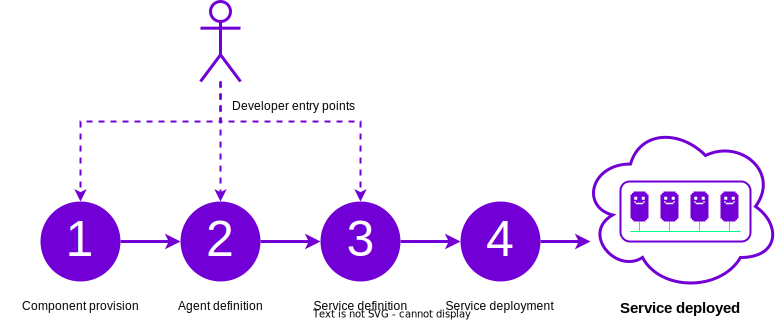

# Quick Start

The purpose of this quick start is to get you up and running with the {{open_autonomy}} framework for agent service development as quickly as possible.
The overall pipeline with the framework is summarized in the figure below:

<figure markdown>

<figcaption>Overall pipeline to deploy an agent service with the Open Autonomy framework</figcaption>
</figure>

The steps defined in the figure above are materialized as follows:

1. **Component provision:** The developer ensures that the agent components are available, either by programming them from scratch using the {{open_aea}} framework, or fetching them from the Component Registry. Each agent service needs one or more underlying {{fsm_app}}(s) that define the service business logic. The {{open_autonomy}} framework contains packages with base classes that help define {{fsm_app}}s.

2. **Agent definition:** The developer ensures that the agents that make up the service are available, either by defining them  using the {{open_aea}} framework, or by fetching them from the Agent Registry.

3. **Service definition:** The developer produces a service definition based on the corresponding agents, or it fetches a service from the Service Registry. Agent operators register agent instances against the service.

4. **Service deployment:** Once the service is defined, the developer can use the {{open_autonomy}} CLI to deploy the service.

The dashed arrows in the figure denote the "entry points" for a developer in the pipeline. For example, if the developer is satisfied with some agent available in the agent registry, then they can skip the first step about defining agent components, and fetch that agent directly. We will give more detail about the pipeline below.

The goal of this quick start guide is to showcase steps 3-4 from the pipeline. That is, how to execute a (local) deployment of a demonstration service. We will cover the particularities of the components that make up agents in an agent service in other sections of the documentation.


## Requirements

Ensure your machine satisfies the following requirements:

- Python `>= 3.7` (recommended `>= 3.10`)
- [Tendermint](https://docs.tendermint.com/master/introduction/install.html) `==0.34.19`
- [Pipenv](https://pipenv.pypa.io/en/latest/install/) `>=2021.x.xx`

## Setup

1. Setup the environment
```bash
export OPEN_AEA_IPFS_ADDR="/dns/registry.autonolas.tech/tcp/443/https"
touch Pipfile && pipenv --python 3.10 && pipenv shell
```

2. Install {{open_autonomy}}
```bash
pip install open-autonomy
```

## Deploy a local agent service

Follow the steps indicated in the diagram to define and build and deploy locally an example agent service using Docker Compose.
In this case, we consider the demonstration [Hello World agent service](https://docs.autonolas.network/service_example/).


1. Download the files containing the Dockerfile templates.
    ```bash
    git clone --recursive git@github.com:valory-xyz/open-autonomy.git
    cd open-autonomy
    cd third_party/safe-contracts && yarn install
    cd ../..
    cd third_party/contracts-amm && yarn install
    cd ../..
    make new_env
    pipenv shell
    ```

    !!!warning
        The commands shown above are currently required in order to download a number of template files that are expected to be integrated in an upcoming release of the {{open_autonomy}} framework.

2. Build the Docker images that make up the agent service.
    ```bash
    autonomy deploy build image valory/hello_world
    autonomy deploy build image valory/hello_world --dependencies
    ```
3. Generate the relevant build configuration for the agent service.
    ```bash
    autonomy deploy build deployment valory/hello_world deployments/keys/hardhat_keys.json
    ```

4. The build configuration will be located in `./abci_build`. Execute `docker-compose` as indicated below.
   This will generate a Hello World agent service with 4 agents connected to 4 Tendermint nodes.
    ```bash
    cd abci_build
    docker-compose up --force-recreate
    ```

5. The logs of a single agent or node can then be inspected with, e.g.,
    ```bash
    docker logs {container_id} --follows
    ```
