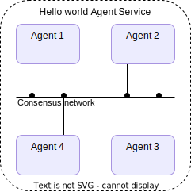
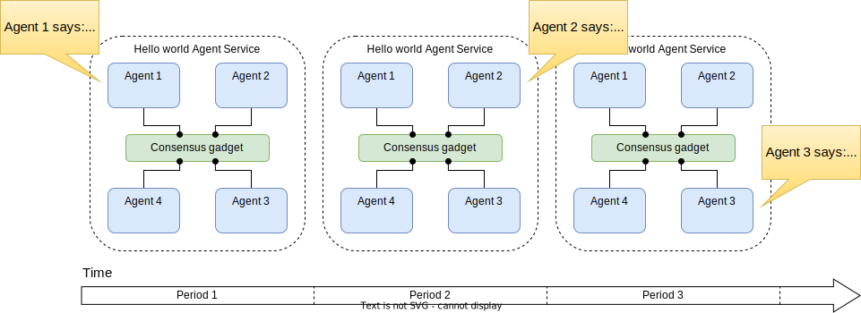
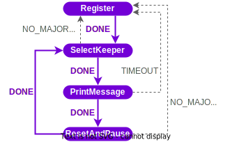
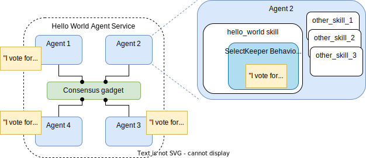
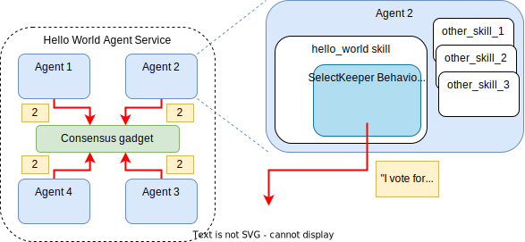
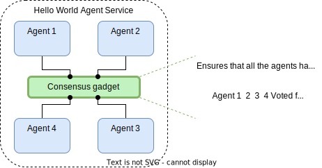
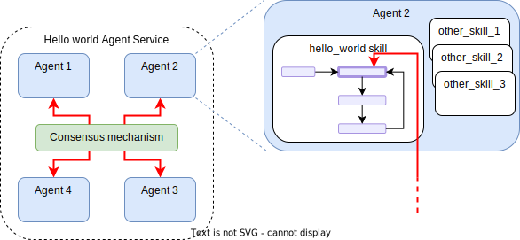
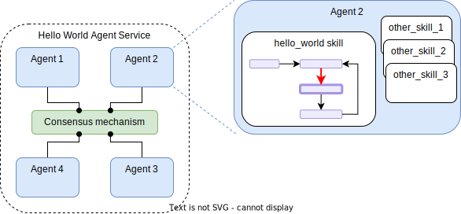
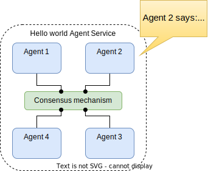
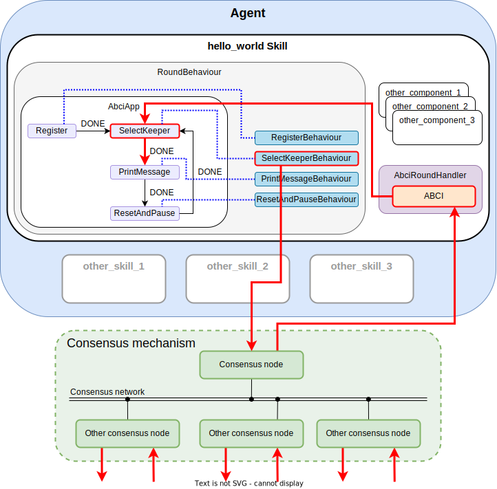

# Example of a service

This section is aimed at giving a general, introductory overview of the library and a high-level view of the main elements that make an Agent Service, without delving into the specific details. Hopefully this will give a global understanding on the development process and the relationship between the main components of the stack.

We start with a simple "Hello World" example service, and we will add progressively more complexity and functionality to it.


## A Hello World! {{agent_service}}
We start our tour to the framework by visiting an elementary example. The goal is to come up with a service composed of four agents. The functionality of this service will be extremely simple. Namely, each agent will output the following message to its own console:
> "Agent $i$ in period $j$ says: Hello World!"

More concretely, we divide the timeline into _periods_, and within each period, _only one designated agent will print the message_. The other agents will print nothing. Think of a period as an interval where the service carries out an iteration of its intended functionality.

The architecture of this {{agent_service}} is as simple as it can be: four agents that are inherently connected through a _consensus gadget_.

<figure markdown>

<figcaption>Hello World service architecture</figcaption>
</figure>


!!! warning "Important"

    Every {{agent_service}} has an associated *consensus gadget*:

    * The consensus gadget is the component that makes possible for the agents to synchronise data. This allows them to, e.g., reach agreement on certain decentralized operations or simply share information.

    * Anything happening at the consensus network is completely abstracted away to the developer. An application run by the {{agent_service}} can be thought and developed as a single "virtual" application.


This is what the service would look like in all its glory:

<figure markdown>

<figcaption>Hello World {{agent_service}} in action</figcaption>
</figure>

Even though printing "Hello World" on their local console is far from being an exciting functionality, this example shows a number of  nontrivial elements that are key elements in an {{agent_service}}:

* The service defines a sequence of "atomic," well-defined actions whose execution in the appropriate order achieves the intended functionality.
* Agents have to interact with each other to execute the overall functionality, and reach a consensus on a number of decisions at certain moments (e.g., who is the agent that prints the message in each period).
* Agents are also allowed to execute actions on their own. In this simple example it just consists of printing a local message.
* Agents have to use a global store for persistent data (e.g., which was the last agent that printed the message).
* Finally, the application can progress make progress even if some agent is faulty or malicious (up to a certain threshold of malicious agents).

Of course, in this toy example we assume that the agent that prints the message will behave honestly. When this printing functionality is replaced by other critical operations, like sending a transaction to a blockchain, it is not enough with trusting that the agent will behave honestly, and further security and cryptographic mechanisms will be required.

The main questions that we try to answer at this point are:

* What are the main elements of the {{open_autonomy}} framework to implement an {{agent_service}}?, and
* How do agents interact with the different components in an {{agent_service}}?

## The Finite State Machine of an {{agent_service}}

The first step when designing an {{agent_service}} is to divide the intended functionality into "atomic" steps. For example, for the Hello World service, we identify these steps as

1. Each agent registers to the service.
2. [If Step 1 OK] Agents select what is the next agent to print the message. We call this agent the _keeper_.
3. [If Step 2 OK] The keeper prints the message "Hello World" on its local console.
4. Pause for a while and go to Step 2.

The reader should have probably already identified Steps 2 and 3. Step 1 is a requirement in each {{agent_service}}: it is simply a preliminary stage where each agent shows its willingness to participate actively in the service. This will allow all the agents to have an idea on what agents are participating in the service. Step 4, on the other hand is also a standard step in services that "loop", like the Hello World service. It serves as a "sleep" block of the {{agent_service}}.

Graphically, the sequence of atomic steps that the service is following can be seen as

<figure markdown>

<figcaption>Diagram of atomic operations of the Hello World service</figcaption>
</figure>

This sequence diagram of operations can be interpreted as a finite state machine (FSM) that defines the service. Ignoring network latency and delays caused by the underlying consensus gadget, it can be considered that at any given time, **all agents have the same view of the service FSM**, and **all agents execute the same transitions**. This is one of the key concepts of the {{open_autonomy}} framework.

!!! note

    FSMs are in fact an abstract model of computation. An FSM defines

    * a set of _states_,
    * a set of _events_, and
    * a [_state-transition function_](https://en.wikipedia.org/wiki/Finite-state_machine#Mathematical_model).

    The [state-transition function](https://en.wikipedia.org/wiki/Finite-state_machine#Mathematical_model) indicates how to move from a given state once an event has been received. At any timepoint, an FSM can only be located at a given state (_current state_). You can find a brief introduction about FSMs on Wikipedia, but for our purposes it is enough to understand the three bullet points above.

    Note that, according to the most the rigorous definition of an FSM, besides the current state, the FSM "has no other memory." That is, it does not know _how_ it arrived at a given state. Of course, in order to develop useful {{agent_service}}s, the {{open_autonomy}} framework equips these FSMs with persistent storage.

Each agent runs internally a process or application that implements the service FSM, processes events and transit to new states according to the state-transition function. The component that encapsulates this functionality is an agent _skill_. As its name suggests, a skill is some sort of "knowledge" that the agent possesses.

Let us call `hello_world_abci`the skill that encapsulates the Hello World functionality (the reason for the suffix `abci` will be explained below). A zoom on an agent would look like this:

<figure markdown>

<figcaption>Zoom on an agent.</figcaption>
</figure>

Observe that Agent 2 has three additional skills. In fact, an agent can have one or multiple skills, in addition to several other components. Skills can implement a variety of functionalities, not only FSMs.

!!! warning "Important"

    All agents in an {{agent_service}} are implemented by the same codebase. The codebase implementing an agent is called a _canonical agent_, whereas each of the actual instances is called _agent instance_, or simply _agent_ for short.
    Each agent instance is then parameterized with their own set of keys, addresses and other required attributes.

## Transitioning through the FSM

But how exactly does an agent transition through the FSM? That is, how are the events generated, and how are they received?

To answer this question, let us focus on a concrete state, namely, the SelectKeeper state. Several things are expected when the service is at this point.

A high level view of what occurs is as follows:

1.  Prepare the vote. Each agent determines what agent he wishes to vote for as the new keeper. Since there is the need to reach an agreement, we consider that each agent wants to vote for "Agent $M\pmod 4+1$," where $M$ is the value of the current period. Thus, the agent prepares an appropriate _payload_ that contains that information.

    


2.  Send the vote. The `hello_world_abci` skill has a component (_Behaviour_) that is in charge of casting the vote to the consensus gadget.

    


3.  The consensus gadget reads the agents' outputs, and ensures that the collection of responses observed is consistent. The gadget takes the responsibility of executing the consensus algorithm, which is abstracted away to the developer of the {{agent_service}}.
    *   Note that this does not mean that the consensus gadget ensures that all the agents vote the same. Rather, it means that all the agents reach an agreement on what vote was sent by each of them.

    


4.  Once the consensus phase is finished (and persistently stored in a temporary blockchain maintained by the agents), each agent is notified with the corresponding information via an interface called _ABCI_ (this is why we called the skill `hello_world_abci`).

    


5.  A certain skill component (called _Round_) receives and processes this information. If strictly more than $2/3$ of the agents voted for a certain keeper, then the agent records this result persistently to be used in future phases of the service. After finalizing all this processing, the same skill component outputs the event that indicates the success of the expected actions at that state.


6.  The event cast in the previous step is received by the component that actually manages the service FSM (_AbciApp_). This component processes the event according to the state-transition function and moves the current state of the FSM appropriately.

    


!!! warning "Important"

    As illustrated by the example above, there are a number of components from a skill in the {{open_autonomy}} framework that the developer needs to define in order to build an {{agent_service}}. More concretely, these are:

    * **`AbciApp`**: The component that defines the FSM itself and the transitions between states.
    * **`Rounds`**: The components that process the input from the consensus gadget and outputs the appropriate events to make the next transition. **There must be one round per FSM state.**
    * **`Behaviours`**: The components that execute the proactive action expected at each state. E.g., cast a vote for a keeper, print a message on screen, execute a transaction on a blockchain, etc. **There must be one behaviour per FSM state.**
    * **`Payloads`**: Associated to each behaviour. They define the contents of the transaction of the corresponding behaviour.
    * **`RoundBehaviour`**: This can be seen as the main class of the skill, which aggregates the `AbciApp` and ensures to establish a one-to-one relationship between the rounds and behaviours associated to each state of the FSM.


!!! Note

    As you have probably realized at this point, there are several items which are called after the interface that connects with the consensus gadget, i.e., the Application Blockchain Interface (ABCI). In case you are not familiar with it, for now, it is enough to know that it is an interface that abstracts away the protocol executed at the consensus gadget, and it produces callbacks to the skill when relevant events occur (e.g., agreement on a block). You can read more about the ABCI [here](https://docs.tendermint.com/master/spec/abci/).

At this point, the walkthrough that we have presented, i.e., a single transition from one state of the FSM, has essentially introduced the main components of an agent and the main interactions that occur in an {{agent_service}}. It is important that the developer keeps these concepts in mind, since executions of further state transitions can be easily mapped with what has been presented here so far.

## Executing the Main Functionality

Still, the service has only transitioned to a new state on its FSM. But, what would happen in an actual execution of the service functionality?

Mimicking the steps that occurred in the previous state, it is not difficult to see that this is what would actually happen:

1.   Upon entering the PrintMessage state, the associated behaviour, say `PrintMessageBehaviour` will be in charge of executing the appropriate functionality. For Agent 2, it will be printing the celebrated message "Agent 2 says: Hello World". The rest of the agents can simply do nothing.
2.   In any case, a dummy message (e.g., a constant value "Task completed") must be sent by all the agents so that the consensus gadget does its work.
3.   The consensus gadget will execute its protocol
4.   The result of the consensus will be forwarded to all the agents through ABCI.
5.   The `PrintMessageRound` will receive a callback originated from the consensus gadget. It will verify that all agents have responded, and it will then cast the `DONE` event.
6.   The `AbciApp` will take over and process the event `DONE`, and move the current state of the FSM to the next state, ResetAndPause.

As a result, we have finished a "happy path" of execution of the FSM, concluding with the expected output:

<figure markdown>

<figcaption>Result of the execution the second period of the Hello World {{agent_service}}</figcaption>
</figure>


!!! note

    In Step 2 of the main (printing) functionality, by design, we have required that all agents respond with a dummy constant value.
    We remark that not all states of the FSM require that all agents respond. In this example, we could simply have required that the keeper sends the "Task completed" message, and the remaining agents would  wait for that single message.

    Other states might have different waiting conditions, e.g.,

    * wait that all agents respond with a different value, or
    * wait that more than a threshold of agents respond with the same value.

    When the waiting condition is not met during a certain interval, a special timeout event is generated by the `Round`, and the developer is in charge of defining how the FSM will transit in that case.

## Bird's Eye View
As a summary, find below an image which shows the main components of the agent and the skill related to the Hello World {{agent_service}} presented in this overview. Of course, this is by no means the complete picture of what is inside an agent, but it should give the developer a good intuition of what are the main elements that play a role in any {{agent_service}} and how they interact.

<figure markdown>

<figcaption>Main components of an agent that play a role in an {{agent_service}}. Red arrows indicate a high-level flow of messages when the agent is in the SelectKeeper state.</figcaption>
</figure>

## Coding the Hello World! {{agent_service}}: A Primer
So far, we have given a conceptual description of the Hello World {{agent_service}}. As we have seen, there are a number of components that the developer needs to focus in order to fully define the service.

The objective of this section is to explore what are the main steps to code and get the service running. Note that the complete code for the example can be found in

* `packages/valory/agents/hello_world`: the Hello World agent,
* `packages/valory/skills/hello_world_abci`: the `hello_world_abci` skill.

### Coding the Agent
Agents are defined through the {{open_aea}} library as YAML files, which specify what components is the agent composed of, together with some other configuration parameters. Agents components can be, for example, connections, contracts, protocols or skills. We refer to the {{open_aea_doc}} for the complete details, although the reader might already have some intuition about their meaning.

This is an excerpt of the `/agents/hello_world/aea-config.yaml` file:

```yaml
# ...
connections:
- valory/abci:0.1.0:<ipfs_hash>
- valory/http_client:0.1.0:<ipfs_hash>
contracts: []
protocols:
- open_aea/signing:1.0.0:<ipfs_hash>
- valory/abci:0.1.0:<ipfs_hash>
- valory/http:1.0.0:<ipfs_hash>
skills:
- valory/abstract_abci:0.1.0:<ipfs_hash>
- valory/abstract_round_abci:0.1.0:<ipfs_hash>
- valory/hello_world_abci:0.1.0:<ipfs_hash>
# ...
```

It is mandatory that all agents that will be part of an {{agent_service}} have the `abci` connection, the `abci` protocol, as well as the `abstract_abci` and `abstract_round_abci` skills. These are the essential components that allow to interact with the consensus gadget, and contain helper and base classes that simplify the process of building the code for the skill.

Additionally, the agent can use other connections, protocols or skills, depending of its particular needs. In the example, the `http_client` connection and the `http` protocol allows the agent to interact with HTTP servers (although we are not using it in this service). Similarly, you can add the `ledger` connection and the `ledger_api` protocol in case the agent needs to interact with a blockchain.

Note that the agent also includes the `hello_world_abci` skill, which is the one that we need to code for this example. Except that, there is no more to code to write for the agent. The {{open_aea}} library will be in charge of reading this configuration file and execute its skills accordingly.

Note that although it is possible to develop your own protocols and connections, the {{open_aea}} framework provides a number of typical ones which can be reused. Therefore, it is usual that the developer focuses most of its programming efforts in coding the particular skill/s for the agent.

### Coding the Skill

Recall that the skill needs to define the `AbciApp`; the `Rounds`, `Behaviours` and `Payloads` associated to each state of the FSM; and the main skill class, i.e., the `RoundBehaviour` class. Let's look how each of these objects are implemented. The files referenced below are all placed within `packages/valory/skills/hello_world_abci`:

  **`rounds.py`**: This file defines both the `Rounds` and the `AbciApp` class. This is how the printing round (`PrintMessageRound`) inherits from the stack classes:

  <figure markdown>
  <div class="mermaid">
  classDiagram
      AbstractRound <|-- CollectionRound
      CollectionRound <|-- _CollectUntilAllRound
      _CollectUntilAllRound <|-- CollectDifferentUntilAllRound
      CollectDifferentUntilAllRound <|-- PrintMessageRound
      HelloWorldABCIAbstractRound <|-- PrintMessageRound
      AbstractRound <|-- HelloWorldABCIAbstractRound
      class AbstractRound{
        +round_id
        +allowed_tx_type
        +payload_attribute
        -_synchronized_data
        +synchronized_data()
        +end_block()*
        +check_payload()*
        +process_payload()*
      }
      class HelloWorldABCIAbstractRound{
        +synchronized_data()
        -_return_no_majority_event()
      }
      class CollectionRound{
        -collection
        +payloads()
        +payloads_count()
        +process_payload()
        +check_payload()
      }
      class _CollectUntilAllRound{
        +check_payload()
        +process_payload()
        +collection_threshold_reached()
      }
      class CollectDifferentUntilAllRound{
        +check_payload()
      }
      class PrintMessageRound{
        +round_id = "print_message"
        +allowed_tx_type = PrintMessagePayload.transaction_type
        +payload_attribute = "message"
        +end_block()
      }
  </div>
  <figcaption>Hierarchy of the PrintMessageRound class (some methods and fields are omitted)</figcaption>
  </figure>

  Note that the `HelloWorldABCIAbstractRound` is merely a convenience class defined in the same file. The class `CollectDifferentUntilAllRound` is a helper class for rounds that expect that each agent sends a different message. In this case, the message to be sent is the agent printed by each agent, which will be obviously different for each agent (one of them will be the celebrated 'Hello World' message, and the others will be 'empty' messages). Other helper classes exist within the stack to account for rounds that expect agents to agree on a common value.

  Since most of the logic is already implemented in the base classes, the programmer only needs to define a few parameters and methods within the `Round`. Most notably, the method `end_block`, which is triggered when the ABCI notifies the end of a block in the consensus gadget:

  ```python
  class PrintMessageRound(CollectDifferentUntilAllRound, HelloWorldABCIAbstractRound):

  # ...

    def end_block(self) -> Optional[Tuple[BaseSynchronizedData, Event]]:
        """Process the end of the block."""
        if self.collection_threshold_reached:
            synchronized_data = self.synchronized_data.update(
                participants=self.collection,
                all_participants=self.collection,
                synchronized_data_class=SynchronizedData,
            )
            return synchronized_data, Event.DONE
        return None
  ```

  The method updates a number of variables collected at that point, and returns the appropriate event (`DONE`) so that the `AbciApp` can process and transit to the next round.

  Observe that the `RegistrationRound` is very similar to the `PrintMessageRound`, as it simply has to collect the different addresses that each agent sends.

  After having defined the `Rounds`, the `HelloWorldAbciApp` does not have much mystery. It simply defines the transitions from one state to another in the FSM, arranged as Python dictionaries. For example,

  ```python
  SelectKeeperRound: {
      Event.DONE: PrintMessageRound,
      Event.ROUND_TIMEOUT: RegistrationRound,
      Event.NO_MAJORITY: RegistrationRound,
  },
  ```

  denotes the three possible transitions from the `SelectKeeperRound` to the corresponding `Rounds`, according to the FSM depicted above.


**`behaviours.py`**: This file defines the `Behaviours`, which encode the proactive actions occurring at each state of the FSM. The class diagram for the `PrintMessageBehaviour` is as follows:

  <figure markdown>
  <div class="mermaid">
  classDiagram
      HelloWorldABCIBaseBehaviour <|-- PrintMessageBehaviour
      BaseBehaviour <|-- HelloWorldABCIBaseBehaviour
      IPFSBehaviour <|-- BaseBehaviour
      AsyncBehaviour <|-- BaseBehaviour
      CleanUpBehaviour <|-- BaseBehaviour
      SimpleBehaviour <|-- IPFSBehaviour
      Behaviour <|-- SimpleBehaviour

      class AsyncBehaviour{
          +async_act()*
          +async_act_wrapper()*
      }
      class HelloWorldABCIBaseBehaviour {
          +syncrhonized_data()
          +params()
      }
      class PrintMessageBehaviour{
          +behaviour_id = "print_message"
          +matching_round = PrintMessageRound
          +async_act()
      }
  </div>
  <figcaption>Hierarchy of the PrintMessageBehaviour class (some methods and fields are omitted)</figcaption>
  </figure>

Again, the `HelloWorldABCIBaseBehaviour` is a convenience class, and the upper class in the hierarchy are abstract classes from the stack that facilitate re-usability of code when implementing the `Behaviour`. An excerpt of its code is:

```python
class PrintMessageBehaviour(HelloWorldABCIBaseBehaviour, ABC):
    """Prints the celebrated 'HELLO WORLD!' message."""

    behaviour_id = "print_message"
    matching_round = PrintMessageRound

    def async_act(self) -> Generator:
        """
        Do the action.

        Steps:
        - Determine if this agent is the current keeper agent.
        - Print the appropriate to the local console.
        - Send the transaction with the printed message and wait for it to be mined.
        - Wait until ABCI application transitions to the next round.
        - Go to the next behaviour (set done event).
        """

        printed_message = f"Agent {self.context.agent_name} (address {self.context.agent_address}) in period {self.synchronized_data.period_count} says: "
        if (
            self.context.agent_address
            == self.synchronized_data.most_voted_keeper_address
        ):
            printed_message += "HELLO WORLD!"
        else:
            printed_message += ":|"

        print(printed_message)
        self.context.logger.info(f"printed_message={printed_message}")

        payload = PrintMessagePayload(self.context.agent_address, printed_message)

        with self.context.benchmark_tool.measure(self.behaviour_id).consensus():
            yield from self.send_a2a_transaction(payload)
            yield from self.wait_until_round_end()

        self.set_done()
```

Let us remark a number of noteworthy points from this code:

1.  The `matching_round` variable must be set to the corresponding `Round`.
2.  Within `async_act()`, The action must be executed (in this case, print 'Hello World' sequentially). Note how the agent reads the `context` and `synchronized_data.period_count` to determine if it is the keeper agent.
3.  After the action has been executed, the agent must prepare the `Payload` associated with this state. The payload can be anything that other agents might find useful for the action in this or future states. In this case, we simply send the message printed to the console.
4.  The agent must send the `Payload`, which the consensus gadget will be in charge of synchronizing with all the agents.
5.  The agent must wait until the consensus gadgets finishes its work, and mark the state as 'done'.

Steps 3, 4, 5 above are common for all the `Behaviours` in the {{agent_service}} skills.

Once all the `Behaviours` are defined, it is time to define the `RoundBehaviour` class. This class follows a quite standard structure in all the {{agent_service}}s, and the reader can easily infer what is it from the source code:

```python
class HelloWorldRoundBehaviour(AbstractRoundBehaviour):
    """This behaviour manages the consensus stages for the Hello World abci app."""

    initial_behaviour_cls = RegistrationBehaviour
    abci_app_cls = HelloWorldAbciApp  # type: ignore
    behaviours: Set[Type[HelloWorldABCIBaseBehaviour]] = {  # type: ignore
        RegistrationBehaviour,  # type: ignore
        SelectKeeperBehaviour,  # type: ignore
        PrintMessageBehaviour,  # type: ignore
        ResetAndPauseBehaviour,  # type: ignore
    }
```

**`payloads.py`**: This file defines the payloads associated to the consensus engine for each of the states. Payload classes are mostly used to encapsulate the data values, and carry almost no business logic. For illustration purposes, consider the payload associated to the `PrintMessageBehaviour`:

```python
class PrintMessagePayload(BaseHelloWorldAbciPayload):
    """Represent a transaction payload of type 'randomness'."""

    transaction_type = TransactionType.PRINT_MESSAGE

    def __init__(self, sender: str, message: str, **kwargs: Any) -> None:
        """Initialize an 'select_keeper' transaction payload.

        :param sender: the sender (Ethereum) address
        :param message: the message printed by the agent
        :param kwargs: the keyword arguments
        """
        super().__init__(sender, **kwargs)
        self._message = message

    @property
    def message(self) -> str:
        """Get the message"""
        return self._message

    @property
    def data(self) -> Dict:
        """Get the data."""
        return dict(message=self._message)
```


**Other required components.**  As you an see, there are a number of extra files which define other components required by the agent that we have not addressed so far.
To conclude this section, let us briefly describe the purposes of each one, and we urge the reader to take a look at the source code:

* `skill.yaml`: This is the skill specification file. Similarly as the agent, it defines the components (protocols, connections, etc.) required by the skill, as well as a number of configuration parameters.
* `handlers.py`: Defines the `Handlers` (implementing reactive actions) used by the skill. It is mandatory that the skill associated to an {{agent_service}} implements a handler inherited from the `ABCIRoundHandler`. Other handlers are required according to the actions that the skill is performing (e.g., interacting with an HTTP server). As you can see by exploring the file, little coding is expected unless you need to implement a custom protocol.
* `dialogues.py`: It defines the dialogues associated to the protocols described in the `skill.yaml` configuration file. Again, not much coding is expected in most cases.
* `models.py`:
* `fsm_specification.yaml`: It contains a specification of the FSM in a simplified syntax. It is used for checking the consistency of the implementation, and it can be automatically generated using a script.


## Further Reading
While this walkthrough to a simple Hello World example should give a general overview of the development process and the main elements that play a role in an {{agent_service}} and inside an agent, there are a few more elements in the {{open_autonomy}} framework that facilitate building complex applications and interact with real blockchains and other networks. We refer the reader to the more advanced sections of the documentation, where we explore in detail the stack.
