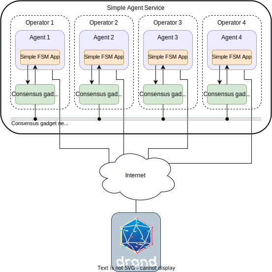

# Simple {{fsm_app}}

!!!note
    For clarity, the snippets of code presented here are a simplified version of the actual
    implementation. We refer the reader to the {{open_autonomy_api}} for the complete details.

The Simple {{fsm_app}} is an example application that demonstrates how to use the {{open_autonomy}} framework. The goal is to provide the minimum background so that users can start developing their own {{agent_service}}s, and to showcase how AEAs interact with local Tendermint nodes. Indeed, we recommend that new users use the Simple {{fsm_app}} as the starting point for developing their own {{agent_service}}s.

Roughly speaking, on a successful execution of a period of the application (i.e., no timeouts, no error conditions, etc.), the following actions would occur in order:

1. AEAs indicate their willingness to participate in a given period of the service.
2. AEAs agree on a random value.
3. AEAs nominate a keeper (i.e., a "delegate" agent).
4. Go to step 2.

The complete state machine depicting the states and transitions of the application is shown below.

<figure markdown>
<div class="mermaid">
stateDiagram-v2
    RegistrationRound --> RandomnessStartupRound: <center>DONE</center>
    RandomnessStartupRound --> SelectKeeperAtStartupRound: <center>DONE</center>
    RandomnessStartupRound --> RandomnessStartupRound: <center>NO_MAJORITY<br />ROUND_TIMEOUT</center>
    ResetAndPauseRound --> RandomnessStartupRound: <center>DONE</center>
    ResetAndPauseRound --> RegistrationRound: <center>NO_MAJORITY<br />RESET_TIMEOUT</center>
    SelectKeeperAtStartupRound --> ResetAndPauseRound: <center>DONE</center>
    SelectKeeperAtStartupRound --> RegistrationRound: <center>NO_MAJORITY<br />ROUND_TIMEOUT</center>
</div>
<figcaption>Simple ABCI Application FSM</figcaption>
</figure>

Recall that, from the point of view of the developer, the application FSM is replicated transparently in all the AEAs. The developer can simply focus on developing the FSM as if it were being executed in a single machine, and the underlying consensus layer will handle the replication mechanism across different machines.

The `valory/simple_abci` skill is the main component of the {{fsm_app}}. In
general terms, the developer should put the focus on the four action points below:

1. Implement the `Rounds`, `Behaviours` and `Payloads` associated with each FSM state.
2. Implement the `AbciApp` class.
3. Implement the `AbstractRoundBehaviour` class.

Below we discuss these points in detail for the case of the Simple {{fsm_app}}.


## Implementation of the Rounds, Behaviours and Payloads for Each State

The main modules to take into account in this development step are:

- `behaviours.py`: Contains the implementation of the behaviours to be executed at each state of the FSM. Each behaviour is one-to-one associated to a round. It also contains the `SimpleAbciConsensusBehaviour` class, which can be thought as the "main" class for the skill behaviour, and will be discussed in a separate section below.
- `rounds.py`: Contains the implementation of the rounds associated to each state and the shared `SynchronizedData`. It also contains the declaration of the FSM events, and the `SimpleAbciApp` which defines the transition function of the FSM, which will be also discussed in a separate section.
- `payloads.py`: Contains the implementation of the payloads associated to each state. One payload can be used per state. Payloads are used so sync data between agents, and therefore the application state.


### `RegistrationRound` and `RegistrationBehaviour`

The `RegistrationRound` and `RegistrationBehaviour` are the round and behaviour classes associated to the start state of the application FSM. The hierarchy diagram for the `RegistrationRound` is depicted below:

<figure markdown>
<div class="mermaid">
classDiagram
    AbstractRound <|-- CollectionRound
    CollectionRound <|-- CollectDifferentUntilAllRound
    CollectDifferentUntilAllRound <|-- RegistrationRound
    SimpleABCIAbstractRound <|-- RegistrationRound
    AbstractRound <|-- SimpleABCIAbstractRound

    class AbstractRound{
      +round_id
      +allowed_tx_type
      +payload_attribute
      -_state
      +period_state()
      +end_block()*
      +check_payload()*
      +process_payload()*
    }
    class SimpleABCIAbstractRound{
      +period_state()
      -_return_no_majority_event()
    }
    class CollectionRound{
      -collection
      +payloads()
      +payloads_count()
      +process_payload()
      +check_payload()
    }
    class CollectDifferentUntilAllRound{
      +process_payload()
      +check_payload()
      +collection_threshold_reached()
      +most_voted_payload()
    }
    class RegistrationRound{
      +round_id = "registration"
      +allowed_tx_type = TransactionType.REGISTRATION
      +payload_attribute = "sender"
      +end_block()
    }
</div>
<figcaption>Hierarchy of the `RegistrationRound` class (some methods and fields are omitted)</figcaption>
</figure>

As it can be seen, it inherits from the main abstract class `AbstractRound` through a series of intermediate classes:

- `CollectionRound`: Helper class for rounds where the application is expected to wait until some some sort of value is collected: either a common value (e.g., a common randomness observation), or a collection of different values (e.g., exchange values from different sources).
- `CollectDifferentUntilAllRound`: Helper class for rounds that should wait until a collection of different values is collected, one from each agent ("all").
- `SimpleABCIAbstractRound`: Helper class particular to the Simple {{fsm_app}} which contains common methods for all rounds.
- `RegistrationRound`: Class that implements the particular instance of the `AbstractRound`. Many of the functionalities are already covered by the parent classes, but any concrete implementation of `AbstractRound` need to implement the abstract method `end_block()`. The method `end_block()` has the responsibility of checking the conditions to transit to the next state, and as such, it must return (1) a reference to the (updated) `SynchronizedData`, and (2) an event that will define the transition to the next state in the FSM.


To sum up, the `RegistrationRound` simply waits to collect all agent addresses (a mechanism inherited from `CollectDifferentUntilAllRound`) and it produces the `DONE` event when it finishes. The agents send their address through the proactive behaviour discussed below.
As it can be seen here, the {{open_autonomy}} framework provides a number of intermediate helper classes that can be used to simplify the development of a round.

On the other hand, the `RegistrationBehaviour` hierarchy is as follows:
<figure markdown>
<div class="mermaid">
classDiagram
    SimpleABCIBaseBehaviour<|-- RegistrationBehaviour
    BaseBehaviour <|-- SimpleABCIBaseBehaviour
    IPFSBehaviour <|-- BaseBehaviour
    AsyncBehaviour <|-- BaseBehaviour
    CleanUpBehaviour <|-- BaseBehaviour
    SimpleBehaviour <|-- IPFSBehaviour
    Behaviour <|-- SimpleBehaviour

    class AsyncBehaviour{
        +async_act()*
        +async_act_wrapper()*
    }
    class SimpleABCIBaseBehaviour {
        +period_state()
        +params()
    }
    class RegistrationBehaviour{
        +state_id = "register"
        +matching_round = RegistrationRound
        +async_act()
    }
</div>
<figcaption>Hierarchy of the `RegistrationBehaviour` class (some methods and fields are omitted)</figcaption>
</figure>

As it can be seen, the `RegistrationBehaviour` inherits from `BaseBehaviour`, which is the base class for FSM states. This class aggregates the functionality from some other classes, most notably from the `AsyncBehaviour` class which defines the `async_act()` abstract method, which must be implemented in the `RegistrationBehaviour` class. In this case, `async_act()` does the following:

1. Build the registration transaction payload.
2. Send the transaction payload and wait for it to be mined.
3. Wait until the {{fsm_app}} transitions to the next round.
4. Go to the next behaviour state (set done event).

An excerpt of the code corresponding to the `RegistrationBehaviour` is:

```python
class RegistrationBehaviour(SimpleABCIBaseBehaviour):
    """Register to the next round."""

    behaviour_id = "register"
    matching_round = RegistrationRound

    def async_act(self) -> Generator:
        """
        Do the action.

        Steps:
        - Build a registration transaction.
        - Send the transaction and wait for it to be mined.
        - Wait until ABCI application transitions to the next round.
        - Go to the next behaviour (set done event).
        """

        with self.context.benchmark_tool.measure(self.behaviour_id).local():
            payload = RegistrationPayload(self.context.agent_address)

        with self.context.benchmark_tool.measure(self.behaviour_id).consensus():
            yield from self.send_a2a_transaction(payload)
            yield from self.wait_until_round_end()

        self.set_done()
```

Finally, the hierarchy for the `RegistrationPayload` is as follows:

<figure markdown>
<div class="mermaid">
classDiagram
  BaseSimpleAbciPayload <|-- RegistrationPayload
  BaseTxPayload <|-- BaseSimpleAbciPayload

  class BaseTxPayload {
    +transaction_type
    +sender
    +id_
    +round_count
    +_initialisation
    +round_count()
  }

  class RegistrationPayload{
    +transaction_type = TransactionType.REGISTRATION
  }
</div>
<figcaption>Hierarchy of the `RegistrationPayload` class (some methods and fields are omitted)</figcaption>
</figure>

The class `RegistrationPayload` is simply a wrapper for the data to be sent by the
corresponding behaviour in the `async_act()` method.


The remaining states from the FSM follow a similar approach in the definition of the rounds, behaviours and payloads. Therefore, we will omit most of the details and highlight only the relevant information for them.


### `RandomnessStartupRound` and `RandomnessStartupBehaviour`
As opposed to `RegistrationRound`, the class `RandomnessStartupRound` inherits from the helper abstract class `CollectSameUntilThresholdRound`. That is, the round will wait until 2/3 of the agents have agreed in the same collected value (in this case, a random string from a decentralized randomness source). If for whatever reason agents do not agree within a given timeframe, this state is revisited. As above, the method `end_block()` must be implemented, and it must return the appropriate events accordingly.

The `RandomnessBehaviour` on the other hand is the proactive part that connects to the distributed randomness service, reads the value,  commits it to the temporary blockchain, and stores it in the `SynchronizedData`.
As above, all these operations are carried on the `async_act()` method, and the
payload class `RandomnessPayload` encapsulates the collected randomness as well as the round identifier.

### `SelectKeeperAtStartupRound` and `SelectKeeperAtStartupBehaviour`
In this case, `SelectKeeperAtStartupRound` inherits from the class `CollectSameUntilThresholdRound` as above. The value to be agreed by 2/3 of the agents is the address of the agent that will be designated as a keeper. Again, the `end_block()` method must handle the appropriate events to return, depending on the status of the consensus.


The `SelectKeeperAtStartupBehaviour` is in charge of executing the operation of selecting the keeper, which is a deterministic function of the randomness collected in the previous round. The behaviour accesses the randomness through the `SynchronizedData`, commits the output to the temporary blockchain, and it also records it on the `SynchronizedData`. The corresponding payload class, `SelectKeeperPayload` stores the selected keeper.


### `ResetAndPauseRound` and `ResetAndPauseBehaviour`
The `ResetAndPauseRound` also inherits from  `CollectSameUntilThresholdRound`. The value that the rounds waits that the agents agree is simply the period number (an increasing integer). Once 2/3 of the agents have agreed on it, the {{fsm_app}} transitions again to the `RandomnessStartupRound`.

The `ResetAndPauseBehaviour` class simply logs the state, sleeps for a configured interval, and submits the transaction payload (period number) to the temporary blockchain. As usual, the functionality is encoded in `end_block()`. For convention, the payload associated to the class `ResetPayload` contains the round identifier.

## Implementation of `SimpleAbciApp`
This class can be found on `rounds.py`, and it simply encodes the basic parameters of the FSM transition function depicted above. Namely, it defines:
- the initial round,
- the set of initial states,
- the transition function,
- the set of final states, and
- the timeout events.

This class derives from the abstract class `AbciApp` and it must be implemented by the developer. In general, the implementation of this class does not require to define any method or parameter, besides the ones commented above.

The transition function, which is the main part of this class, is defined using Python dictionaries as it is shown here:

```python
class SimpleAbciApp(AbciApp[Event]):
    """SimpleAbciApp

    Initial round: RegistrationRound

    Initial states: {RegistrationRound}

    Transition states:
        0. RegistrationRound
            - done: 1.
        1. RandomnessStartupRound
            - done: 2.
            - round timeout: 1.
            - no majority: 1.
        2. SelectKeeperAtStartupRound
            - done: 3.
            - round timeout: 0.
            - no majority: 0.
        3. ResetAndPauseRound
            - done: 1.
            - reset timeout: 0.
            - no majority: 0.

    Final states: {}

    Timeouts:
        round timeout: 30.0
        reset timeout: 30.0
    """

    initial_round_cls: Type[AbstractRound] = RegistrationRound
    transition_function: AbciAppTransitionFunction = {
        RegistrationRound: {
            Event.DONE: RandomnessStartupRound,
        },
        RandomnessStartupRound: {
            Event.DONE: SelectKeeperAtStartupRound,
            Event.ROUND_TIMEOUT: RandomnessStartupRound,
            Event.NO_MAJORITY: RandomnessStartupRound,
        },
        SelectKeeperAtStartupRound: {
            Event.DONE: ResetAndPauseRound,
            Event.ROUND_TIMEOUT: RegistrationRound,
            Event.NO_MAJORITY: RegistrationRound,
        },
        ResetAndPauseRound: {
            Event.DONE: RandomnessStartupRound,
            Event.RESET_TIMEOUT: RegistrationRound,
            Event.NO_MAJORITY: RegistrationRound,
        },
    }
    event_to_timeout: Dict[Event, float] = {
        Event.ROUND_TIMEOUT: 30.0,
        Event.RESET_TIMEOUT: 30.0,
    }
```

For example, upon receiving the event `DONE` being in the state `SelectKeeperAtStartupRound`, the FSM will transit to `ResetAndPauseRound`.

## Implementation of `SimpleAbciConsensusBehaviour`
This class can be found in `behaviours.py`, and is the main behaviour class, aggregating the behaviours from the different states. It is a subclass of `AbstractRoundBehaviour`. The developer needs to define:

- the initial behaviour,
- the `AbciApp` associated to the behaviour,
- the collection of individual behaviours for each state.

Recall that each behaviour is in one-to-one correspondence with a round. Upon instantiation, the parent class ensures that this correspondence holds (i.e., there are not two behaviours associated to the same round). The correspondence is achieved through the field `matching_round` from the parent class `BaseBehaviour`of each state behaviour.


## Specification of the FSM

For convenience, we provide a simplified YAML syntax to describe concisely the FSM of the {{fsm_app}}s. For the case of
the Simple {{fsm_app}} the specification is as follows:

```yaml
alphabet_in:
- DONE
- NO_MAJORITY
- RESET_TIMEOUT
- ROUND_TIMEOUT
default_start_state: RegistrationRound
final_states: []
label: packages.valory.skills.simple_abci.rounds.SimpleAbciApp
start_states:
- RegistrationRound
states:
- RandomnessStartupRound
- RegistrationRound
- ResetAndPauseRound
- SelectKeeperAtStartupRound
transition_func:
    (RandomnessStartupRound, DONE): SelectKeeperAtStartupRound
    (RandomnessStartupRound, NO_MAJORITY): RandomnessStartupRound
    (RandomnessStartupRound, ROUND_TIMEOUT): RandomnessStartupRound
    (RegistrationRound, DONE): RandomnessStartupRound
    (ResetAndPauseRound, DONE): RandomnessStartupRound
    (ResetAndPauseRound, NO_MAJORITY): RegistrationRound
    (ResetAndPauseRound, RESET_TIMEOUT): RegistrationRound
    (SelectKeeperAtStartupRound, DONE): ResetAndPauseRound
    (SelectKeeperAtStartupRound, NO_MAJORITY): RegistrationRound
    (SelectKeeperAtStartupRound, ROUND_TIMEOUT): RegistrationRound
```

## Running the Tests
There are several end-to-end tests where the developer can see the {{fsm_app}} operation. Ensure that your system meets the [stack requirements](./quick_start.md) before launching the tests. To run the tests, execute the command

```bash
pytest tests/test_agents/test_simple_abci.py
```
The tests nicely demonstrate how the same code can be run as a single agent app or as a multi-agent service with two or four agents. The diagram below depicts the architecture for the latter test case:

<figure markdown>
  {align=center}
  <figcaption>Test case architecture for the Simple ABCI Application with 4 agents</figcaption>
</figure>
